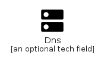
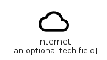
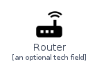

# Network

The module Network contains 4 entries.

- [Network](#family-network)

## Network

| |Name|
|:---:|---|
||[homecloud/Network/Dns](../homecloud/Network/Dns.md)
||[homecloud/Network/Internet](../homecloud/Network/Internet.md)
||[homecloud/Network/LocalNetwork](../homecloud/Network/LocalNetwork.md)
||[homecloud/Network/Router](../homecloud/Network/Router.md)

