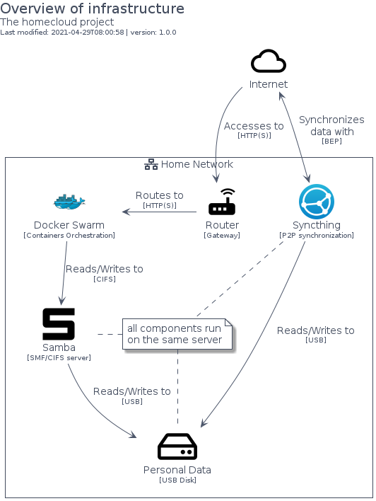

# homecloud


## Bootstrap

The package handles its own bootstrap.

```plantuml
' loads the homecloud bootstrap
include('homecloud/bootstrap')
```


## Style

The package handles its own style.

The bootstrap loads the style too! ;)

```plantuml
' loads the homecloud style
include('homecloud/style')
```


# Modules

The package provides 3 modules.


- [Element](element.md) with 21 elements
- [Brand](brand.md) with 7 elements
- [Group](group.md) with 9 elements

# Examples

The package provides 1 examples.


## simple
<br>
[The source file.](../homecloud/examples/simple.puml)

