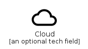
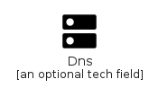
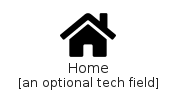
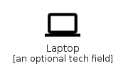
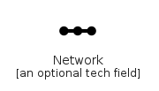
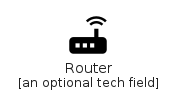
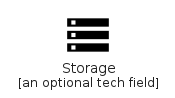
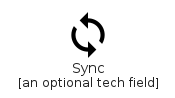
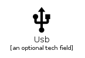

# Element

The module Element contains 23 entries.

- [Element](#family-element)

## Element

| |Name|
|:---:|---|
||[homecloud/Element/Backup](../homecloud/Element/Backup.md)
||[homecloud/Element/Board](../homecloud/Element/Board.md)
||[homecloud/Element/Cloud](../homecloud/Element/Cloud.md)
||[homecloud/Element/Container](../homecloud/Element/Container.md)
||[homecloud/Element/Dns](../homecloud/Element/Dns.md)
||[homecloud/Element/Home](../homecloud/Element/Home.md)
||[homecloud/Element/Laptop](../homecloud/Element/Laptop.md)
||[homecloud/Element/Lock](../homecloud/Element/Lock.md)
||[homecloud/Element/Mail](../homecloud/Element/Mail.md)
||[homecloud/Element/Network](../homecloud/Element/Network.md)
||[homecloud/Element/People](../homecloud/Element/People.md)
||[homecloud/Element/Person](../homecloud/Element/Person.md)
||[homecloud/Element/Registry](../homecloud/Element/Registry.md)
||[homecloud/Element/Router](../homecloud/Element/Router.md)
||[homecloud/Element/SdCard](../homecloud/Element/SdCard.md)
||[homecloud/Element/Security](../homecloud/Element/Security.md)
||[homecloud/Element/Service](../homecloud/Element/Service.md)
||[homecloud/Element/Share](../homecloud/Element/Share.md)
||[homecloud/Element/Smartphone](../homecloud/Element/Smartphone.md)
||[homecloud/Element/Stack](../homecloud/Element/Stack.md)
||[homecloud/Element/Storage](../homecloud/Element/Storage.md)
||[homecloud/Element/Sync](../homecloud/Element/Sync.md)
||[homecloud/Element/Usb](../homecloud/Element/Usb.md)

