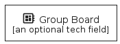
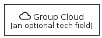
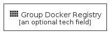
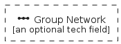
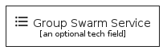
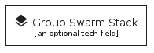

# Group

The module Group contains 9 entries.

| |Name|
|:---:|---|
||[homecloud/Group/GroupBoard](../homecloud/Group/GroupBoard.md)
||[homecloud/Group/GroupCloud](../homecloud/Group/GroupCloud.md)
||[homecloud/Group/GroupDockerRegistry](../homecloud/Group/GroupDockerRegistry.md)
||[homecloud/Group/GroupLock](../homecloud/Group/GroupLock.md)
||[homecloud/Group/GroupNetwork](../homecloud/Group/GroupNetwork.md)
||[homecloud/Group/GroupSwarm](../homecloud/Group/GroupSwarm.md)
||[homecloud/Group/GroupSwarmContainer](../homecloud/Group/GroupSwarmContainer.md)
||[homecloud/Group/GroupSwarmService](../homecloud/Group/GroupSwarmService.md)
||[homecloud/Group/GroupSwarmStack](../homecloud/Group/GroupSwarmStack.md)

