# Action

The module Action contains 343 entries.

| |Name|
|:---:|---|
||[material-4.0/Action/A3DRotation](../material-4.0/Action/A3DRotation.md)
|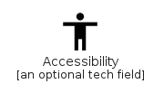|[material-4.0/Action/Accessibility](../material-4.0/Action/Accessibility.md)
||[material-4.0/Action/AccessibilityNew](../material-4.0/Action/AccessibilityNew.md)
||[material-4.0/Action/Accessible](../material-4.0/Action/Accessible.md)
||[material-4.0/Action/AccessibleForward](../material-4.0/Action/AccessibleForward.md)
||[material-4.0/Action/AccountBalance](../material-4.0/Action/AccountBalance.md)
||[material-4.0/Action/AccountBalanceWallet](../material-4.0/Action/AccountBalanceWallet.md)
||[material-4.0/Action/AccountBox](../material-4.0/Action/AccountBox.md)
||[material-4.0/Action/AccountCircle](../material-4.0/Action/AccountCircle.md)
||[material-4.0/Action/Addchart](../material-4.0/Action/Addchart.md)
||[material-4.0/Action/AddShoppingCart](../material-4.0/Action/AddShoppingCart.md)
||[material-4.0/Action/AddTask](../material-4.0/Action/AddTask.md)
||[material-4.0/Action/AddToDrive](../material-4.0/Action/AddToDrive.md)
||[material-4.0/Action/AdminPanelSettings](../material-4.0/Action/AdminPanelSettings.md)
|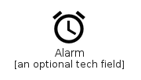|[material-4.0/Action/Alarm](../material-4.0/Action/Alarm.md)
||[material-4.0/Action/AlarmAdd](../material-4.0/Action/AlarmAdd.md)
||[material-4.0/Action/AlarmOff](../material-4.0/Action/AlarmOff.md)
||[material-4.0/Action/AlarmOn](../material-4.0/Action/AlarmOn.md)
||[material-4.0/Action/AllInbox](../material-4.0/Action/AllInbox.md)
||[material-4.0/Action/AllOut](../material-4.0/Action/AllOut.md)
||[material-4.0/Action/Analytics](../material-4.0/Action/Analytics.md)
||[material-4.0/Action/Anchor](../material-4.0/Action/Anchor.md)
||[material-4.0/Action/Android](../material-4.0/Action/Android.md)
||[material-4.0/Action/Announcement](../material-4.0/Action/Announcement.md)
|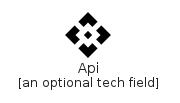|[material-4.0/Action/Api](../material-4.0/Action/Api.md)
||[material-4.0/Action/AppBlocking](../material-4.0/Action/AppBlocking.md)
||[material-4.0/Action/ArrowCircleDown](../material-4.0/Action/ArrowCircleDown.md)
||[material-4.0/Action/ArrowCircleUp](../material-4.0/Action/ArrowCircleUp.md)
|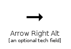|[material-4.0/Action/ArrowRightAlt](../material-4.0/Action/ArrowRightAlt.md)
||[material-4.0/Action/Article](../material-4.0/Action/Article.md)
|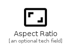|[material-4.0/Action/AspectRatio](../material-4.0/Action/AspectRatio.md)
||[material-4.0/Action/Assessment](../material-4.0/Action/Assessment.md)
||[material-4.0/Action/Assignment](../material-4.0/Action/Assignment.md)
||[material-4.0/Action/AssignmentInd](../material-4.0/Action/AssignmentInd.md)
||[material-4.0/Action/AssignmentLate](../material-4.0/Action/AssignmentLate.md)
||[material-4.0/Action/AssignmentReturn](../material-4.0/Action/AssignmentReturn.md)
||[material-4.0/Action/AssignmentReturned](../material-4.0/Action/AssignmentReturned.md)
||[material-4.0/Action/AssignmentTurnedIn](../material-4.0/Action/AssignmentTurnedIn.md)
|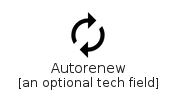|[material-4.0/Action/Autorenew](../material-4.0/Action/Autorenew.md)
||[material-4.0/Action/Backup](../material-4.0/Action/Backup.md)
||[material-4.0/Action/BackupTable](../material-4.0/Action/BackupTable.md)
||[material-4.0/Action/BatchPrediction](../material-4.0/Action/BatchPrediction.md)
||[material-4.0/Action/Book](../material-4.0/Action/Book.md)
||[material-4.0/Action/Bookmark](../material-4.0/Action/Bookmark.md)
||[material-4.0/Action/BookmarkBorder](../material-4.0/Action/BookmarkBorder.md)
||[material-4.0/Action/Bookmarks](../material-4.0/Action/Bookmarks.md)
||[material-4.0/Action/BookOnline](../material-4.0/Action/BookOnline.md)
||[material-4.0/Action/BugReport](../material-4.0/Action/BugReport.md)
|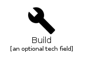|[material-4.0/Action/Build](../material-4.0/Action/Build.md)
||[material-4.0/Action/BuildCircle](../material-4.0/Action/BuildCircle.md)
||[material-4.0/Action/Cached](../material-4.0/Action/Cached.md)
||[material-4.0/Action/CalendarToday](../material-4.0/Action/CalendarToday.md)
||[material-4.0/Action/CalendarViewDay](../material-4.0/Action/CalendarViewDay.md)
||[material-4.0/Action/CameraEnhance](../material-4.0/Action/CameraEnhance.md)
||[material-4.0/Action/CancelScheduleSend](../material-4.0/Action/CancelScheduleSend.md)
||[material-4.0/Action/CardGiftcard](../material-4.0/Action/CardGiftcard.md)
||[material-4.0/Action/CardMembership](../material-4.0/Action/CardMembership.md)
||[material-4.0/Action/CardTravel](../material-4.0/Action/CardTravel.md)
||[material-4.0/Action/ChangeHistory](../material-4.0/Action/ChangeHistory.md)
||[material-4.0/Action/CheckCircle](../material-4.0/Action/CheckCircle.md)
||[material-4.0/Action/CheckCircleOutline](../material-4.0/Action/CheckCircleOutline.md)
||[material-4.0/Action/ChromeReaderMode](../material-4.0/Action/ChromeReaderMode.md)
||[material-4.0/Action/CircleNotifications](../material-4.0/Action/CircleNotifications.md)
|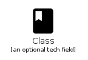|[material-4.0/Action/Class](../material-4.0/Action/Class.md)
||[material-4.0/Action/CloseFullscreen](../material-4.0/Action/CloseFullscreen.md)
|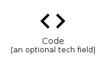|[material-4.0/Action/Code](../material-4.0/Action/Code.md)
||[material-4.0/Action/CommentBank](../material-4.0/Action/CommentBank.md)
||[material-4.0/Action/Commute](../material-4.0/Action/Commute.md)
|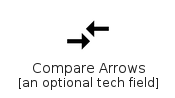|[material-4.0/Action/CompareArrows](../material-4.0/Action/CompareArrows.md)
|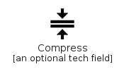|[material-4.0/Action/Compress](../material-4.0/Action/Compress.md)
||[material-4.0/Action/Contactless](../material-4.0/Action/Contactless.md)
||[material-4.0/Action/ContactPage](../material-4.0/Action/ContactPage.md)
||[material-4.0/Action/ContactSupport](../material-4.0/Action/ContactSupport.md)
||[material-4.0/Action/Copyright](../material-4.0/Action/Copyright.md)
||[material-4.0/Action/CreditCard](../material-4.0/Action/CreditCard.md)
||[material-4.0/Action/Dangerous](../material-4.0/Action/Dangerous.md)
||[material-4.0/Action/Dashboard](../material-4.0/Action/Dashboard.md)
||[material-4.0/Action/DashboardCustomize](../material-4.0/Action/DashboardCustomize.md)
||[material-4.0/Action/DateRange](../material-4.0/Action/DateRange.md)
||[material-4.0/Action/Delete](../material-4.0/Action/Delete.md)
||[material-4.0/Action/DeleteForever](../material-4.0/Action/DeleteForever.md)
||[material-4.0/Action/DeleteOutline](../material-4.0/Action/DeleteOutline.md)
||[material-4.0/Action/Description](../material-4.0/Action/Description.md)
||[material-4.0/Action/DisabledByDefault](../material-4.0/Action/DisabledByDefault.md)
||[material-4.0/Action/Dns](../material-4.0/Action/Dns.md)
||[material-4.0/Action/Done](../material-4.0/Action/Done.md)
||[material-4.0/Action/DoneAll](../material-4.0/Action/DoneAll.md)
||[material-4.0/Action/DoneOutline](../material-4.0/Action/DoneOutline.md)
||[material-4.0/Action/DonutLarge](../material-4.0/Action/DonutLarge.md)
||[material-4.0/Action/DonutSmall](../material-4.0/Action/DonutSmall.md)
||[material-4.0/Action/DragIndicator](../material-4.0/Action/DragIndicator.md)
||[material-4.0/Action/DynamicForm](../material-4.0/Action/DynamicForm.md)
|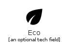|[material-4.0/Action/Eco](../material-4.0/Action/Eco.md)
||[material-4.0/Action/EditOff](../material-4.0/Action/EditOff.md)
|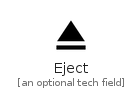|[material-4.0/Action/Eject](../material-4.0/Action/Eject.md)
||[material-4.0/Action/EuroSymbol](../material-4.0/Action/EuroSymbol.md)
|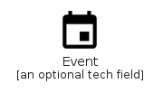|[material-4.0/Action/Event](../material-4.0/Action/Event.md)
||[material-4.0/Action/EventSeat](../material-4.0/Action/EventSeat.md)
||[material-4.0/Action/ExitToApp](../material-4.0/Action/ExitToApp.md)
|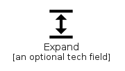|[material-4.0/Action/Expand](../material-4.0/Action/Expand.md)
||[material-4.0/Action/Explore](../material-4.0/Action/Explore.md)
||[material-4.0/Action/ExploreOff](../material-4.0/Action/ExploreOff.md)
||[material-4.0/Action/Extension](../material-4.0/Action/Extension.md)
|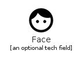|[material-4.0/Action/Face](../material-4.0/Action/Face.md)
||[material-4.0/Action/FactCheck](../material-4.0/Action/FactCheck.md)
||[material-4.0/Action/Favorite](../material-4.0/Action/Favorite.md)
||[material-4.0/Action/FavoriteBorder](../material-4.0/Action/FavoriteBorder.md)
||[material-4.0/Action/Feedback](../material-4.0/Action/Feedback.md)
||[material-4.0/Action/FilePresent](../material-4.0/Action/FilePresent.md)
||[material-4.0/Action/FilterAlt](../material-4.0/Action/FilterAlt.md)
||[material-4.0/Action/FilterListAlt](../material-4.0/Action/FilterListAlt.md)
||[material-4.0/Action/FindInPage](../material-4.0/Action/FindInPage.md)
||[material-4.0/Action/FindReplace](../material-4.0/Action/FindReplace.md)
||[material-4.0/Action/Fingerprint](../material-4.0/Action/Fingerprint.md)
||[material-4.0/Action/FitScreen](../material-4.0/Action/FitScreen.md)
||[material-4.0/Action/Flaky](../material-4.0/Action/Flaky.md)
||[material-4.0/Action/FlightLand](../material-4.0/Action/FlightLand.md)
||[material-4.0/Action/FlightTakeoff](../material-4.0/Action/FlightTakeoff.md)
||[material-4.0/Action/FlipToBack](../material-4.0/Action/FlipToBack.md)
||[material-4.0/Action/FlipToFront](../material-4.0/Action/FlipToFront.md)
||[material-4.0/Action/Gavel](../material-4.0/Action/Gavel.md)
||[material-4.0/Action/GetApp](../material-4.0/Action/GetApp.md)
|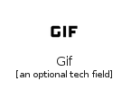|[material-4.0/Action/Gif](../material-4.0/Action/Gif.md)
||[material-4.0/Action/Grade](../material-4.0/Action/Grade.md)
||[material-4.0/Action/Grading](../material-4.0/Action/Grading.md)
||[material-4.0/Action/GroupWork](../material-4.0/Action/GroupWork.md)
||[material-4.0/Action/GTranslate](../material-4.0/Action/GTranslate.md)
||[material-4.0/Action/Help](../material-4.0/Action/Help.md)
||[material-4.0/Action/HelpCenter](../material-4.0/Action/HelpCenter.md)
||[material-4.0/Action/HelpOutline](../material-4.0/Action/HelpOutline.md)
||[material-4.0/Action/HighlightAlt](../material-4.0/Action/HighlightAlt.md)
||[material-4.0/Action/HighlightOff](../material-4.0/Action/HighlightOff.md)
||[material-4.0/Action/History](../material-4.0/Action/History.md)
||[material-4.0/Action/HistoryToggleOff](../material-4.0/Action/HistoryToggleOff.md)
|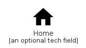|[material-4.0/Action/Home](../material-4.0/Action/Home.md)
||[material-4.0/Action/HomeFilled](../material-4.0/Action/HomeFilled.md)
||[material-4.0/Action/HorizontalSplit](../material-4.0/Action/HorizontalSplit.md)
||[material-4.0/Action/HourglassDisabled](../material-4.0/Action/HourglassDisabled.md)
||[material-4.0/Action/HourglassEmpty](../material-4.0/Action/HourglassEmpty.md)
|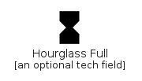|[material-4.0/Action/HourglassFull](../material-4.0/Action/HourglassFull.md)
||[material-4.0/Action/Http](../material-4.0/Action/Http.md)
||[material-4.0/Action/Https](../material-4.0/Action/Https.md)
||[material-4.0/Action/ImportantDevices](../material-4.0/Action/ImportantDevices.md)
||[material-4.0/Action/Info](../material-4.0/Action/Info.md)
||[material-4.0/Action/InfoOutline](../material-4.0/Action/InfoOutline.md)
|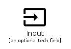|[material-4.0/Action/Input](../material-4.0/Action/Input.md)
||[material-4.0/Action/IntegrationInstructions](../material-4.0/Action/IntegrationInstructions.md)
||[material-4.0/Action/InvertColors](../material-4.0/Action/InvertColors.md)
|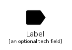|[material-4.0/Action/Label](../material-4.0/Action/Label.md)
||[material-4.0/Action/LabelImportant](../material-4.0/Action/LabelImportant.md)
|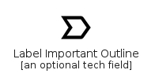|[material-4.0/Action/LabelImportantOutline](../material-4.0/Action/LabelImportantOutline.md)
||[material-4.0/Action/LabelOff](../material-4.0/Action/LabelOff.md)
|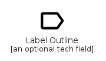|[material-4.0/Action/LabelOutline](../material-4.0/Action/LabelOutline.md)
||[material-4.0/Action/Language](../material-4.0/Action/Language.md)
||[material-4.0/Action/Launch](../material-4.0/Action/Launch.md)
||[material-4.0/Action/Leaderboard](../material-4.0/Action/Leaderboard.md)
|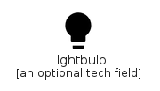|[material-4.0/Action/Lightbulb](../material-4.0/Action/Lightbulb.md)
||[material-4.0/Action/LightbulbOutline](../material-4.0/Action/LightbulbOutline.md)
||[material-4.0/Action/LineStyle](../material-4.0/Action/LineStyle.md)
||[material-4.0/Action/LineWeight](../material-4.0/Action/LineWeight.md)
||[material-4.0/Action/List](../material-4.0/Action/List.md)
||[material-4.0/Action/Lock](../material-4.0/Action/Lock.md)
||[material-4.0/Action/LockClock](../material-4.0/Action/LockClock.md)
||[material-4.0/Action/LockOpen](../material-4.0/Action/LockOpen.md)
||[material-4.0/Action/LockOutline](../material-4.0/Action/LockOutline.md)
||[material-4.0/Action/Login](../material-4.0/Action/Login.md)
|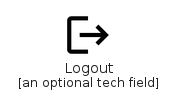|[material-4.0/Action/Logout](../material-4.0/Action/Logout.md)
||[material-4.0/Action/Loyalty](../material-4.0/Action/Loyalty.md)
||[material-4.0/Action/MarkAsUnread](../material-4.0/Action/MarkAsUnread.md)
||[material-4.0/Action/MarkunreadMailbox](../material-4.0/Action/MarkunreadMailbox.md)
||[material-4.0/Action/Maximize](../material-4.0/Action/Maximize.md)
||[material-4.0/Action/Mediation](../material-4.0/Action/Mediation.md)
||[material-4.0/Action/Minimize](../material-4.0/Action/Minimize.md)
||[material-4.0/Action/ModelTraining](../material-4.0/Action/ModelTraining.md)
||[material-4.0/Action/NextPlan](../material-4.0/Action/NextPlan.md)
||[material-4.0/Action/NightlightRound](../material-4.0/Action/NightlightRound.md)
||[material-4.0/Action/NotAccessible](../material-4.0/Action/NotAccessible.md)
||[material-4.0/Action/NoteAdd](../material-4.0/Action/NoteAdd.md)
||[material-4.0/Action/NotStarted](../material-4.0/Action/NotStarted.md)
||[material-4.0/Action/OfflineBolt](../material-4.0/Action/OfflineBolt.md)
||[material-4.0/Action/OfflinePin](../material-4.0/Action/OfflinePin.md)
||[material-4.0/Action/OnlinePrediction](../material-4.0/Action/OnlinePrediction.md)
|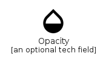|[material-4.0/Action/Opacity](../material-4.0/Action/Opacity.md)
||[material-4.0/Action/OpenInBrowser](../material-4.0/Action/OpenInBrowser.md)
||[material-4.0/Action/OpenInFull](../material-4.0/Action/OpenInFull.md)
||[material-4.0/Action/OpenInNew](../material-4.0/Action/OpenInNew.md)
|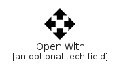|[material-4.0/Action/OpenWith](../material-4.0/Action/OpenWith.md)
||[material-4.0/Action/Outbond](../material-4.0/Action/Outbond.md)
||[material-4.0/Action/Outbox](../material-4.0/Action/Outbox.md)
||[material-4.0/Action/OutgoingMail](../material-4.0/Action/OutgoingMail.md)
|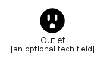|[material-4.0/Action/Outlet](../material-4.0/Action/Outlet.md)
||[material-4.0/Action/Pageview](../material-4.0/Action/Pageview.md)
||[material-4.0/Action/PanTool](../material-4.0/Action/PanTool.md)
||[material-4.0/Action/Payment](../material-4.0/Action/Payment.md)
||[material-4.0/Action/Pending](../material-4.0/Action/Pending.md)
||[material-4.0/Action/PendingActions](../material-4.0/Action/PendingActions.md)
||[material-4.0/Action/PermCameraMic](../material-4.0/Action/PermCameraMic.md)
||[material-4.0/Action/PermContactCalendar](../material-4.0/Action/PermContactCalendar.md)
||[material-4.0/Action/PermDataSetting](../material-4.0/Action/PermDataSetting.md)
||[material-4.0/Action/PermDeviceInformation](../material-4.0/Action/PermDeviceInformation.md)
||[material-4.0/Action/PermIdentity](../material-4.0/Action/PermIdentity.md)
||[material-4.0/Action/PermMedia](../material-4.0/Action/PermMedia.md)
||[material-4.0/Action/PermPhoneMsg](../material-4.0/Action/PermPhoneMsg.md)
||[material-4.0/Action/PermScanWifi](../material-4.0/Action/PermScanWifi.md)
|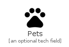|[material-4.0/Action/Pets](../material-4.0/Action/Pets.md)
||[material-4.0/Action/PictureInPicture](../material-4.0/Action/PictureInPicture.md)
||[material-4.0/Action/PictureInPictureAlt](../material-4.0/Action/PictureInPictureAlt.md)
||[material-4.0/Action/Plagiarism](../material-4.0/Action/Plagiarism.md)
||[material-4.0/Action/PlayForWork](../material-4.0/Action/PlayForWork.md)
||[material-4.0/Action/Polymer](../material-4.0/Action/Polymer.md)
||[material-4.0/Action/PowerSettingsNew](../material-4.0/Action/PowerSettingsNew.md)
||[material-4.0/Action/PregnantWoman](../material-4.0/Action/PregnantWoman.md)
||[material-4.0/Action/Preview](../material-4.0/Action/Preview.md)
||[material-4.0/Action/Print](../material-4.0/Action/Print.md)
||[material-4.0/Action/PrivacyTip](../material-4.0/Action/PrivacyTip.md)
||[material-4.0/Action/PublishedWithChanges](../material-4.0/Action/PublishedWithChanges.md)
||[material-4.0/Action/QueryBuilder](../material-4.0/Action/QueryBuilder.md)
||[material-4.0/Action/QuestionAnswer](../material-4.0/Action/QuestionAnswer.md)
||[material-4.0/Action/Quickreply](../material-4.0/Action/Quickreply.md)
||[material-4.0/Action/Receipt](../material-4.0/Action/Receipt.md)
||[material-4.0/Action/RecordVoiceOver](../material-4.0/Action/RecordVoiceOver.md)
||[material-4.0/Action/Redeem](../material-4.0/Action/Redeem.md)
||[material-4.0/Action/RemoveDone](../material-4.0/Action/RemoveDone.md)
||[material-4.0/Action/RemoveShoppingCart](../material-4.0/Action/RemoveShoppingCart.md)
||[material-4.0/Action/Reorder](../material-4.0/Action/Reorder.md)
|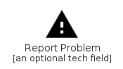|[material-4.0/Action/ReportProblem](../material-4.0/Action/ReportProblem.md)
||[material-4.0/Action/RequestPage](../material-4.0/Action/RequestPage.md)
|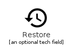|[material-4.0/Action/Restore](../material-4.0/Action/Restore.md)
||[material-4.0/Action/RestoreFromTrash](../material-4.0/Action/RestoreFromTrash.md)
||[material-4.0/Action/RestorePage](../material-4.0/Action/RestorePage.md)
||[material-4.0/Action/Room](../material-4.0/Action/Room.md)
||[material-4.0/Action/RoundedCorner](../material-4.0/Action/RoundedCorner.md)
||[material-4.0/Action/Rowing](../material-4.0/Action/Rowing.md)
|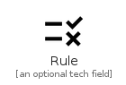|[material-4.0/Action/Rule](../material-4.0/Action/Rule.md)
||[material-4.0/Action/SavedSearch](../material-4.0/Action/SavedSearch.md)
||[material-4.0/Action/Schedule](../material-4.0/Action/Schedule.md)
||[material-4.0/Action/ScheduleSend](../material-4.0/Action/ScheduleSend.md)
||[material-4.0/Action/Search](../material-4.0/Action/Search.md)
||[material-4.0/Action/SearchOff](../material-4.0/Action/SearchOff.md)
||[material-4.0/Action/Segment](../material-4.0/Action/Segment.md)
||[material-4.0/Action/SendAndArchive](../material-4.0/Action/SendAndArchive.md)
||[material-4.0/Action/Settings](../material-4.0/Action/Settings.md)
||[material-4.0/Action/SettingsApplications](../material-4.0/Action/SettingsApplications.md)
||[material-4.0/Action/SettingsBackupRestore](../material-4.0/Action/SettingsBackupRestore.md)
||[material-4.0/Action/SettingsBluetooth](../material-4.0/Action/SettingsBluetooth.md)
||[material-4.0/Action/SettingsBrightness](../material-4.0/Action/SettingsBrightness.md)
||[material-4.0/Action/SettingsCell](../material-4.0/Action/SettingsCell.md)
|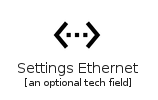|[material-4.0/Action/SettingsEthernet](../material-4.0/Action/SettingsEthernet.md)
||[material-4.0/Action/SettingsInputAntenna](../material-4.0/Action/SettingsInputAntenna.md)
|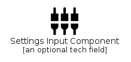|[material-4.0/Action/SettingsInputComponent](../material-4.0/Action/SettingsInputComponent.md)
||[material-4.0/Action/SettingsInputComposite](../material-4.0/Action/SettingsInputComposite.md)
||[material-4.0/Action/SettingsInputHdmi](../material-4.0/Action/SettingsInputHdmi.md)
||[material-4.0/Action/SettingsInputSvideo](../material-4.0/Action/SettingsInputSvideo.md)
||[material-4.0/Action/SettingsOverscan](../material-4.0/Action/SettingsOverscan.md)
||[material-4.0/Action/SettingsPhone](../material-4.0/Action/SettingsPhone.md)
||[material-4.0/Action/SettingsPower](../material-4.0/Action/SettingsPower.md)
||[material-4.0/Action/SettingsRemote](../material-4.0/Action/SettingsRemote.md)
||[material-4.0/Action/SettingsVoice](../material-4.0/Action/SettingsVoice.md)
||[material-4.0/Action/Shop](../material-4.0/Action/Shop.md)
||[material-4.0/Action/ShoppingBag](../material-4.0/Action/ShoppingBag.md)
||[material-4.0/Action/ShoppingBasket](../material-4.0/Action/ShoppingBasket.md)
||[material-4.0/Action/ShoppingCart](../material-4.0/Action/ShoppingCart.md)
||[material-4.0/Action/ShopTwo](../material-4.0/Action/ShopTwo.md)
||[material-4.0/Action/SmartButton](../material-4.0/Action/SmartButton.md)
||[material-4.0/Action/Source](../material-4.0/Action/Source.md)
||[material-4.0/Action/SpeakerNotes](../material-4.0/Action/SpeakerNotes.md)
||[material-4.0/Action/SpeakerNotesOff](../material-4.0/Action/SpeakerNotesOff.md)
||[material-4.0/Action/Spellcheck](../material-4.0/Action/Spellcheck.md)
||[material-4.0/Action/StarRate](../material-4.0/Action/StarRate.md)
||[material-4.0/Action/Stars](../material-4.0/Action/Stars.md)
||[material-4.0/Action/StickyNote2](../material-4.0/Action/StickyNote2.md)
||[material-4.0/Action/Store](../material-4.0/Action/Store.md)
||[material-4.0/Action/Subject](../material-4.0/Action/Subject.md)
||[material-4.0/Action/SubtitlesOff](../material-4.0/Action/SubtitlesOff.md)
||[material-4.0/Action/SupervisedUserCircle](../material-4.0/Action/SupervisedUserCircle.md)
||[material-4.0/Action/SupervisorAccount](../material-4.0/Action/SupervisorAccount.md)
|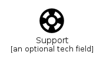|[material-4.0/Action/Support](../material-4.0/Action/Support.md)
|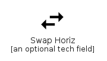|[material-4.0/Action/SwapHoriz](../material-4.0/Action/SwapHoriz.md)
||[material-4.0/Action/SwapHorizontalCircle](../material-4.0/Action/SwapHorizontalCircle.md)
|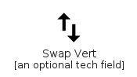|[material-4.0/Action/SwapVert](../material-4.0/Action/SwapVert.md)
||[material-4.0/Action/SwapVerticalCircle](../material-4.0/Action/SwapVerticalCircle.md)
|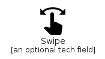|[material-4.0/Action/Swipe](../material-4.0/Action/Swipe.md)
|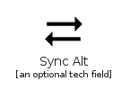|[material-4.0/Action/SyncAlt](../material-4.0/Action/SyncAlt.md)
|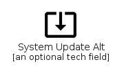|[material-4.0/Action/SystemUpdateAlt](../material-4.0/Action/SystemUpdateAlt.md)
|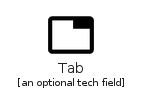|[material-4.0/Action/Tab](../material-4.0/Action/Tab.md)
||[material-4.0/Action/TableView](../material-4.0/Action/TableView.md)
||[material-4.0/Action/TabUnselected](../material-4.0/Action/TabUnselected.md)
|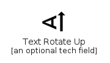|[material-4.0/Action/TextRotateUp](../material-4.0/Action/TextRotateUp.md)
||[material-4.0/Action/TextRotateVertical](../material-4.0/Action/TextRotateVertical.md)
||[material-4.0/Action/TextRotationAngledown](../material-4.0/Action/TextRotationAngledown.md)
|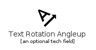|[material-4.0/Action/TextRotationAngleup](../material-4.0/Action/TextRotationAngleup.md)
||[material-4.0/Action/TextRotationDown](../material-4.0/Action/TextRotationDown.md)
||[material-4.0/Action/TextRotationNone](../material-4.0/Action/TextRotationNone.md)
||[material-4.0/Action/Theaters](../material-4.0/Action/Theaters.md)
||[material-4.0/Action/ThumbDown](../material-4.0/Action/ThumbDown.md)
||[material-4.0/Action/ThumbDownOffAlt](../material-4.0/Action/ThumbDownOffAlt.md)
||[material-4.0/Action/ThumbsUpDown](../material-4.0/Action/ThumbsUpDown.md)
||[material-4.0/Action/ThumbUp](../material-4.0/Action/ThumbUp.md)
||[material-4.0/Action/ThumbUpOffAlt](../material-4.0/Action/ThumbUpOffAlt.md)
||[material-4.0/Action/Timeline](../material-4.0/Action/Timeline.md)
|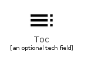|[material-4.0/Action/Toc](../material-4.0/Action/Toc.md)
|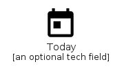|[material-4.0/Action/Today](../material-4.0/Action/Today.md)
||[material-4.0/Action/Toll](../material-4.0/Action/Toll.md)
||[material-4.0/Action/TouchApp](../material-4.0/Action/TouchApp.md)
||[material-4.0/Action/Tour](../material-4.0/Action/Tour.md)
||[material-4.0/Action/TrackChanges](../material-4.0/Action/TrackChanges.md)
||[material-4.0/Action/Translate](../material-4.0/Action/Translate.md)
||[material-4.0/Action/TrendingDown](../material-4.0/Action/TrendingDown.md)
|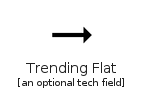|[material-4.0/Action/TrendingFlat](../material-4.0/Action/TrendingFlat.md)
||[material-4.0/Action/TrendingUp](../material-4.0/Action/TrendingUp.md)
||[material-4.0/Action/TurnedIn](../material-4.0/Action/TurnedIn.md)
||[material-4.0/Action/TurnedInNot](../material-4.0/Action/TurnedInNot.md)
||[material-4.0/Action/Unpublished](../material-4.0/Action/Unpublished.md)
||[material-4.0/Action/Update](../material-4.0/Action/Update.md)
||[material-4.0/Action/Upgrade](../material-4.0/Action/Upgrade.md)
||[material-4.0/Action/Verified](../material-4.0/Action/Verified.md)
||[material-4.0/Action/VerifiedUser](../material-4.0/Action/VerifiedUser.md)
||[material-4.0/Action/VerticalSplit](../material-4.0/Action/VerticalSplit.md)
||[material-4.0/Action/ViewAgenda](../material-4.0/Action/ViewAgenda.md)
|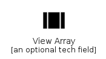|[material-4.0/Action/ViewArray](../material-4.0/Action/ViewArray.md)
||[material-4.0/Action/ViewCarousel](../material-4.0/Action/ViewCarousel.md)
||[material-4.0/Action/ViewColumn](../material-4.0/Action/ViewColumn.md)
||[material-4.0/Action/ViewDay](../material-4.0/Action/ViewDay.md)
||[material-4.0/Action/ViewHeadline](../material-4.0/Action/ViewHeadline.md)
|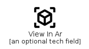|[material-4.0/Action/ViewInAr](../material-4.0/Action/ViewInAr.md)
||[material-4.0/Action/ViewList](../material-4.0/Action/ViewList.md)
||[material-4.0/Action/ViewModule](../material-4.0/Action/ViewModule.md)
||[material-4.0/Action/ViewQuilt](../material-4.0/Action/ViewQuilt.md)
||[material-4.0/Action/ViewSidebar](../material-4.0/Action/ViewSidebar.md)
||[material-4.0/Action/ViewStream](../material-4.0/Action/ViewStream.md)
||[material-4.0/Action/ViewWeek](../material-4.0/Action/ViewWeek.md)
||[material-4.0/Action/Visibility](../material-4.0/Action/Visibility.md)
||[material-4.0/Action/VisibilityOff](../material-4.0/Action/VisibilityOff.md)
||[material-4.0/Action/VoiceOverOff](../material-4.0/Action/VoiceOverOff.md)
||[material-4.0/Action/WatchLater](../material-4.0/Action/WatchLater.md)
||[material-4.0/Action/WifiProtectedSetup](../material-4.0/Action/WifiProtectedSetup.md)
||[material-4.0/Action/Work](../material-4.0/Action/Work.md)
||[material-4.0/Action/WorkOff](../material-4.0/Action/WorkOff.md)
||[material-4.0/Action/WorkOutline](../material-4.0/Action/WorkOutline.md)
||[material-4.0/Action/Wysiwyg](../material-4.0/Action/Wysiwyg.md)
||[material-4.0/Action/YoutubeSearchedFor](../material-4.0/Action/YoutubeSearchedFor.md)
||[material-4.0/Action/ZoomIn](../material-4.0/Action/ZoomIn.md)
||[material-4.0/Action/ZoomOut](../material-4.0/Action/ZoomOut.md)

