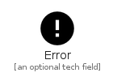
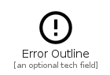
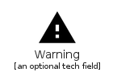

# Alert

The module Alert contains 6 entries.

| |Name|
|:---:|---|
||[material-4.0/Alert/AddAlert](../material-4.0/Alert/AddAlert.md)
||[material-4.0/Alert/AutoDelete](../material-4.0/Alert/AutoDelete.md)
||[material-4.0/Alert/Error](../material-4.0/Alert/Error.md)
||[material-4.0/Alert/ErrorOutline](../material-4.0/Alert/ErrorOutline.md)
||[material-4.0/Alert/NotificationImportant](../material-4.0/Alert/NotificationImportant.md)
||[material-4.0/Alert/Warning](../material-4.0/Alert/Warning.md)

