# Av

The module Av contains 115 entries.

| |Name|
|:---:|---|
||[material-4.0/Av/A10K](../material-4.0/Av/A10K.md)
||[material-4.0/Av/A1K](../material-4.0/Av/A1K.md)
||[material-4.0/Av/A1KPlus](../material-4.0/Av/A1KPlus.md)
||[material-4.0/Av/A2K](../material-4.0/Av/A2K.md)
||[material-4.0/Av/A2KPlus](../material-4.0/Av/A2KPlus.md)
||[material-4.0/Av/A3K](../material-4.0/Av/A3K.md)
||[material-4.0/Av/A3KPlus](../material-4.0/Av/A3KPlus.md)
|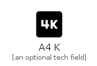|[material-4.0/Av/A4K](../material-4.0/Av/A4K.md)
||[material-4.0/Av/A4KPlus](../material-4.0/Av/A4KPlus.md)
||[material-4.0/Av/A5G](../material-4.0/Av/A5G.md)
||[material-4.0/Av/A5K](../material-4.0/Av/A5K.md)
||[material-4.0/Av/A5KPlus](../material-4.0/Av/A5KPlus.md)
|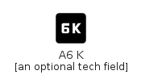|[material-4.0/Av/A6K](../material-4.0/Av/A6K.md)
||[material-4.0/Av/A6KPlus](../material-4.0/Av/A6KPlus.md)
||[material-4.0/Av/A7K](../material-4.0/Av/A7K.md)
||[material-4.0/Av/A7KPlus](../material-4.0/Av/A7KPlus.md)
||[material-4.0/Av/A8K](../material-4.0/Av/A8K.md)
||[material-4.0/Av/A8KPlus](../material-4.0/Av/A8KPlus.md)
||[material-4.0/Av/A9K](../material-4.0/Av/A9K.md)
||[material-4.0/Av/A9KPlus](../material-4.0/Av/A9KPlus.md)
||[material-4.0/Av/AddToQueue](../material-4.0/Av/AddToQueue.md)
|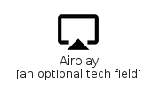|[material-4.0/Av/Airplay](../material-4.0/Av/Airplay.md)
||[material-4.0/Av/Album](../material-4.0/Av/Album.md)
||[material-4.0/Av/ArtTrack](../material-4.0/Av/ArtTrack.md)
|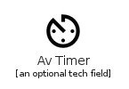|[material-4.0/Av/AvTimer](../material-4.0/Av/AvTimer.md)
||[material-4.0/Av/BrandingWatermark](../material-4.0/Av/BrandingWatermark.md)
||[material-4.0/Av/CallToAction](../material-4.0/Av/CallToAction.md)
||[material-4.0/Av/ClosedCaption](../material-4.0/Av/ClosedCaption.md)
||[material-4.0/Av/ClosedCaptionDisabled](../material-4.0/Av/ClosedCaptionDisabled.md)
||[material-4.0/Av/ClosedCaptionOff](../material-4.0/Av/ClosedCaptionOff.md)
||[material-4.0/Av/ControlCamera](../material-4.0/Av/ControlCamera.md)
||[material-4.0/Av/Equalizer](../material-4.0/Av/Equalizer.md)
||[material-4.0/Av/Explicit](../material-4.0/Av/Explicit.md)
||[material-4.0/Av/FastForward](../material-4.0/Av/FastForward.md)
||[material-4.0/Av/FastRewind](../material-4.0/Av/FastRewind.md)
||[material-4.0/Av/FeaturedPlayList](../material-4.0/Av/FeaturedPlayList.md)
||[material-4.0/Av/FeaturedVideo](../material-4.0/Av/FeaturedVideo.md)
||[material-4.0/Av/FiberDvr](../material-4.0/Av/FiberDvr.md)
||[material-4.0/Av/FiberManualRecord](../material-4.0/Av/FiberManualRecord.md)
||[material-4.0/Av/FiberNew](../material-4.0/Av/FiberNew.md)
||[material-4.0/Av/FiberPin](../material-4.0/Av/FiberPin.md)
||[material-4.0/Av/FiberSmartRecord](../material-4.0/Av/FiberSmartRecord.md)
||[material-4.0/Av/Forward10](../material-4.0/Av/Forward10.md)
||[material-4.0/Av/Forward30](../material-4.0/Av/Forward30.md)
|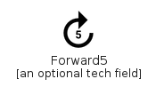|[material-4.0/Av/Forward5](../material-4.0/Av/Forward5.md)
||[material-4.0/Av/Games](../material-4.0/Av/Games.md)
||[material-4.0/Av/Hd](../material-4.0/Av/Hd.md)
||[material-4.0/Av/Hearing](../material-4.0/Av/Hearing.md)
||[material-4.0/Av/HearingDisabled](../material-4.0/Av/HearingDisabled.md)
||[material-4.0/Av/HighQuality](../material-4.0/Av/HighQuality.md)
||[material-4.0/Av/LibraryAdd](../material-4.0/Av/LibraryAdd.md)
||[material-4.0/Av/LibraryAddCheck](../material-4.0/Av/LibraryAddCheck.md)
||[material-4.0/Av/LibraryBooks](../material-4.0/Av/LibraryBooks.md)
||[material-4.0/Av/LibraryMusic](../material-4.0/Av/LibraryMusic.md)
||[material-4.0/Av/Loop](../material-4.0/Av/Loop.md)
||[material-4.0/Av/Mic](../material-4.0/Av/Mic.md)
||[material-4.0/Av/MicNone](../material-4.0/Av/MicNone.md)
||[material-4.0/Av/MicOff](../material-4.0/Av/MicOff.md)
||[material-4.0/Av/MissedVideoCall](../material-4.0/Av/MissedVideoCall.md)
|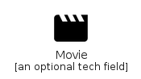|[material-4.0/Av/Movie](../material-4.0/Av/Movie.md)
||[material-4.0/Av/MusicVideo](../material-4.0/Av/MusicVideo.md)
||[material-4.0/Av/NewReleases](../material-4.0/Av/NewReleases.md)
||[material-4.0/Av/Note](../material-4.0/Av/Note.md)
||[material-4.0/Av/NotInterested](../material-4.0/Av/NotInterested.md)
|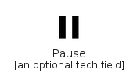|[material-4.0/Av/Pause](../material-4.0/Av/Pause.md)
|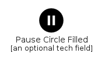|[material-4.0/Av/PauseCircleFilled](../material-4.0/Av/PauseCircleFilled.md)
||[material-4.0/Av/PauseCircleOutline](../material-4.0/Av/PauseCircleOutline.md)
|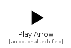|[material-4.0/Av/PlayArrow](../material-4.0/Av/PlayArrow.md)
||[material-4.0/Av/PlayCircleFilled](../material-4.0/Av/PlayCircleFilled.md)
||[material-4.0/Av/PlayCircleOutline](../material-4.0/Av/PlayCircleOutline.md)
||[material-4.0/Av/PlayDisabled](../material-4.0/Av/PlayDisabled.md)
||[material-4.0/Av/PlaylistAdd](../material-4.0/Av/PlaylistAdd.md)
||[material-4.0/Av/PlaylistAddCheck](../material-4.0/Av/PlaylistAddCheck.md)
||[material-4.0/Av/PlaylistPlay](../material-4.0/Av/PlaylistPlay.md)
||[material-4.0/Av/Queue](../material-4.0/Av/Queue.md)
||[material-4.0/Av/QueueMusic](../material-4.0/Av/QueueMusic.md)
||[material-4.0/Av/QueuePlayNext](../material-4.0/Av/QueuePlayNext.md)
||[material-4.0/Av/Radio](../material-4.0/Av/Radio.md)
||[material-4.0/Av/RecentActors](../material-4.0/Av/RecentActors.md)
||[material-4.0/Av/RemoveFromQueue](../material-4.0/Av/RemoveFromQueue.md)
|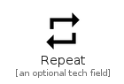|[material-4.0/Av/Repeat](../material-4.0/Av/Repeat.md)
||[material-4.0/Av/RepeatOn](../material-4.0/Av/RepeatOn.md)
||[material-4.0/Av/RepeatOne](../material-4.0/Av/RepeatOne.md)
||[material-4.0/Av/RepeatOneOn](../material-4.0/Av/RepeatOneOn.md)
|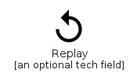|[material-4.0/Av/Replay](../material-4.0/Av/Replay.md)
||[material-4.0/Av/Replay10](../material-4.0/Av/Replay10.md)
|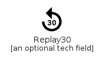|[material-4.0/Av/Replay30](../material-4.0/Av/Replay30.md)
||[material-4.0/Av/Replay5](../material-4.0/Av/Replay5.md)
||[material-4.0/Av/ReplayCircleFilled](../material-4.0/Av/ReplayCircleFilled.md)
||[material-4.0/Av/Sd](../material-4.0/Av/Sd.md)
||[material-4.0/Av/Shuffle](../material-4.0/Av/Shuffle.md)
||[material-4.0/Av/ShuffleOn](../material-4.0/Av/ShuffleOn.md)
||[material-4.0/Av/SkipNext](../material-4.0/Av/SkipNext.md)
||[material-4.0/Av/SkipPrevious](../material-4.0/Av/SkipPrevious.md)
||[material-4.0/Av/SlowMotionVideo](../material-4.0/Av/SlowMotionVideo.md)
||[material-4.0/Av/Snooze](../material-4.0/Av/Snooze.md)
||[material-4.0/Av/SortByAlpha](../material-4.0/Av/SortByAlpha.md)
||[material-4.0/Av/Speed](../material-4.0/Av/Speed.md)
|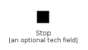|[material-4.0/Av/Stop](../material-4.0/Av/Stop.md)
||[material-4.0/Av/StopCircle](../material-4.0/Av/StopCircle.md)
||[material-4.0/Av/Subscriptions](../material-4.0/Av/Subscriptions.md)
||[material-4.0/Av/Subtitles](../material-4.0/Av/Subtitles.md)
||[material-4.0/Av/SurroundSound](../material-4.0/Av/SurroundSound.md)
||[material-4.0/Av/VideoCall](../material-4.0/Av/VideoCall.md)
||[material-4.0/Av/Videocam](../material-4.0/Av/Videocam.md)
||[material-4.0/Av/VideocamOff](../material-4.0/Av/VideocamOff.md)
||[material-4.0/Av/VideoLabel](../material-4.0/Av/VideoLabel.md)
||[material-4.0/Av/VideoLibrary](../material-4.0/Av/VideoLibrary.md)
||[material-4.0/Av/VideoSettings](../material-4.0/Av/VideoSettings.md)
||[material-4.0/Av/VolumeDown](../material-4.0/Av/VolumeDown.md)
|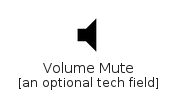|[material-4.0/Av/VolumeMute](../material-4.0/Av/VolumeMute.md)
||[material-4.0/Av/VolumeOff](../material-4.0/Av/VolumeOff.md)
||[material-4.0/Av/VolumeUp](../material-4.0/Av/VolumeUp.md)
||[material-4.0/Av/Web](../material-4.0/Av/Web.md)
||[material-4.0/Av/WebAsset](../material-4.0/Av/WebAsset.md)

