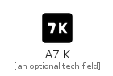

# A7 K

```text
material-4.0/Av/A7K
```

```text
include('material-4.0/Av/A7K')
```

|icon|element|
|---|---|
|||


## element
### Load remotely
```plantuml
@startuml
' configures the library
!global $LIB_BASE_LOCATION="https://raw.githubusercontent.com/tmorin/plantuml-libs/master/dist"
' loads the library
!include $LIB_BASE_LOCATION/bootstrap.puml
' loads the material-4.0 bootstrap
include('material-4.0/bootstrap')
' loads the A7K element
include('material-4.0/Av/A7K')
A7K('a_7_k', 'A7 K', 'an optional tech field')
@enduml
```
### Load locally
```plantuml
@startuml
' configures the library
!global $INCLUSION_MODE="local"
!global $LIB_BASE_LOCATION="../.."
' loads the library
!include $LIB_BASE_LOCATION/bootstrap.puml
' loads the material-4.0 bootstrap
include('material-4.0/bootstrap')
' loads the A7K element
include('material-4.0/Av/A7K')
A7K('a_7_k', 'A7 K', 'an optional tech field')
@enduml
```

