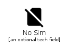
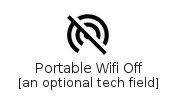

# Communication

The module Communication contains 83 entries.

| |Name|
|:---:|---|
||[material-4.0/Communication/AddIcCall](../material-4.0/Communication/AddIcCall.md)
||[material-4.0/Communication/AlternateEmail](../material-4.0/Communication/AlternateEmail.md)
||[material-4.0/Communication/AppRegistration](../material-4.0/Communication/AppRegistration.md)
||[material-4.0/Communication/Business](../material-4.0/Communication/Business.md)
||[material-4.0/Communication/Call](../material-4.0/Communication/Call.md)
||[material-4.0/Communication/CallEnd](../material-4.0/Communication/CallEnd.md)
||[material-4.0/Communication/CallMade](../material-4.0/Communication/CallMade.md)
||[material-4.0/Communication/CallMerge](../material-4.0/Communication/CallMerge.md)
||[material-4.0/Communication/CallMissed](../material-4.0/Communication/CallMissed.md)
||[material-4.0/Communication/CallMissedOutgoing](../material-4.0/Communication/CallMissedOutgoing.md)
||[material-4.0/Communication/CallReceived](../material-4.0/Communication/CallReceived.md)
||[material-4.0/Communication/CallSplit](../material-4.0/Communication/CallSplit.md)
||[material-4.0/Communication/CancelPresentation](../material-4.0/Communication/CancelPresentation.md)
||[material-4.0/Communication/CellWifi](../material-4.0/Communication/CellWifi.md)
||[material-4.0/Communication/Chat](../material-4.0/Communication/Chat.md)
||[material-4.0/Communication/ChatBubble](../material-4.0/Communication/ChatBubble.md)
||[material-4.0/Communication/ChatBubbleOutline](../material-4.0/Communication/ChatBubbleOutline.md)
||[material-4.0/Communication/ClearAll](../material-4.0/Communication/ClearAll.md)
||[material-4.0/Communication/Comment](../material-4.0/Communication/Comment.md)
||[material-4.0/Communication/ContactMail](../material-4.0/Communication/ContactMail.md)
||[material-4.0/Communication/ContactPhone](../material-4.0/Communication/ContactPhone.md)
||[material-4.0/Communication/Contacts](../material-4.0/Communication/Contacts.md)
||[material-4.0/Communication/DesktopAccessDisabled](../material-4.0/Communication/DesktopAccessDisabled.md)
||[material-4.0/Communication/DialerSip](../material-4.0/Communication/DialerSip.md)
||[material-4.0/Communication/Dialpad](../material-4.0/Communication/Dialpad.md)
||[material-4.0/Communication/DomainDisabled](../material-4.0/Communication/DomainDisabled.md)
||[material-4.0/Communication/DomainVerification](../material-4.0/Communication/DomainVerification.md)
||[material-4.0/Communication/Duo](../material-4.0/Communication/Duo.md)
||[material-4.0/Communication/Email](../material-4.0/Communication/Email.md)
||[material-4.0/Communication/Forum](../material-4.0/Communication/Forum.md)
||[material-4.0/Communication/ForwardToInbox](../material-4.0/Communication/ForwardToInbox.md)
||[material-4.0/Communication/HourglassBottom](../material-4.0/Communication/HourglassBottom.md)
||[material-4.0/Communication/HourglassTop](../material-4.0/Communication/HourglassTop.md)
||[material-4.0/Communication/ImportContacts](../material-4.0/Communication/ImportContacts.md)
||[material-4.0/Communication/ImportExport](../material-4.0/Communication/ImportExport.md)
||[material-4.0/Communication/InvertColorsOff](../material-4.0/Communication/InvertColorsOff.md)
||[material-4.0/Communication/ListAlt](../material-4.0/Communication/ListAlt.md)
||[material-4.0/Communication/LiveHelp](../material-4.0/Communication/LiveHelp.md)
||[material-4.0/Communication/LocationOff](../material-4.0/Communication/LocationOff.md)
||[material-4.0/Communication/LocationOn](../material-4.0/Communication/LocationOn.md)
||[material-4.0/Communication/MailOutline](../material-4.0/Communication/MailOutline.md)
||[material-4.0/Communication/MarkChatRead](../material-4.0/Communication/MarkChatRead.md)
||[material-4.0/Communication/MarkChatUnread](../material-4.0/Communication/MarkChatUnread.md)
||[material-4.0/Communication/MarkEmailRead](../material-4.0/Communication/MarkEmailRead.md)
||[material-4.0/Communication/MarkEmailUnread](../material-4.0/Communication/MarkEmailUnread.md)
||[material-4.0/Communication/Message](../material-4.0/Communication/Message.md)
||[material-4.0/Communication/MobileScreenShare](../material-4.0/Communication/MobileScreenShare.md)
||[material-4.0/Communication/MoreTime](../material-4.0/Communication/MoreTime.md)
||[material-4.0/Communication/Nat](../material-4.0/Communication/Nat.md)
||[material-4.0/Communication/NoSim](../material-4.0/Communication/NoSim.md)
||[material-4.0/Communication/PausePresentation](../material-4.0/Communication/PausePresentation.md)
||[material-4.0/Communication/PersonAddDisabled](../material-4.0/Communication/PersonAddDisabled.md)
||[material-4.0/Communication/PersonSearch](../material-4.0/Communication/PersonSearch.md)
||[material-4.0/Communication/Phone](../material-4.0/Communication/Phone.md)
||[material-4.0/Communication/PhoneDisabled](../material-4.0/Communication/PhoneDisabled.md)
||[material-4.0/Communication/PhoneEnabled](../material-4.0/Communication/PhoneEnabled.md)
||[material-4.0/Communication/PhonelinkErase](../material-4.0/Communication/PhonelinkErase.md)
||[material-4.0/Communication/PhonelinkLock](../material-4.0/Communication/PhonelinkLock.md)
||[material-4.0/Communication/PhonelinkRing](../material-4.0/Communication/PhonelinkRing.md)
||[material-4.0/Communication/PhonelinkSetup](../material-4.0/Communication/PhonelinkSetup.md)
||[material-4.0/Communication/PortableWifiOff](../material-4.0/Communication/PortableWifiOff.md)
||[material-4.0/Communication/PresentToAll](../material-4.0/Communication/PresentToAll.md)
||[material-4.0/Communication/PrintDisabled](../material-4.0/Communication/PrintDisabled.md)
||[material-4.0/Communication/QrCode](../material-4.0/Communication/QrCode.md)
||[material-4.0/Communication/QrCodeScanner](../material-4.0/Communication/QrCodeScanner.md)
||[material-4.0/Communication/ReadMore](../material-4.0/Communication/ReadMore.md)
||[material-4.0/Communication/RingVolume](../material-4.0/Communication/RingVolume.md)
||[material-4.0/Communication/RssFeed](../material-4.0/Communication/RssFeed.md)
||[material-4.0/Communication/Rtt](../material-4.0/Communication/Rtt.md)
||[material-4.0/Communication/ScreenShare](../material-4.0/Communication/ScreenShare.md)
||[material-4.0/Communication/SentimentSatisfiedAlt](../material-4.0/Communication/SentimentSatisfiedAlt.md)
||[material-4.0/Communication/SpeakerPhone](../material-4.0/Communication/SpeakerPhone.md)
||[material-4.0/Communication/StayCurrentLandscape](../material-4.0/Communication/StayCurrentLandscape.md)
||[material-4.0/Communication/StayCurrentPortrait](../material-4.0/Communication/StayCurrentPortrait.md)
||[material-4.0/Communication/StayPrimaryLandscape](../material-4.0/Communication/StayPrimaryLandscape.md)
||[material-4.0/Communication/StayPrimaryPortrait](../material-4.0/Communication/StayPrimaryPortrait.md)
||[material-4.0/Communication/StopScreenShare](../material-4.0/Communication/StopScreenShare.md)
||[material-4.0/Communication/SwapCalls](../material-4.0/Communication/SwapCalls.md)
||[material-4.0/Communication/Textsms](../material-4.0/Communication/Textsms.md)
||[material-4.0/Communication/Unsubscribe](../material-4.0/Communication/Unsubscribe.md)
||[material-4.0/Communication/Voicemail](../material-4.0/Communication/Voicemail.md)
||[material-4.0/Communication/VpnKey](../material-4.0/Communication/VpnKey.md)
||[material-4.0/Communication/WifiCalling](../material-4.0/Communication/WifiCalling.md)

