# Content

The module Content contains 67 entries.

| |Name|
|:---:|---|
||[material-4.0/Content/Add](../material-4.0/Content/Add.md)
||[material-4.0/Content/AddBox](../material-4.0/Content/AddBox.md)
||[material-4.0/Content/AddCircle](../material-4.0/Content/AddCircle.md)
|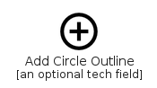|[material-4.0/Content/AddCircleOutline](../material-4.0/Content/AddCircleOutline.md)
||[material-4.0/Content/AddLink](../material-4.0/Content/AddLink.md)
||[material-4.0/Content/AmpStories](../material-4.0/Content/AmpStories.md)
||[material-4.0/Content/Archive](../material-4.0/Content/Archive.md)
||[material-4.0/Content/Backspace](../material-4.0/Content/Backspace.md)
|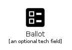|[material-4.0/Content/Ballot](../material-4.0/Content/Ballot.md)
||[material-4.0/Content/Biotech](../material-4.0/Content/Biotech.md)
|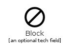|[material-4.0/Content/Block](../material-4.0/Content/Block.md)
|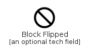|[material-4.0/Content/BlockFlipped](../material-4.0/Content/BlockFlipped.md)
|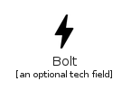|[material-4.0/Content/Bolt](../material-4.0/Content/Bolt.md)
|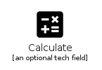|[material-4.0/Content/Calculate](../material-4.0/Content/Calculate.md)
||[material-4.0/Content/Clear](../material-4.0/Content/Clear.md)
||[material-4.0/Content/ContentCopy](../material-4.0/Content/ContentCopy.md)
||[material-4.0/Content/ContentCut](../material-4.0/Content/ContentCut.md)
||[material-4.0/Content/ContentPaste](../material-4.0/Content/ContentPaste.md)
|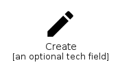|[material-4.0/Content/Create](../material-4.0/Content/Create.md)
|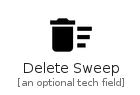|[material-4.0/Content/DeleteSweep](../material-4.0/Content/DeleteSweep.md)
||[material-4.0/Content/Drafts](../material-4.0/Content/Drafts.md)
||[material-4.0/Content/DynamicFeed](../material-4.0/Content/DynamicFeed.md)
||[material-4.0/Content/FileCopy](../material-4.0/Content/FileCopy.md)
|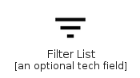|[material-4.0/Content/FilterList](../material-4.0/Content/FilterList.md)
|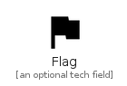|[material-4.0/Content/Flag](../material-4.0/Content/Flag.md)
||[material-4.0/Content/FontDownload](../material-4.0/Content/FontDownload.md)
|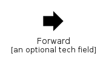|[material-4.0/Content/Forward](../material-4.0/Content/Forward.md)
||[material-4.0/Content/Gesture](../material-4.0/Content/Gesture.md)
||[material-4.0/Content/HowToReg](../material-4.0/Content/HowToReg.md)
||[material-4.0/Content/HowToVote](../material-4.0/Content/HowToVote.md)
||[material-4.0/Content/Inbox](../material-4.0/Content/Inbox.md)
||[material-4.0/Content/Insights](../material-4.0/Content/Insights.md)
||[material-4.0/Content/Inventory](../material-4.0/Content/Inventory.md)
||[material-4.0/Content/Link](../material-4.0/Content/Link.md)
||[material-4.0/Content/LinkOff](../material-4.0/Content/LinkOff.md)
||[material-4.0/Content/LowPriority](../material-4.0/Content/LowPriority.md)
||[material-4.0/Content/Mail](../material-4.0/Content/Mail.md)
||[material-4.0/Content/Markunread](../material-4.0/Content/Markunread.md)
||[material-4.0/Content/MoveToInbox](../material-4.0/Content/MoveToInbox.md)
||[material-4.0/Content/NextWeek](../material-4.0/Content/NextWeek.md)
||[material-4.0/Content/OutlinedFlag](../material-4.0/Content/OutlinedFlag.md)
||[material-4.0/Content/Policy](../material-4.0/Content/Policy.md)
|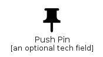|[material-4.0/Content/PushPin](../material-4.0/Content/PushPin.md)
||[material-4.0/Content/Redo](../material-4.0/Content/Redo.md)
||[material-4.0/Content/Remove](../material-4.0/Content/Remove.md)
||[material-4.0/Content/RemoveCircle](../material-4.0/Content/RemoveCircle.md)
|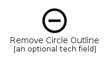|[material-4.0/Content/RemoveCircleOutline](../material-4.0/Content/RemoveCircleOutline.md)
||[material-4.0/Content/Reply](../material-4.0/Content/Reply.md)
||[material-4.0/Content/ReplyAll](../material-4.0/Content/ReplyAll.md)
||[material-4.0/Content/Report](../material-4.0/Content/Report.md)
||[material-4.0/Content/ReportOff](../material-4.0/Content/ReportOff.md)
||[material-4.0/Content/Save](../material-4.0/Content/Save.md)
||[material-4.0/Content/SaveAlt](../material-4.0/Content/SaveAlt.md)
||[material-4.0/Content/SelectAll](../material-4.0/Content/SelectAll.md)
||[material-4.0/Content/Send](../material-4.0/Content/Send.md)
||[material-4.0/Content/Shield](../material-4.0/Content/Shield.md)
|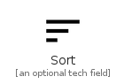|[material-4.0/Content/Sort](../material-4.0/Content/Sort.md)
|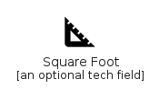|[material-4.0/Content/SquareFoot](../material-4.0/Content/SquareFoot.md)
||[material-4.0/Content/StackedBarChart](../material-4.0/Content/StackedBarChart.md)
||[material-4.0/Content/Stream](../material-4.0/Content/Stream.md)
||[material-4.0/Content/Tag](../material-4.0/Content/Tag.md)
||[material-4.0/Content/TextFormat](../material-4.0/Content/TextFormat.md)
||[material-4.0/Content/Unarchive](../material-4.0/Content/Unarchive.md)
||[material-4.0/Content/Undo](../material-4.0/Content/Undo.md)
|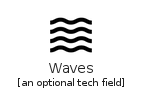|[material-4.0/Content/Waves](../material-4.0/Content/Waves.md)
||[material-4.0/Content/Weekend](../material-4.0/Content/Weekend.md)
||[material-4.0/Content/WhereToVote](../material-4.0/Content/WhereToVote.md)

