# Device

The module Device contains 63 entries.

| |Name|
|:---:|---|
||[material-4.0/Device/AccessAlarm](../material-4.0/Device/AccessAlarm.md)
||[material-4.0/Device/AccessAlarms](../material-4.0/Device/AccessAlarms.md)
||[material-4.0/Device/AccessTime](../material-4.0/Device/AccessTime.md)
||[material-4.0/Device/AddAlarm](../material-4.0/Device/AddAlarm.md)
||[material-4.0/Device/AddToHomeScreen](../material-4.0/Device/AddToHomeScreen.md)
||[material-4.0/Device/AdUnits](../material-4.0/Device/AdUnits.md)
||[material-4.0/Device/AirplanemodeActive](../material-4.0/Device/AirplanemodeActive.md)
||[material-4.0/Device/AirplanemodeInactive](../material-4.0/Device/AirplanemodeInactive.md)
|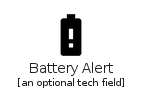|[material-4.0/Device/BatteryAlert](../material-4.0/Device/BatteryAlert.md)
|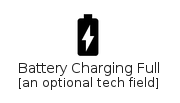|[material-4.0/Device/BatteryChargingFull](../material-4.0/Device/BatteryChargingFull.md)
|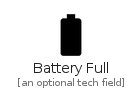|[material-4.0/Device/BatteryFull](../material-4.0/Device/BatteryFull.md)
|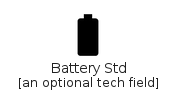|[material-4.0/Device/BatteryStd](../material-4.0/Device/BatteryStd.md)
|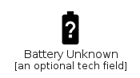|[material-4.0/Device/BatteryUnknown](../material-4.0/Device/BatteryUnknown.md)
|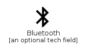|[material-4.0/Device/Bluetooth](../material-4.0/Device/Bluetooth.md)
||[material-4.0/Device/BluetoothConnected](../material-4.0/Device/BluetoothConnected.md)
||[material-4.0/Device/BluetoothDisabled](../material-4.0/Device/BluetoothDisabled.md)
||[material-4.0/Device/BluetoothSearching](../material-4.0/Device/BluetoothSearching.md)
||[material-4.0/Device/BrightnessAuto](../material-4.0/Device/BrightnessAuto.md)
||[material-4.0/Device/BrightnessHigh](../material-4.0/Device/BrightnessHigh.md)
||[material-4.0/Device/BrightnessLow](../material-4.0/Device/BrightnessLow.md)
||[material-4.0/Device/BrightnessMedium](../material-4.0/Device/BrightnessMedium.md)
||[material-4.0/Device/DataUsage](../material-4.0/Device/DataUsage.md)
||[material-4.0/Device/DeveloperMode](../material-4.0/Device/DeveloperMode.md)
||[material-4.0/Device/Devices](../material-4.0/Device/Devices.md)
||[material-4.0/Device/DeviceThermostat](../material-4.0/Device/DeviceThermostat.md)
||[material-4.0/Device/Dvr](../material-4.0/Device/Dvr.md)
||[material-4.0/Device/GpsFixed](../material-4.0/Device/GpsFixed.md)
|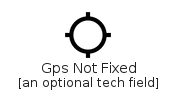|[material-4.0/Device/GpsNotFixed](../material-4.0/Device/GpsNotFixed.md)
||[material-4.0/Device/GpsOff](../material-4.0/Device/GpsOff.md)
||[material-4.0/Device/GraphicEq](../material-4.0/Device/GraphicEq.md)
||[material-4.0/Device/LocationDisabled](../material-4.0/Device/LocationDisabled.md)
||[material-4.0/Device/LocationSearching](../material-4.0/Device/LocationSearching.md)
||[material-4.0/Device/MobileFriendly](../material-4.0/Device/MobileFriendly.md)
||[material-4.0/Device/MobileOff](../material-4.0/Device/MobileOff.md)
||[material-4.0/Device/NetworkCell](../material-4.0/Device/NetworkCell.md)
||[material-4.0/Device/NetworkWifi](../material-4.0/Device/NetworkWifi.md)
|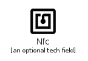|[material-4.0/Device/Nfc](../material-4.0/Device/Nfc.md)
||[material-4.0/Device/ResetTv](../material-4.0/Device/ResetTv.md)
||[material-4.0/Device/ScreenLockLandscape](../material-4.0/Device/ScreenLockLandscape.md)
||[material-4.0/Device/ScreenLockPortrait](../material-4.0/Device/ScreenLockPortrait.md)
||[material-4.0/Device/ScreenLockRotation](../material-4.0/Device/ScreenLockRotation.md)
||[material-4.0/Device/ScreenRotation](../material-4.0/Device/ScreenRotation.md)
||[material-4.0/Device/ScreenSearchDesktop](../material-4.0/Device/ScreenSearchDesktop.md)
|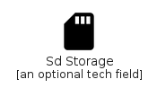|[material-4.0/Device/SdStorage](../material-4.0/Device/SdStorage.md)
||[material-4.0/Device/SendToMobile](../material-4.0/Device/SendToMobile.md)
|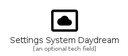|[material-4.0/Device/SettingsSystemDaydream](../material-4.0/Device/SettingsSystemDaydream.md)
||[material-4.0/Device/SignalCellular0Bar](../material-4.0/Device/SignalCellular0Bar.md)
||[material-4.0/Device/SignalCellular4Bar](../material-4.0/Device/SignalCellular4Bar.md)
||[material-4.0/Device/SignalCellularAlt](../material-4.0/Device/SignalCellularAlt.md)
||[material-4.0/Device/SignalCellularConnectedNoInternet4Bar](../material-4.0/Device/SignalCellularConnectedNoInternet4Bar.md)
||[material-4.0/Device/SignalCellularNoSim](../material-4.0/Device/SignalCellularNoSim.md)
||[material-4.0/Device/SignalCellularNull](../material-4.0/Device/SignalCellularNull.md)
||[material-4.0/Device/SignalCellularOff](../material-4.0/Device/SignalCellularOff.md)
|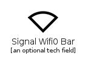|[material-4.0/Device/SignalWifi0Bar](../material-4.0/Device/SignalWifi0Bar.md)
|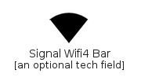|[material-4.0/Device/SignalWifi4Bar](../material-4.0/Device/SignalWifi4Bar.md)
||[material-4.0/Device/SignalWifi4BarLock](../material-4.0/Device/SignalWifi4BarLock.md)
||[material-4.0/Device/SignalWifiOff](../material-4.0/Device/SignalWifiOff.md)
||[material-4.0/Device/Storage](../material-4.0/Device/Storage.md)
|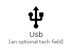|[material-4.0/Device/Usb](../material-4.0/Device/Usb.md)
||[material-4.0/Device/Wallpaper](../material-4.0/Device/Wallpaper.md)
||[material-4.0/Device/Widgets](../material-4.0/Device/Widgets.md)
||[material-4.0/Device/WifiLock](../material-4.0/Device/WifiLock.md)
||[material-4.0/Device/WifiTethering](../material-4.0/Device/WifiTethering.md)

