# Editor

The module Editor contains 86 entries.

| |Name|
|:---:|---|
||[material-4.0/Editor/AddChart](../material-4.0/Editor/AddChart.md)
||[material-4.0/Editor/AddComment](../material-4.0/Editor/AddComment.md)
||[material-4.0/Editor/AttachFile](../material-4.0/Editor/AttachFile.md)
||[material-4.0/Editor/AttachMoney](../material-4.0/Editor/AttachMoney.md)
||[material-4.0/Editor/BarChart](../material-4.0/Editor/BarChart.md)
||[material-4.0/Editor/BorderAll](../material-4.0/Editor/BorderAll.md)
||[material-4.0/Editor/BorderBottom](../material-4.0/Editor/BorderBottom.md)
||[material-4.0/Editor/BorderClear](../material-4.0/Editor/BorderClear.md)
||[material-4.0/Editor/BorderColor](../material-4.0/Editor/BorderColor.md)
||[material-4.0/Editor/BorderHorizontal](../material-4.0/Editor/BorderHorizontal.md)
||[material-4.0/Editor/BorderInner](../material-4.0/Editor/BorderInner.md)
||[material-4.0/Editor/BorderLeft](../material-4.0/Editor/BorderLeft.md)
|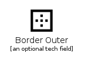|[material-4.0/Editor/BorderOuter](../material-4.0/Editor/BorderOuter.md)
||[material-4.0/Editor/BorderRight](../material-4.0/Editor/BorderRight.md)
||[material-4.0/Editor/BorderStyle](../material-4.0/Editor/BorderStyle.md)
||[material-4.0/Editor/BorderTop](../material-4.0/Editor/BorderTop.md)
||[material-4.0/Editor/BorderVertical](../material-4.0/Editor/BorderVertical.md)
|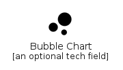|[material-4.0/Editor/BubbleChart](../material-4.0/Editor/BubbleChart.md)
|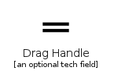|[material-4.0/Editor/DragHandle](../material-4.0/Editor/DragHandle.md)
||[material-4.0/Editor/FormatAlignCenter](../material-4.0/Editor/FormatAlignCenter.md)
||[material-4.0/Editor/FormatAlignJustify](../material-4.0/Editor/FormatAlignJustify.md)
||[material-4.0/Editor/FormatAlignLeft](../material-4.0/Editor/FormatAlignLeft.md)
||[material-4.0/Editor/FormatAlignRight](../material-4.0/Editor/FormatAlignRight.md)
|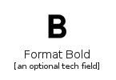|[material-4.0/Editor/FormatBold](../material-4.0/Editor/FormatBold.md)
||[material-4.0/Editor/FormatClear](../material-4.0/Editor/FormatClear.md)
|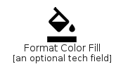|[material-4.0/Editor/FormatColorFill](../material-4.0/Editor/FormatColorFill.md)
|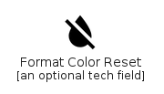|[material-4.0/Editor/FormatColorReset](../material-4.0/Editor/FormatColorReset.md)
|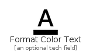|[material-4.0/Editor/FormatColorText](../material-4.0/Editor/FormatColorText.md)
||[material-4.0/Editor/FormatIndentDecrease](../material-4.0/Editor/FormatIndentDecrease.md)
||[material-4.0/Editor/FormatIndentIncrease](../material-4.0/Editor/FormatIndentIncrease.md)
|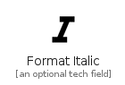|[material-4.0/Editor/FormatItalic](../material-4.0/Editor/FormatItalic.md)
||[material-4.0/Editor/FormatLineSpacing](../material-4.0/Editor/FormatLineSpacing.md)
||[material-4.0/Editor/FormatListBulleted](../material-4.0/Editor/FormatListBulleted.md)
|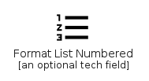|[material-4.0/Editor/FormatListNumbered](../material-4.0/Editor/FormatListNumbered.md)
|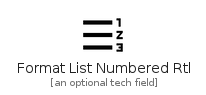|[material-4.0/Editor/FormatListNumberedRtl](../material-4.0/Editor/FormatListNumberedRtl.md)
|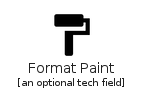|[material-4.0/Editor/FormatPaint](../material-4.0/Editor/FormatPaint.md)
||[material-4.0/Editor/FormatQuote](../material-4.0/Editor/FormatQuote.md)
|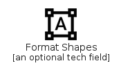|[material-4.0/Editor/FormatShapes](../material-4.0/Editor/FormatShapes.md)
|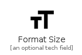|[material-4.0/Editor/FormatSize](../material-4.0/Editor/FormatSize.md)
||[material-4.0/Editor/FormatStrikethrough](../material-4.0/Editor/FormatStrikethrough.md)
|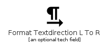|[material-4.0/Editor/FormatTextdirectionLToR](../material-4.0/Editor/FormatTextdirectionLToR.md)
|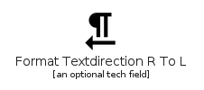|[material-4.0/Editor/FormatTextdirectionRToL](../material-4.0/Editor/FormatTextdirectionRToL.md)
||[material-4.0/Editor/FormatUnderlined](../material-4.0/Editor/FormatUnderlined.md)
|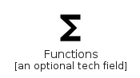|[material-4.0/Editor/Functions](../material-4.0/Editor/Functions.md)
|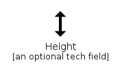|[material-4.0/Editor/Height](../material-4.0/Editor/Height.md)
||[material-4.0/Editor/Highlight](../material-4.0/Editor/Highlight.md)
|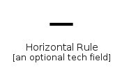|[material-4.0/Editor/HorizontalRule](../material-4.0/Editor/HorizontalRule.md)
||[material-4.0/Editor/InsertChart](../material-4.0/Editor/InsertChart.md)
||[material-4.0/Editor/InsertChartOutlined](../material-4.0/Editor/InsertChartOutlined.md)
||[material-4.0/Editor/InsertComment](../material-4.0/Editor/InsertComment.md)
||[material-4.0/Editor/InsertDriveFile](../material-4.0/Editor/InsertDriveFile.md)
||[material-4.0/Editor/InsertEmoticon](../material-4.0/Editor/InsertEmoticon.md)
||[material-4.0/Editor/InsertInvitation](../material-4.0/Editor/InsertInvitation.md)
||[material-4.0/Editor/InsertLink](../material-4.0/Editor/InsertLink.md)
||[material-4.0/Editor/InsertPhoto](../material-4.0/Editor/InsertPhoto.md)
|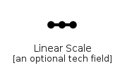|[material-4.0/Editor/LinearScale](../material-4.0/Editor/LinearScale.md)
||[material-4.0/Editor/Margin](../material-4.0/Editor/Margin.md)
||[material-4.0/Editor/MergeType](../material-4.0/Editor/MergeType.md)
||[material-4.0/Editor/ModeComment](../material-4.0/Editor/ModeComment.md)
|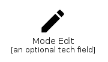|[material-4.0/Editor/ModeEdit](../material-4.0/Editor/ModeEdit.md)
||[material-4.0/Editor/MonetizationOn](../material-4.0/Editor/MonetizationOn.md)
||[material-4.0/Editor/MoneyOff](../material-4.0/Editor/MoneyOff.md)
|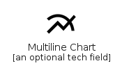|[material-4.0/Editor/MultilineChart](../material-4.0/Editor/MultilineChart.md)
|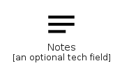|[material-4.0/Editor/Notes](../material-4.0/Editor/Notes.md)
|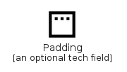|[material-4.0/Editor/Padding](../material-4.0/Editor/Padding.md)
||[material-4.0/Editor/PieChart](../material-4.0/Editor/PieChart.md)
||[material-4.0/Editor/PieChartOutlined](../material-4.0/Editor/PieChartOutlined.md)
||[material-4.0/Editor/PostAdd](../material-4.0/Editor/PostAdd.md)
||[material-4.0/Editor/Publish](../material-4.0/Editor/Publish.md)
|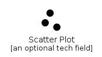|[material-4.0/Editor/ScatterPlot](../material-4.0/Editor/ScatterPlot.md)
||[material-4.0/Editor/Score](../material-4.0/Editor/Score.md)
|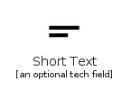|[material-4.0/Editor/ShortText](../material-4.0/Editor/ShortText.md)
||[material-4.0/Editor/ShowChart](../material-4.0/Editor/ShowChart.md)
||[material-4.0/Editor/SpaceBar](../material-4.0/Editor/SpaceBar.md)
||[material-4.0/Editor/StackedLineChart](../material-4.0/Editor/StackedLineChart.md)
||[material-4.0/Editor/StrikethroughS](../material-4.0/Editor/StrikethroughS.md)
||[material-4.0/Editor/Subscript](../material-4.0/Editor/Subscript.md)
||[material-4.0/Editor/Superscript](../material-4.0/Editor/Superscript.md)
||[material-4.0/Editor/TableChart](../material-4.0/Editor/TableChart.md)
||[material-4.0/Editor/TableRows](../material-4.0/Editor/TableRows.md)
||[material-4.0/Editor/TextFields](../material-4.0/Editor/TextFields.md)
||[material-4.0/Editor/Title](../material-4.0/Editor/Title.md)
|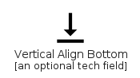|[material-4.0/Editor/VerticalAlignBottom](../material-4.0/Editor/VerticalAlignBottom.md)
||[material-4.0/Editor/VerticalAlignCenter](../material-4.0/Editor/VerticalAlignCenter.md)
|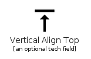|[material-4.0/Editor/VerticalAlignTop](../material-4.0/Editor/VerticalAlignTop.md)
|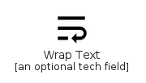|[material-4.0/Editor/WrapText](../material-4.0/Editor/WrapText.md)

