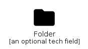
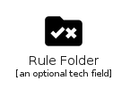

# File

The module File contains 30 entries.

| |Name|
|:---:|---|
||[material-4.0/File/Approval](../material-4.0/File/Approval.md)
||[material-4.0/File/AttachEmail](../material-4.0/File/AttachEmail.md)
||[material-4.0/File/Attachment](../material-4.0/File/Attachment.md)
||[material-4.0/File/Cloud](../material-4.0/File/Cloud.md)
||[material-4.0/File/CloudCircle](../material-4.0/File/CloudCircle.md)
||[material-4.0/File/CloudDone](../material-4.0/File/CloudDone.md)
||[material-4.0/File/CloudDownload](../material-4.0/File/CloudDownload.md)
||[material-4.0/File/CloudOff](../material-4.0/File/CloudOff.md)
||[material-4.0/File/CloudQueue](../material-4.0/File/CloudQueue.md)
||[material-4.0/File/CloudUpload](../material-4.0/File/CloudUpload.md)
||[material-4.0/File/CreateNewFolder](../material-4.0/File/CreateNewFolder.md)
||[material-4.0/File/DriveFileMove](../material-4.0/File/DriveFileMove.md)
||[material-4.0/File/DriveFileMoveOutline](../material-4.0/File/DriveFileMoveOutline.md)
||[material-4.0/File/DriveFileRenameOutline](../material-4.0/File/DriveFileRenameOutline.md)
||[material-4.0/File/DriveFolderUpload](../material-4.0/File/DriveFolderUpload.md)
||[material-4.0/File/FileDownload](../material-4.0/File/FileDownload.md)
||[material-4.0/File/FileDownloadDone](../material-4.0/File/FileDownloadDone.md)
||[material-4.0/File/FileUpload](../material-4.0/File/FileUpload.md)
||[material-4.0/File/Folder](../material-4.0/File/Folder.md)
||[material-4.0/File/FolderOpen](../material-4.0/File/FolderOpen.md)
||[material-4.0/File/FolderShared](../material-4.0/File/FolderShared.md)
||[material-4.0/File/GridView](../material-4.0/File/GridView.md)
||[material-4.0/File/RequestQuote](../material-4.0/File/RequestQuote.md)
||[material-4.0/File/RuleFolder](../material-4.0/File/RuleFolder.md)
||[material-4.0/File/SnippetFolder](../material-4.0/File/SnippetFolder.md)
||[material-4.0/File/TextSnippet](../material-4.0/File/TextSnippet.md)
||[material-4.0/File/Topic](../material-4.0/File/Topic.md)
||[material-4.0/File/UploadFile](../material-4.0/File/UploadFile.md)
||[material-4.0/File/WorkspacesFilled](../material-4.0/File/WorkspacesFilled.md)
||[material-4.0/File/WorkspacesOutline](../material-4.0/File/WorkspacesOutline.md)

