# Hardware

The module Hardware contains 55 entries.

| |Name|
|:---:|---|
||[material-4.0/Hardware/BrowserNotSupported](../material-4.0/Hardware/BrowserNotSupported.md)
|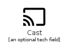|[material-4.0/Hardware/Cast](../material-4.0/Hardware/Cast.md)
||[material-4.0/Hardware/CastConnected](../material-4.0/Hardware/CastConnected.md)
||[material-4.0/Hardware/CastForEducation](../material-4.0/Hardware/CastForEducation.md)
|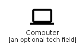|[material-4.0/Hardware/Computer](../material-4.0/Hardware/Computer.md)
||[material-4.0/Hardware/ConnectedTv](../material-4.0/Hardware/ConnectedTv.md)
||[material-4.0/Hardware/DesktopMac](../material-4.0/Hardware/DesktopMac.md)
||[material-4.0/Hardware/DesktopWindows](../material-4.0/Hardware/DesktopWindows.md)
||[material-4.0/Hardware/DeveloperBoard](../material-4.0/Hardware/DeveloperBoard.md)
|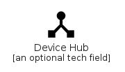|[material-4.0/Hardware/DeviceHub](../material-4.0/Hardware/DeviceHub.md)
||[material-4.0/Hardware/DevicesOther](../material-4.0/Hardware/DevicesOther.md)
||[material-4.0/Hardware/DeviceUnknown](../material-4.0/Hardware/DeviceUnknown.md)
||[material-4.0/Hardware/Dock](../material-4.0/Hardware/Dock.md)
||[material-4.0/Hardware/Gamepad](../material-4.0/Hardware/Gamepad.md)
||[material-4.0/Hardware/Headset](../material-4.0/Hardware/Headset.md)
||[material-4.0/Hardware/HeadsetMic](../material-4.0/Hardware/HeadsetMic.md)
||[material-4.0/Hardware/HeadsetOff](../material-4.0/Hardware/HeadsetOff.md)
|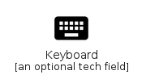|[material-4.0/Hardware/Keyboard](../material-4.0/Hardware/Keyboard.md)
||[material-4.0/Hardware/KeyboardArrowDown](../material-4.0/Hardware/KeyboardArrowDown.md)
||[material-4.0/Hardware/KeyboardArrowLeft](../material-4.0/Hardware/KeyboardArrowLeft.md)
||[material-4.0/Hardware/KeyboardArrowRight](../material-4.0/Hardware/KeyboardArrowRight.md)
|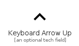|[material-4.0/Hardware/KeyboardArrowUp](../material-4.0/Hardware/KeyboardArrowUp.md)
|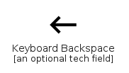|[material-4.0/Hardware/KeyboardBackspace](../material-4.0/Hardware/KeyboardBackspace.md)
|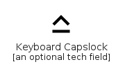|[material-4.0/Hardware/KeyboardCapslock](../material-4.0/Hardware/KeyboardCapslock.md)
|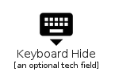|[material-4.0/Hardware/KeyboardHide](../material-4.0/Hardware/KeyboardHide.md)
||[material-4.0/Hardware/KeyboardReturn](../material-4.0/Hardware/KeyboardReturn.md)
|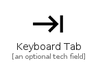|[material-4.0/Hardware/KeyboardTab](../material-4.0/Hardware/KeyboardTab.md)
||[material-4.0/Hardware/KeyboardVoice](../material-4.0/Hardware/KeyboardVoice.md)
|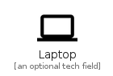|[material-4.0/Hardware/Laptop](../material-4.0/Hardware/Laptop.md)
|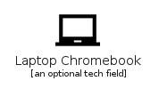|[material-4.0/Hardware/LaptopChromebook](../material-4.0/Hardware/LaptopChromebook.md)
|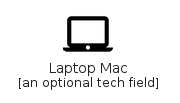|[material-4.0/Hardware/LaptopMac](../material-4.0/Hardware/LaptopMac.md)
||[material-4.0/Hardware/LaptopWindows](../material-4.0/Hardware/LaptopWindows.md)
||[material-4.0/Hardware/Memory](../material-4.0/Hardware/Memory.md)
||[material-4.0/Hardware/Monitor](../material-4.0/Hardware/Monitor.md)
||[material-4.0/Hardware/Mouse](../material-4.0/Hardware/Mouse.md)
|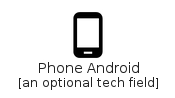|[material-4.0/Hardware/PhoneAndroid](../material-4.0/Hardware/PhoneAndroid.md)
|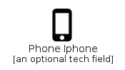|[material-4.0/Hardware/PhoneIphone](../material-4.0/Hardware/PhoneIphone.md)
||[material-4.0/Hardware/Phonelink](../material-4.0/Hardware/Phonelink.md)
||[material-4.0/Hardware/PhonelinkOff](../material-4.0/Hardware/PhonelinkOff.md)
||[material-4.0/Hardware/PointOfSale](../material-4.0/Hardware/PointOfSale.md)
|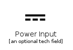|[material-4.0/Hardware/PowerInput](../material-4.0/Hardware/PowerInput.md)
|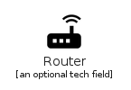|[material-4.0/Hardware/Router](../material-4.0/Hardware/Router.md)
||[material-4.0/Hardware/Scanner](../material-4.0/Hardware/Scanner.md)
||[material-4.0/Hardware/Security](../material-4.0/Hardware/Security.md)
|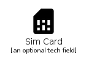|[material-4.0/Hardware/SimCard](../material-4.0/Hardware/SimCard.md)
||[material-4.0/Hardware/Smartphone](../material-4.0/Hardware/Smartphone.md)
||[material-4.0/Hardware/Speaker](../material-4.0/Hardware/Speaker.md)
||[material-4.0/Hardware/SpeakerGroup](../material-4.0/Hardware/SpeakerGroup.md)
|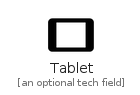|[material-4.0/Hardware/Tablet](../material-4.0/Hardware/Tablet.md)
||[material-4.0/Hardware/TabletAndroid](../material-4.0/Hardware/TabletAndroid.md)
||[material-4.0/Hardware/TabletMac](../material-4.0/Hardware/TabletMac.md)
|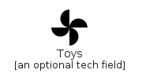|[material-4.0/Hardware/Toys](../material-4.0/Hardware/Toys.md)
|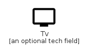|[material-4.0/Hardware/Tv](../material-4.0/Hardware/Tv.md)
|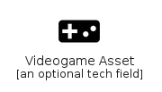|[material-4.0/Hardware/VideogameAsset](../material-4.0/Hardware/VideogameAsset.md)
|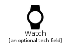|[material-4.0/Hardware/Watch](../material-4.0/Hardware/Watch.md)

