# Maps

The module Maps contains 146 entries.

| |Name|
|:---:|---|
|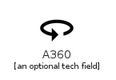|[material-4.0/Maps/A360](../material-4.0/Maps/A360.md)
||[material-4.0/Maps/AddBusiness](../material-4.0/Maps/AddBusiness.md)
||[material-4.0/Maps/AddLocation](../material-4.0/Maps/AddLocation.md)
||[material-4.0/Maps/AddLocationAlt](../material-4.0/Maps/AddLocationAlt.md)
||[material-4.0/Maps/AddRoad](../material-4.0/Maps/AddRoad.md)
|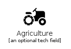|[material-4.0/Maps/Agriculture](../material-4.0/Maps/Agriculture.md)
|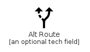|[material-4.0/Maps/AltRoute](../material-4.0/Maps/AltRoute.md)
|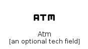|[material-4.0/Maps/Atm](../material-4.0/Maps/Atm.md)
|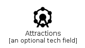|[material-4.0/Maps/Attractions](../material-4.0/Maps/Attractions.md)
||[material-4.0/Maps/Badge](../material-4.0/Maps/Badge.md)
||[material-4.0/Maps/BakeryDining](../material-4.0/Maps/BakeryDining.md)
||[material-4.0/Maps/Beenhere](../material-4.0/Maps/Beenhere.md)
||[material-4.0/Maps/BikeScooter](../material-4.0/Maps/BikeScooter.md)
||[material-4.0/Maps/BreakfastDining](../material-4.0/Maps/BreakfastDining.md)
||[material-4.0/Maps/BrunchDining](../material-4.0/Maps/BrunchDining.md)
||[material-4.0/Maps/BusAlert](../material-4.0/Maps/BusAlert.md)
||[material-4.0/Maps/CarRental](../material-4.0/Maps/CarRental.md)
||[material-4.0/Maps/CarRepair](../material-4.0/Maps/CarRepair.md)
||[material-4.0/Maps/Category](../material-4.0/Maps/Category.md)
||[material-4.0/Maps/Celebration](../material-4.0/Maps/Celebration.md)
||[material-4.0/Maps/CleaningServices](../material-4.0/Maps/CleaningServices.md)
||[material-4.0/Maps/CompassCalibration](../material-4.0/Maps/CompassCalibration.md)
||[material-4.0/Maps/DeliveryDining](../material-4.0/Maps/DeliveryDining.md)
||[material-4.0/Maps/DepartureBoard](../material-4.0/Maps/DepartureBoard.md)
||[material-4.0/Maps/DesignServices](../material-4.0/Maps/DesignServices.md)
||[material-4.0/Maps/DinnerDining](../material-4.0/Maps/DinnerDining.md)
||[material-4.0/Maps/Directions](../material-4.0/Maps/Directions.md)
||[material-4.0/Maps/DirectionsBike](../material-4.0/Maps/DirectionsBike.md)
||[material-4.0/Maps/DirectionsBoat](../material-4.0/Maps/DirectionsBoat.md)
||[material-4.0/Maps/DirectionsBus](../material-4.0/Maps/DirectionsBus.md)
||[material-4.0/Maps/DirectionsCar](../material-4.0/Maps/DirectionsCar.md)
||[material-4.0/Maps/DirectionsRailway](../material-4.0/Maps/DirectionsRailway.md)
||[material-4.0/Maps/DirectionsRun](../material-4.0/Maps/DirectionsRun.md)
||[material-4.0/Maps/DirectionsSubway](../material-4.0/Maps/DirectionsSubway.md)
||[material-4.0/Maps/DirectionsTransit](../material-4.0/Maps/DirectionsTransit.md)
|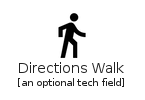|[material-4.0/Maps/DirectionsWalk](../material-4.0/Maps/DirectionsWalk.md)
||[material-4.0/Maps/DryCleaning](../material-4.0/Maps/DryCleaning.md)
||[material-4.0/Maps/EditAttributes](../material-4.0/Maps/EditAttributes.md)
||[material-4.0/Maps/EditLocation](../material-4.0/Maps/EditLocation.md)
||[material-4.0/Maps/EditRoad](../material-4.0/Maps/EditRoad.md)
||[material-4.0/Maps/ElectricalServices](../material-4.0/Maps/ElectricalServices.md)
|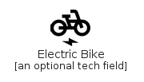|[material-4.0/Maps/ElectricBike](../material-4.0/Maps/ElectricBike.md)
|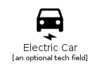|[material-4.0/Maps/ElectricCar](../material-4.0/Maps/ElectricCar.md)
|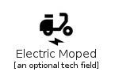|[material-4.0/Maps/ElectricMoped](../material-4.0/Maps/ElectricMoped.md)
|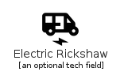|[material-4.0/Maps/ElectricRickshaw](../material-4.0/Maps/ElectricRickshaw.md)
||[material-4.0/Maps/ElectricScooter](../material-4.0/Maps/ElectricScooter.md)
|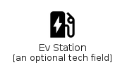|[material-4.0/Maps/EvStation](../material-4.0/Maps/EvStation.md)
||[material-4.0/Maps/Fastfood](../material-4.0/Maps/Fastfood.md)
|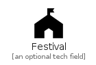|[material-4.0/Maps/Festival](../material-4.0/Maps/Festival.md)
||[material-4.0/Maps/Flight](../material-4.0/Maps/Flight.md)
|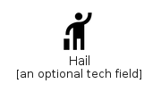|[material-4.0/Maps/Hail](../material-4.0/Maps/Hail.md)
||[material-4.0/Maps/Handyman](../material-4.0/Maps/Handyman.md)
||[material-4.0/Maps/Hardware](../material-4.0/Maps/Hardware.md)
||[material-4.0/Maps/HomeRepairService](../material-4.0/Maps/HomeRepairService.md)
||[material-4.0/Maps/Hotel](../material-4.0/Maps/Hotel.md)
|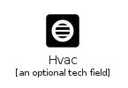|[material-4.0/Maps/Hvac](../material-4.0/Maps/Hvac.md)
|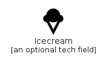|[material-4.0/Maps/Icecream](../material-4.0/Maps/Icecream.md)
||[material-4.0/Maps/Layers](../material-4.0/Maps/Layers.md)
||[material-4.0/Maps/LayersClear](../material-4.0/Maps/LayersClear.md)
||[material-4.0/Maps/Liquor](../material-4.0/Maps/Liquor.md)
||[material-4.0/Maps/LocalActivity](../material-4.0/Maps/LocalActivity.md)
||[material-4.0/Maps/LocalAirport](../material-4.0/Maps/LocalAirport.md)
||[material-4.0/Maps/LocalAtm](../material-4.0/Maps/LocalAtm.md)
|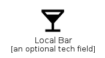|[material-4.0/Maps/LocalBar](../material-4.0/Maps/LocalBar.md)
||[material-4.0/Maps/LocalCafe](../material-4.0/Maps/LocalCafe.md)
||[material-4.0/Maps/LocalCarWash](../material-4.0/Maps/LocalCarWash.md)
||[material-4.0/Maps/LocalConvenienceStore](../material-4.0/Maps/LocalConvenienceStore.md)
|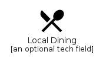|[material-4.0/Maps/LocalDining](../material-4.0/Maps/LocalDining.md)
||[material-4.0/Maps/LocalDrink](../material-4.0/Maps/LocalDrink.md)
||[material-4.0/Maps/LocalFireDepartment](../material-4.0/Maps/LocalFireDepartment.md)
||[material-4.0/Maps/LocalFlorist](../material-4.0/Maps/LocalFlorist.md)
||[material-4.0/Maps/LocalGasStation](../material-4.0/Maps/LocalGasStation.md)
||[material-4.0/Maps/LocalGroceryStore](../material-4.0/Maps/LocalGroceryStore.md)
||[material-4.0/Maps/LocalHospital](../material-4.0/Maps/LocalHospital.md)
||[material-4.0/Maps/LocalHotel](../material-4.0/Maps/LocalHotel.md)
||[material-4.0/Maps/LocalLaundryService](../material-4.0/Maps/LocalLaundryService.md)
||[material-4.0/Maps/LocalLibrary](../material-4.0/Maps/LocalLibrary.md)
||[material-4.0/Maps/LocalMall](../material-4.0/Maps/LocalMall.md)
||[material-4.0/Maps/LocalMovies](../material-4.0/Maps/LocalMovies.md)
||[material-4.0/Maps/LocalOffer](../material-4.0/Maps/LocalOffer.md)
||[material-4.0/Maps/LocalParking](../material-4.0/Maps/LocalParking.md)
||[material-4.0/Maps/LocalPharmacy](../material-4.0/Maps/LocalPharmacy.md)
||[material-4.0/Maps/LocalPhone](../material-4.0/Maps/LocalPhone.md)
||[material-4.0/Maps/LocalPizza](../material-4.0/Maps/LocalPizza.md)
||[material-4.0/Maps/LocalPlay](../material-4.0/Maps/LocalPlay.md)
||[material-4.0/Maps/LocalPolice](../material-4.0/Maps/LocalPolice.md)
||[material-4.0/Maps/LocalPostOffice](../material-4.0/Maps/LocalPostOffice.md)
||[material-4.0/Maps/LocalPrintshop](../material-4.0/Maps/LocalPrintshop.md)
||[material-4.0/Maps/LocalSee](../material-4.0/Maps/LocalSee.md)
||[material-4.0/Maps/LocalShipping](../material-4.0/Maps/LocalShipping.md)
||[material-4.0/Maps/LocalTaxi](../material-4.0/Maps/LocalTaxi.md)
||[material-4.0/Maps/LocationPin](../material-4.0/Maps/LocationPin.md)
||[material-4.0/Maps/LunchDining](../material-4.0/Maps/LunchDining.md)
||[material-4.0/Maps/Map](../material-4.0/Maps/Map.md)
||[material-4.0/Maps/MapsUgc](../material-4.0/Maps/MapsUgc.md)
||[material-4.0/Maps/MedicalServices](../material-4.0/Maps/MedicalServices.md)
||[material-4.0/Maps/MenuBook](../material-4.0/Maps/MenuBook.md)
||[material-4.0/Maps/MiscellaneousServices](../material-4.0/Maps/MiscellaneousServices.md)
||[material-4.0/Maps/Money](../material-4.0/Maps/Money.md)
|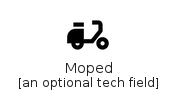|[material-4.0/Maps/Moped](../material-4.0/Maps/Moped.md)
|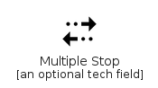|[material-4.0/Maps/MultipleStop](../material-4.0/Maps/MultipleStop.md)
|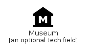|[material-4.0/Maps/Museum](../material-4.0/Maps/Museum.md)
||[material-4.0/Maps/MyLocation](../material-4.0/Maps/MyLocation.md)
||[material-4.0/Maps/Navigation](../material-4.0/Maps/Navigation.md)
||[material-4.0/Maps/NearMe](../material-4.0/Maps/NearMe.md)
||[material-4.0/Maps/NearMeDisabled](../material-4.0/Maps/NearMeDisabled.md)
||[material-4.0/Maps/Nightlife](../material-4.0/Maps/Nightlife.md)
||[material-4.0/Maps/NoMeals](../material-4.0/Maps/NoMeals.md)
||[material-4.0/Maps/NoMealsOuline](../material-4.0/Maps/NoMealsOuline.md)
||[material-4.0/Maps/NotListedLocation](../material-4.0/Maps/NotListedLocation.md)
||[material-4.0/Maps/NoTransfer](../material-4.0/Maps/NoTransfer.md)
|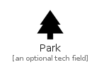|[material-4.0/Maps/Park](../material-4.0/Maps/Park.md)
||[material-4.0/Maps/PedalBike](../material-4.0/Maps/PedalBike.md)
||[material-4.0/Maps/PersonPin](../material-4.0/Maps/PersonPin.md)
||[material-4.0/Maps/PersonPinCircle](../material-4.0/Maps/PersonPinCircle.md)
||[material-4.0/Maps/PestControl](../material-4.0/Maps/PestControl.md)
||[material-4.0/Maps/PestControlRodent](../material-4.0/Maps/PestControlRodent.md)
||[material-4.0/Maps/PinDrop](../material-4.0/Maps/PinDrop.md)
||[material-4.0/Maps/Place](../material-4.0/Maps/Place.md)
||[material-4.0/Maps/Plumbing](../material-4.0/Maps/Plumbing.md)
||[material-4.0/Maps/RailwayAlert](../material-4.0/Maps/RailwayAlert.md)
||[material-4.0/Maps/RamenDining](../material-4.0/Maps/RamenDining.md)
||[material-4.0/Maps/RateReview](../material-4.0/Maps/RateReview.md)
|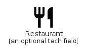|[material-4.0/Maps/Restaurant](../material-4.0/Maps/Restaurant.md)
||[material-4.0/Maps/RestaurantMenu](../material-4.0/Maps/RestaurantMenu.md)
|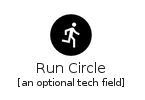|[material-4.0/Maps/RunCircle](../material-4.0/Maps/RunCircle.md)
||[material-4.0/Maps/Satellite](../material-4.0/Maps/Satellite.md)
||[material-4.0/Maps/SetMeal](../material-4.0/Maps/SetMeal.md)
||[material-4.0/Maps/StoreMallDirectory](../material-4.0/Maps/StoreMallDirectory.md)
||[material-4.0/Maps/Streetview](../material-4.0/Maps/Streetview.md)
||[material-4.0/Maps/Subway](../material-4.0/Maps/Subway.md)
||[material-4.0/Maps/TakeoutDining](../material-4.0/Maps/TakeoutDining.md)
||[material-4.0/Maps/TaxiAlert](../material-4.0/Maps/TaxiAlert.md)
|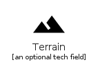|[material-4.0/Maps/Terrain](../material-4.0/Maps/Terrain.md)
||[material-4.0/Maps/TheaterComedy](../material-4.0/Maps/TheaterComedy.md)
||[material-4.0/Maps/Traffic](../material-4.0/Maps/Traffic.md)
||[material-4.0/Maps/Train](../material-4.0/Maps/Train.md)
||[material-4.0/Maps/Tram](../material-4.0/Maps/Tram.md)
|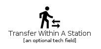|[material-4.0/Maps/TransferWithinAStation](../material-4.0/Maps/TransferWithinAStation.md)
||[material-4.0/Maps/TransitEnterexit](../material-4.0/Maps/TransitEnterexit.md)
||[material-4.0/Maps/TripOrigin](../material-4.0/Maps/TripOrigin.md)
|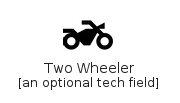|[material-4.0/Maps/TwoWheeler](../material-4.0/Maps/TwoWheeler.md)
||[material-4.0/Maps/VolunteerActivism](../material-4.0/Maps/VolunteerActivism.md)
||[material-4.0/Maps/WineBar](../material-4.0/Maps/WineBar.md)
||[material-4.0/Maps/WrongLocation](../material-4.0/Maps/WrongLocation.md)
||[material-4.0/Maps/ZoomOutMap](../material-4.0/Maps/ZoomOutMap.md)

