# Navigation

The module Navigation contains 53 entries.

| |Name|
|:---:|---|
||[material-4.0/Navigation/Apps](../material-4.0/Navigation/Apps.md)
||[material-4.0/Navigation/AppSettingsAlt](../material-4.0/Navigation/AppSettingsAlt.md)
|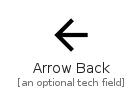|[material-4.0/Navigation/ArrowBack](../material-4.0/Navigation/ArrowBack.md)
|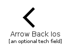|[material-4.0/Navigation/ArrowBackIos](../material-4.0/Navigation/ArrowBackIos.md)
|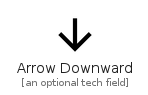|[material-4.0/Navigation/ArrowDownward](../material-4.0/Navigation/ArrowDownward.md)
||[material-4.0/Navigation/ArrowDropDown](../material-4.0/Navigation/ArrowDropDown.md)
||[material-4.0/Navigation/ArrowDropDownCircle](../material-4.0/Navigation/ArrowDropDownCircle.md)
|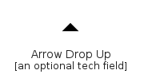|[material-4.0/Navigation/ArrowDropUp](../material-4.0/Navigation/ArrowDropUp.md)
|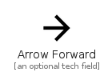|[material-4.0/Navigation/ArrowForward](../material-4.0/Navigation/ArrowForward.md)
|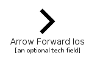|[material-4.0/Navigation/ArrowForwardIos](../material-4.0/Navigation/ArrowForwardIos.md)
|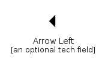|[material-4.0/Navigation/ArrowLeft](../material-4.0/Navigation/ArrowLeft.md)
||[material-4.0/Navigation/ArrowRight](../material-4.0/Navigation/ArrowRight.md)
|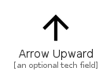|[material-4.0/Navigation/ArrowUpward](../material-4.0/Navigation/ArrowUpward.md)
||[material-4.0/Navigation/AssistantDirection](../material-4.0/Navigation/AssistantDirection.md)
||[material-4.0/Navigation/AssistantNavigation](../material-4.0/Navigation/AssistantNavigation.md)
||[material-4.0/Navigation/Campaign](../material-4.0/Navigation/Campaign.md)
||[material-4.0/Navigation/Cancel](../material-4.0/Navigation/Cancel.md)
||[material-4.0/Navigation/Check](../material-4.0/Navigation/Check.md)
|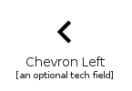|[material-4.0/Navigation/ChevronLeft](../material-4.0/Navigation/ChevronLeft.md)
|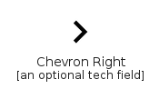|[material-4.0/Navigation/ChevronRight](../material-4.0/Navigation/ChevronRight.md)
|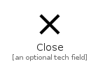|[material-4.0/Navigation/Close](../material-4.0/Navigation/Close.md)
||[material-4.0/Navigation/DoubleArrow](../material-4.0/Navigation/DoubleArrow.md)
|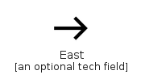|[material-4.0/Navigation/East](../material-4.0/Navigation/East.md)
|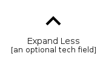|[material-4.0/Navigation/ExpandLess](../material-4.0/Navigation/ExpandLess.md)
||[material-4.0/Navigation/ExpandMore](../material-4.0/Navigation/ExpandMore.md)
||[material-4.0/Navigation/FirstPage](../material-4.0/Navigation/FirstPage.md)
||[material-4.0/Navigation/Fullscreen](../material-4.0/Navigation/Fullscreen.md)
|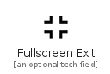|[material-4.0/Navigation/FullscreenExit](../material-4.0/Navigation/FullscreenExit.md)
||[material-4.0/Navigation/HomeWork](../material-4.0/Navigation/HomeWork.md)
||[material-4.0/Navigation/LastPage](../material-4.0/Navigation/LastPage.md)
||[material-4.0/Navigation/LegendToggle](../material-4.0/Navigation/LegendToggle.md)
|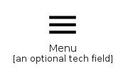|[material-4.0/Navigation/Menu](../material-4.0/Navigation/Menu.md)
||[material-4.0/Navigation/MenuOpen](../material-4.0/Navigation/MenuOpen.md)
||[material-4.0/Navigation/MoreHoriz](../material-4.0/Navigation/MoreHoriz.md)
|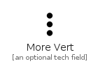|[material-4.0/Navigation/MoreVert](../material-4.0/Navigation/MoreVert.md)
|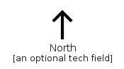|[material-4.0/Navigation/North](../material-4.0/Navigation/North.md)
||[material-4.0/Navigation/NorthEast](../material-4.0/Navigation/NorthEast.md)
|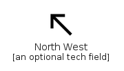|[material-4.0/Navigation/NorthWest](../material-4.0/Navigation/NorthWest.md)
||[material-4.0/Navigation/OfflineShare](../material-4.0/Navigation/OfflineShare.md)
||[material-4.0/Navigation/Payments](../material-4.0/Navigation/Payments.md)
||[material-4.0/Navigation/PivotTableChart](../material-4.0/Navigation/PivotTableChart.md)
||[material-4.0/Navigation/Refresh](../material-4.0/Navigation/Refresh.md)
|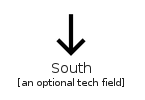|[material-4.0/Navigation/South](../material-4.0/Navigation/South.md)
||[material-4.0/Navigation/SouthEast](../material-4.0/Navigation/SouthEast.md)
||[material-4.0/Navigation/SouthWest](../material-4.0/Navigation/SouthWest.md)
|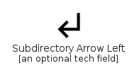|[material-4.0/Navigation/SubdirectoryArrowLeft](../material-4.0/Navigation/SubdirectoryArrowLeft.md)
|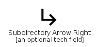|[material-4.0/Navigation/SubdirectoryArrowRight](../material-4.0/Navigation/SubdirectoryArrowRight.md)
|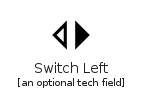|[material-4.0/Navigation/SwitchLeft](../material-4.0/Navigation/SwitchLeft.md)
||[material-4.0/Navigation/SwitchRight](../material-4.0/Navigation/SwitchRight.md)
||[material-4.0/Navigation/UnfoldLess](../material-4.0/Navigation/UnfoldLess.md)
|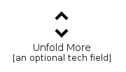|[material-4.0/Navigation/UnfoldMore](../material-4.0/Navigation/UnfoldMore.md)
||[material-4.0/Navigation/WaterfallChart](../material-4.0/Navigation/WaterfallChart.md)
|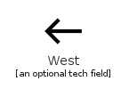|[material-4.0/Navigation/West](../material-4.0/Navigation/West.md)

