# Notification

The module Notification contains 62 entries.

| |Name|
|:---:|---|
||[material-4.0/Notification/AccountTree](../material-4.0/Notification/AccountTree.md)
|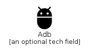|[material-4.0/Notification/Adb](../material-4.0/Notification/Adb.md)
||[material-4.0/Notification/AddCall](../material-4.0/Notification/AddCall.md)
||[material-4.0/Notification/AirlineSeatFlat](../material-4.0/Notification/AirlineSeatFlat.md)
||[material-4.0/Notification/AirlineSeatFlatAngled](../material-4.0/Notification/AirlineSeatFlatAngled.md)
||[material-4.0/Notification/AirlineSeatIndividualSuite](../material-4.0/Notification/AirlineSeatIndividualSuite.md)
||[material-4.0/Notification/AirlineSeatLegroomExtra](../material-4.0/Notification/AirlineSeatLegroomExtra.md)
||[material-4.0/Notification/AirlineSeatLegroomNormal](../material-4.0/Notification/AirlineSeatLegroomNormal.md)
||[material-4.0/Notification/AirlineSeatLegroomReduced](../material-4.0/Notification/AirlineSeatLegroomReduced.md)
||[material-4.0/Notification/AirlineSeatReclineExtra](../material-4.0/Notification/AirlineSeatReclineExtra.md)
||[material-4.0/Notification/AirlineSeatReclineNormal](../material-4.0/Notification/AirlineSeatReclineNormal.md)
|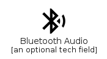|[material-4.0/Notification/BluetoothAudio](../material-4.0/Notification/BluetoothAudio.md)
||[material-4.0/Notification/ConfirmationNumber](../material-4.0/Notification/ConfirmationNumber.md)
||[material-4.0/Notification/DirectionsOff](../material-4.0/Notification/DirectionsOff.md)
||[material-4.0/Notification/DiscFull](../material-4.0/Notification/DiscFull.md)
||[material-4.0/Notification/DoNotDisturb](../material-4.0/Notification/DoNotDisturb.md)
||[material-4.0/Notification/DoNotDisturbAlt](../material-4.0/Notification/DoNotDisturbAlt.md)
||[material-4.0/Notification/DoNotDisturbOff](../material-4.0/Notification/DoNotDisturbOff.md)
||[material-4.0/Notification/DoNotDisturbOn](../material-4.0/Notification/DoNotDisturbOn.md)
|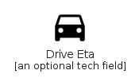|[material-4.0/Notification/DriveEta](../material-4.0/Notification/DriveEta.md)
||[material-4.0/Notification/EnhancedEncryption](../material-4.0/Notification/EnhancedEncryption.md)
||[material-4.0/Notification/EventAvailable](../material-4.0/Notification/EventAvailable.md)
||[material-4.0/Notification/EventBusy](../material-4.0/Notification/EventBusy.md)
||[material-4.0/Notification/EventNote](../material-4.0/Notification/EventNote.md)
||[material-4.0/Notification/FolderSpecial](../material-4.0/Notification/FolderSpecial.md)
||[material-4.0/Notification/ImagesearchRoller](../material-4.0/Notification/ImagesearchRoller.md)
||[material-4.0/Notification/LiveTv](../material-4.0/Notification/LiveTv.md)
|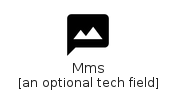|[material-4.0/Notification/Mms](../material-4.0/Notification/Mms.md)
|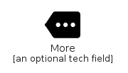|[material-4.0/Notification/More](../material-4.0/Notification/More.md)
||[material-4.0/Notification/NetworkCheck](../material-4.0/Notification/NetworkCheck.md)
||[material-4.0/Notification/NetworkLocked](../material-4.0/Notification/NetworkLocked.md)
||[material-4.0/Notification/NoEncryption](../material-4.0/Notification/NoEncryption.md)
||[material-4.0/Notification/OndemandVideo](../material-4.0/Notification/OndemandVideo.md)
||[material-4.0/Notification/PersonalVideo](../material-4.0/Notification/PersonalVideo.md)
|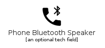|[material-4.0/Notification/PhoneBluetoothSpeaker](../material-4.0/Notification/PhoneBluetoothSpeaker.md)
|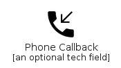|[material-4.0/Notification/PhoneCallback](../material-4.0/Notification/PhoneCallback.md)
|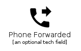|[material-4.0/Notification/PhoneForwarded](../material-4.0/Notification/PhoneForwarded.md)
||[material-4.0/Notification/PhoneInTalk](../material-4.0/Notification/PhoneInTalk.md)
||[material-4.0/Notification/PhoneLocked](../material-4.0/Notification/PhoneLocked.md)
||[material-4.0/Notification/PhoneMissed](../material-4.0/Notification/PhoneMissed.md)
||[material-4.0/Notification/PhonePaused](../material-4.0/Notification/PhonePaused.md)
|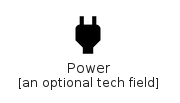|[material-4.0/Notification/Power](../material-4.0/Notification/Power.md)
|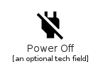|[material-4.0/Notification/PowerOff](../material-4.0/Notification/PowerOff.md)
||[material-4.0/Notification/PriorityHigh](../material-4.0/Notification/PriorityHigh.md)
|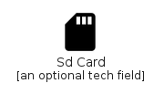|[material-4.0/Notification/SdCard](../material-4.0/Notification/SdCard.md)
|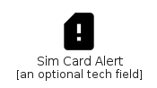|[material-4.0/Notification/SimCardAlert](../material-4.0/Notification/SimCardAlert.md)
|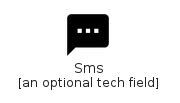|[material-4.0/Notification/Sms](../material-4.0/Notification/Sms.md)
|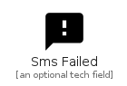|[material-4.0/Notification/SmsFailed](../material-4.0/Notification/SmsFailed.md)
||[material-4.0/Notification/SupportAgent](../material-4.0/Notification/SupportAgent.md)
|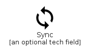|[material-4.0/Notification/Sync](../material-4.0/Notification/Sync.md)
|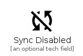|[material-4.0/Notification/SyncDisabled](../material-4.0/Notification/SyncDisabled.md)
|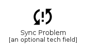|[material-4.0/Notification/SyncProblem](../material-4.0/Notification/SyncProblem.md)
||[material-4.0/Notification/SystemUpdate](../material-4.0/Notification/SystemUpdate.md)
||[material-4.0/Notification/TapAndPlay](../material-4.0/Notification/TapAndPlay.md)
||[material-4.0/Notification/TimeToLeave](../material-4.0/Notification/TimeToLeave.md)
||[material-4.0/Notification/TvOff](../material-4.0/Notification/TvOff.md)
|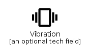|[material-4.0/Notification/Vibration](../material-4.0/Notification/Vibration.md)
||[material-4.0/Notification/VoiceChat](../material-4.0/Notification/VoiceChat.md)
||[material-4.0/Notification/VpnLock](../material-4.0/Notification/VpnLock.md)
||[material-4.0/Notification/Wc](../material-4.0/Notification/Wc.md)
|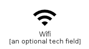|[material-4.0/Notification/Wifi](../material-4.0/Notification/Wifi.md)
||[material-4.0/Notification/WifiOff](../material-4.0/Notification/WifiOff.md)

