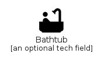
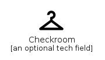
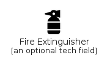
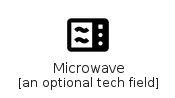
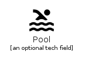
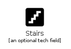
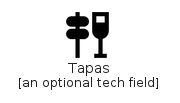
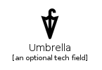
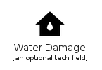

# Places

The module Places contains 68 entries.

| |Name|
|:---:|---|
||[material-4.0/Places/AcUnit](../material-4.0/Places/AcUnit.md)
||[material-4.0/Places/AirportShuttle](../material-4.0/Places/AirportShuttle.md)
||[material-4.0/Places/AllInclusive](../material-4.0/Places/AllInclusive.md)
||[material-4.0/Places/Apartment](../material-4.0/Places/Apartment.md)
||[material-4.0/Places/BabyChangingStation](../material-4.0/Places/BabyChangingStation.md)
||[material-4.0/Places/Backpack](../material-4.0/Places/Backpack.md)
||[material-4.0/Places/Bathtub](../material-4.0/Places/Bathtub.md)
||[material-4.0/Places/BeachAccess](../material-4.0/Places/BeachAccess.md)
||[material-4.0/Places/Bento](../material-4.0/Places/Bento.md)
||[material-4.0/Places/BusinessCenter](../material-4.0/Places/BusinessCenter.md)
||[material-4.0/Places/Carpenter](../material-4.0/Places/Carpenter.md)
||[material-4.0/Places/Casino](../material-4.0/Places/Casino.md)
||[material-4.0/Places/ChargingStation](../material-4.0/Places/ChargingStation.md)
||[material-4.0/Places/Checkroom](../material-4.0/Places/Checkroom.md)
||[material-4.0/Places/ChildCare](../material-4.0/Places/ChildCare.md)
||[material-4.0/Places/ChildFriendly](../material-4.0/Places/ChildFriendly.md)
||[material-4.0/Places/CorporateFare](../material-4.0/Places/CorporateFare.md)
||[material-4.0/Places/Countertops](../material-4.0/Places/Countertops.md)
||[material-4.0/Places/DoNotStep](../material-4.0/Places/DoNotStep.md)
||[material-4.0/Places/DoNotTouch](../material-4.0/Places/DoNotTouch.md)
||[material-4.0/Places/Dry](../material-4.0/Places/Dry.md)
||[material-4.0/Places/Elevator](../material-4.0/Places/Elevator.md)
||[material-4.0/Places/Escalator](../material-4.0/Places/Escalator.md)
||[material-4.0/Places/EscalatorWarning](../material-4.0/Places/EscalatorWarning.md)
||[material-4.0/Places/FamilyRestroom](../material-4.0/Places/FamilyRestroom.md)
||[material-4.0/Places/Fence](../material-4.0/Places/Fence.md)
||[material-4.0/Places/FireExtinguisher](../material-4.0/Places/FireExtinguisher.md)
||[material-4.0/Places/FitnessCenter](../material-4.0/Places/FitnessCenter.md)
||[material-4.0/Places/FoodBank](../material-4.0/Places/FoodBank.md)
||[material-4.0/Places/Foundation](../material-4.0/Places/Foundation.md)
||[material-4.0/Places/FreeBreakfast](../material-4.0/Places/FreeBreakfast.md)
||[material-4.0/Places/GolfCourse](../material-4.0/Places/GolfCourse.md)
||[material-4.0/Places/Grass](../material-4.0/Places/Grass.md)
||[material-4.0/Places/HotTub](../material-4.0/Places/HotTub.md)
||[material-4.0/Places/House](../material-4.0/Places/House.md)
||[material-4.0/Places/HouseSiding](../material-4.0/Places/HouseSiding.md)
||[material-4.0/Places/Kitchen](../material-4.0/Places/Kitchen.md)
||[material-4.0/Places/MeetingRoom](../material-4.0/Places/MeetingRoom.md)
||[material-4.0/Places/Microwave](../material-4.0/Places/Microwave.md)
||[material-4.0/Places/NightShelter](../material-4.0/Places/NightShelter.md)
||[material-4.0/Places/NoBackpack](../material-4.0/Places/NoBackpack.md)
||[material-4.0/Places/NoCell](../material-4.0/Places/NoCell.md)
||[material-4.0/Places/NoDrinks](../material-4.0/Places/NoDrinks.md)
||[material-4.0/Places/NoFlash](../material-4.0/Places/NoFlash.md)
||[material-4.0/Places/NoFood](../material-4.0/Places/NoFood.md)
||[material-4.0/Places/NoMeetingRoom](../material-4.0/Places/NoMeetingRoom.md)
||[material-4.0/Places/NoPhotography](../material-4.0/Places/NoPhotography.md)
||[material-4.0/Places/NoStroller](../material-4.0/Places/NoStroller.md)
||[material-4.0/Places/Pool](../material-4.0/Places/Pool.md)
||[material-4.0/Places/RiceBowl](../material-4.0/Places/RiceBowl.md)
||[material-4.0/Places/Roofing](../material-4.0/Places/Roofing.md)
||[material-4.0/Places/RoomPreferences](../material-4.0/Places/RoomPreferences.md)
||[material-4.0/Places/RoomService](../material-4.0/Places/RoomService.md)
||[material-4.0/Places/RvHookup](../material-4.0/Places/RvHookup.md)
||[material-4.0/Places/SmokeFree](../material-4.0/Places/SmokeFree.md)
||[material-4.0/Places/SmokingRooms](../material-4.0/Places/SmokingRooms.md)
||[material-4.0/Places/Soap](../material-4.0/Places/Soap.md)
||[material-4.0/Places/Spa](../material-4.0/Places/Spa.md)
||[material-4.0/Places/SportsBar](../material-4.0/Places/SportsBar.md)
||[material-4.0/Places/Stairs](../material-4.0/Places/Stairs.md)
||[material-4.0/Places/Storefront](../material-4.0/Places/Storefront.md)
||[material-4.0/Places/Stroller](../material-4.0/Places/Stroller.md)
||[material-4.0/Places/Tapas](../material-4.0/Places/Tapas.md)
||[material-4.0/Places/Tty](../material-4.0/Places/Tty.md)
||[material-4.0/Places/Umbrella](../material-4.0/Places/Umbrella.md)
||[material-4.0/Places/Wash](../material-4.0/Places/Wash.md)
||[material-4.0/Places/WaterDamage](../material-4.0/Places/WaterDamage.md)
||[material-4.0/Places/WheelchairPickup](../material-4.0/Places/WheelchairPickup.md)

