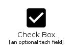
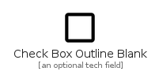
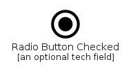
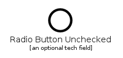
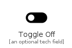
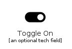

# Toggle

The module Toggle contains 11 entries.

| |Name|
|:---:|---|
||[material-4.0/Toggle/CheckBox](../material-4.0/Toggle/CheckBox.md)
||[material-4.0/Toggle/CheckBoxOutlineBlank](../material-4.0/Toggle/CheckBoxOutlineBlank.md)
||[material-4.0/Toggle/IndeterminateCheckBox](../material-4.0/Toggle/IndeterminateCheckBox.md)
||[material-4.0/Toggle/RadioButtonChecked](../material-4.0/Toggle/RadioButtonChecked.md)
||[material-4.0/Toggle/RadioButtonUnchecked](../material-4.0/Toggle/RadioButtonUnchecked.md)
||[material-4.0/Toggle/Star](../material-4.0/Toggle/Star.md)
||[material-4.0/Toggle/StarBorder](../material-4.0/Toggle/StarBorder.md)
||[material-4.0/Toggle/StarHalf](../material-4.0/Toggle/StarHalf.md)
||[material-4.0/Toggle/StarOutline](../material-4.0/Toggle/StarOutline.md)
||[material-4.0/Toggle/ToggleOff](../material-4.0/Toggle/ToggleOff.md)
||[material-4.0/Toggle/ToggleOn](../material-4.0/Toggle/ToggleOn.md)

