# A

The module A contains 146 entries.

| |Name|
|:---:|---|
|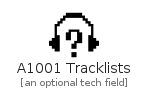|[simpleicons-4.1/A/A1001Tracklists](../simpleicons-4.1/A/A1001Tracklists.md)
||[simpleicons-4.1/A/A1Password](../simpleicons-4.1/A/A1Password.md)
|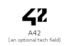|[simpleicons-4.1/A/A42](../simpleicons-4.1/A/A42.md)
|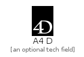|[simpleicons-4.1/A/A4D](../simpleicons-4.1/A/A4D.md)
|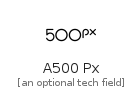|[simpleicons-4.1/A/A500Px](../simpleicons-4.1/A/A500Px.md)
||[simpleicons-4.1/A/Abbrobotstudio](../simpleicons-4.1/A/Abbrobotstudio.md)
||[simpleicons-4.1/A/Abletonlive](../simpleicons-4.1/A/Abletonlive.md)
||[simpleicons-4.1/A/AboutDotMe](../simpleicons-4.1/A/AboutDotMe.md)
||[simpleicons-4.1/A/Abstract](../simpleicons-4.1/A/Abstract.md)
||[simpleicons-4.1/A/Academia](../simpleicons-4.1/A/Academia.md)
||[simpleicons-4.1/A/Accusoft](../simpleicons-4.1/A/Accusoft.md)
|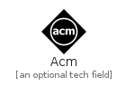|[simpleicons-4.1/A/Acm](../simpleicons-4.1/A/Acm.md)
|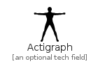|[simpleicons-4.1/A/Actigraph](../simpleicons-4.1/A/Actigraph.md)
|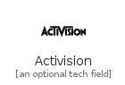|[simpleicons-4.1/A/Activision](../simpleicons-4.1/A/Activision.md)
||[simpleicons-4.1/A/Adblock](../simpleicons-4.1/A/Adblock.md)
||[simpleicons-4.1/A/Adblockplus](../simpleicons-4.1/A/Adblockplus.md)
||[simpleicons-4.1/A/Addthis](../simpleicons-4.1/A/Addthis.md)
||[simpleicons-4.1/A/Adguard](../simpleicons-4.1/A/Adguard.md)
||[simpleicons-4.1/A/Adobe](../simpleicons-4.1/A/Adobe.md)
||[simpleicons-4.1/A/Adobeacrobatreader](../simpleicons-4.1/A/Adobeacrobatreader.md)
|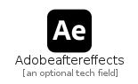|[simpleicons-4.1/A/Adobeaftereffects](../simpleicons-4.1/A/Adobeaftereffects.md)
||[simpleicons-4.1/A/Adobeaudition](../simpleicons-4.1/A/Adobeaudition.md)
||[simpleicons-4.1/A/Adobecreativecloud](../simpleicons-4.1/A/Adobecreativecloud.md)
||[simpleicons-4.1/A/Adobedreamweaver](../simpleicons-4.1/A/Adobedreamweaver.md)
||[simpleicons-4.1/A/Adobefonts](../simpleicons-4.1/A/Adobefonts.md)
||[simpleicons-4.1/A/Adobeillustrator](../simpleicons-4.1/A/Adobeillustrator.md)
||[simpleicons-4.1/A/Adobeindesign](../simpleicons-4.1/A/Adobeindesign.md)
||[simpleicons-4.1/A/Adobelightroom](../simpleicons-4.1/A/Adobelightroom.md)
||[simpleicons-4.1/A/Adobelightroomclassic](../simpleicons-4.1/A/Adobelightroomclassic.md)
||[simpleicons-4.1/A/Adobephonegap](../simpleicons-4.1/A/Adobephonegap.md)
||[simpleicons-4.1/A/Adobephotoshop](../simpleicons-4.1/A/Adobephotoshop.md)
||[simpleicons-4.1/A/Adobepremierepro](../simpleicons-4.1/A/Adobepremierepro.md)
||[simpleicons-4.1/A/Adobexd](../simpleicons-4.1/A/Adobexd.md)
||[simpleicons-4.1/A/Adonisjs](../simpleicons-4.1/A/Adonisjs.md)
||[simpleicons-4.1/A/Aerlingus](../simpleicons-4.1/A/Aerlingus.md)
|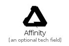|[simpleicons-4.1/A/Affinity](../simpleicons-4.1/A/Affinity.md)
||[simpleicons-4.1/A/Affinitydesigner](../simpleicons-4.1/A/Affinitydesigner.md)
||[simpleicons-4.1/A/Affinityphoto](../simpleicons-4.1/A/Affinityphoto.md)
||[simpleicons-4.1/A/Affinitypublisher](../simpleicons-4.1/A/Affinitypublisher.md)
|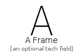|[simpleicons-4.1/A/AFrame](../simpleicons-4.1/A/AFrame.md)
||[simpleicons-4.1/A/Aiqfome](../simpleicons-4.1/A/Aiqfome.md)
||[simpleicons-4.1/A/Airbnb](../simpleicons-4.1/A/Airbnb.md)
||[simpleicons-4.1/A/Airbus](../simpleicons-4.1/A/Airbus.md)
||[simpleicons-4.1/A/Aircall](../simpleicons-4.1/A/Aircall.md)
||[simpleicons-4.1/A/Aircanada](../simpleicons-4.1/A/Aircanada.md)
||[simpleicons-4.1/A/Airfrance](../simpleicons-4.1/A/Airfrance.md)
||[simpleicons-4.1/A/Airplayaudio](../simpleicons-4.1/A/Airplayaudio.md)
||[simpleicons-4.1/A/Airplayvideo](../simpleicons-4.1/A/Airplayvideo.md)
||[simpleicons-4.1/A/Airtable](../simpleicons-4.1/A/Airtable.md)
||[simpleicons-4.1/A/Alfaromeo](../simpleicons-4.1/A/Alfaromeo.md)
||[simpleicons-4.1/A/Algolia](../simpleicons-4.1/A/Algolia.md)
||[simpleicons-4.1/A/Alipay](../simpleicons-4.1/A/Alipay.md)
||[simpleicons-4.1/A/Alliedmodders](../simpleicons-4.1/A/Alliedmodders.md)
||[simpleicons-4.1/A/Allocine](../simpleicons-4.1/A/Allocine.md)
||[simpleicons-4.1/A/Alpinelinux](../simpleicons-4.1/A/Alpinelinux.md)
||[simpleicons-4.1/A/Altiumdesigner](../simpleicons-4.1/A/Altiumdesigner.md)
||[simpleicons-4.1/A/Amazon](../simpleicons-4.1/A/Amazon.md)
||[simpleicons-4.1/A/Amazonalexa](../simpleicons-4.1/A/Amazonalexa.md)
||[simpleicons-4.1/A/Amazonaws](../simpleicons-4.1/A/Amazonaws.md)
||[simpleicons-4.1/A/Amazonfiretv](../simpleicons-4.1/A/Amazonfiretv.md)
||[simpleicons-4.1/A/Amazonlumberyard](../simpleicons-4.1/A/Amazonlumberyard.md)
||[simpleicons-4.1/A/Amazonprime](../simpleicons-4.1/A/Amazonprime.md)
|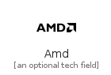|[simpleicons-4.1/A/Amd](../simpleicons-4.1/A/Amd.md)
||[simpleicons-4.1/A/Americanairlines](../simpleicons-4.1/A/Americanairlines.md)
||[simpleicons-4.1/A/Americanexpress](../simpleicons-4.1/A/Americanexpress.md)
||[simpleicons-4.1/A/Anaconda](../simpleicons-4.1/A/Anaconda.md)
||[simpleicons-4.1/A/Analogue](../simpleicons-4.1/A/Analogue.md)
||[simpleicons-4.1/A/Anchor](../simpleicons-4.1/A/Anchor.md)
||[simpleicons-4.1/A/Andela](../simpleicons-4.1/A/Andela.md)
||[simpleicons-4.1/A/Android](../simpleicons-4.1/A/Android.md)
||[simpleicons-4.1/A/Androidauto](../simpleicons-4.1/A/Androidauto.md)
||[simpleicons-4.1/A/Androidstudio](../simpleicons-4.1/A/Androidstudio.md)
||[simpleicons-4.1/A/Angellist](../simpleicons-4.1/A/Angellist.md)
||[simpleicons-4.1/A/Angular](../simpleicons-4.1/A/Angular.md)
||[simpleicons-4.1/A/Angularjs](../simpleicons-4.1/A/Angularjs.md)
||[simpleicons-4.1/A/Angularuniversal](../simpleicons-4.1/A/Angularuniversal.md)
||[simpleicons-4.1/A/Ansible](../simpleicons-4.1/A/Ansible.md)
||[simpleicons-4.1/A/Ansys](../simpleicons-4.1/A/Ansys.md)
||[simpleicons-4.1/A/Antdesign](../simpleicons-4.1/A/Antdesign.md)
|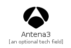|[simpleicons-4.1/A/Antena3](../simpleicons-4.1/A/Antena3.md)
|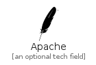|[simpleicons-4.1/A/Apache](../simpleicons-4.1/A/Apache.md)
||[simpleicons-4.1/A/Apacheairflow](../simpleicons-4.1/A/Apacheairflow.md)
|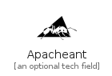|[simpleicons-4.1/A/Apacheant](../simpleicons-4.1/A/Apacheant.md)
||[simpleicons-4.1/A/Apachecassandra](../simpleicons-4.1/A/Apachecassandra.md)
||[simpleicons-4.1/A/Apachecloudstack](../simpleicons-4.1/A/Apachecloudstack.md)
|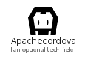|[simpleicons-4.1/A/Apachecordova](../simpleicons-4.1/A/Apachecordova.md)
|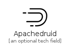|[simpleicons-4.1/A/Apachedruid](../simpleicons-4.1/A/Apachedruid.md)
||[simpleicons-4.1/A/Apacheecharts](../simpleicons-4.1/A/Apacheecharts.md)
||[simpleicons-4.1/A/Apacheflink](../simpleicons-4.1/A/Apacheflink.md)
||[simpleicons-4.1/A/Apachegroovy](../simpleicons-4.1/A/Apachegroovy.md)
||[simpleicons-4.1/A/Apachekafka](../simpleicons-4.1/A/Apachekafka.md)
||[simpleicons-4.1/A/Apachemaven](../simpleicons-4.1/A/Apachemaven.md)
||[simpleicons-4.1/A/Apachenetbeanside](../simpleicons-4.1/A/Apachenetbeanside.md)
||[simpleicons-4.1/A/Apacheopenoffice](../simpleicons-4.1/A/Apacheopenoffice.md)
||[simpleicons-4.1/A/Apachepulsar](../simpleicons-4.1/A/Apachepulsar.md)
||[simpleicons-4.1/A/Apacherocketmq](../simpleicons-4.1/A/Apacherocketmq.md)
||[simpleicons-4.1/A/Apachesolr](../simpleicons-4.1/A/Apachesolr.md)
||[simpleicons-4.1/A/Apachespark](../simpleicons-4.1/A/Apachespark.md)
||[simpleicons-4.1/A/Apollographql](../simpleicons-4.1/A/Apollographql.md)
||[simpleicons-4.1/A/Apple](../simpleicons-4.1/A/Apple.md)
||[simpleicons-4.1/A/Applemusic](../simpleicons-4.1/A/Applemusic.md)
||[simpleicons-4.1/A/Applepay](../simpleicons-4.1/A/Applepay.md)
||[simpleicons-4.1/A/Applepodcasts](../simpleicons-4.1/A/Applepodcasts.md)
||[simpleicons-4.1/A/Appletv](../simpleicons-4.1/A/Appletv.md)
||[simpleicons-4.1/A/Appsignal](../simpleicons-4.1/A/Appsignal.md)
||[simpleicons-4.1/A/Appstore](../simpleicons-4.1/A/Appstore.md)
||[simpleicons-4.1/A/Appveyor](../simpleicons-4.1/A/Appveyor.md)
|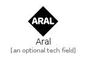|[simpleicons-4.1/A/Aral](../simpleicons-4.1/A/Aral.md)
||[simpleicons-4.1/A/Archicad](../simpleicons-4.1/A/Archicad.md)
||[simpleicons-4.1/A/Archiveofourown](../simpleicons-4.1/A/Archiveofourown.md)
||[simpleicons-4.1/A/Archlinux](../simpleicons-4.1/A/Archlinux.md)
||[simpleicons-4.1/A/Ardour](../simpleicons-4.1/A/Ardour.md)
|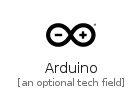|[simpleicons-4.1/A/Arduino](../simpleicons-4.1/A/Arduino.md)
|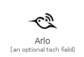|[simpleicons-4.1/A/Arlo](../simpleicons-4.1/A/Arlo.md)
||[simpleicons-4.1/A/Artstation](../simpleicons-4.1/A/Artstation.md)
|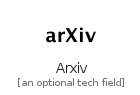|[simpleicons-4.1/A/Arxiv](../simpleicons-4.1/A/Arxiv.md)
||[simpleicons-4.1/A/Asana](../simpleicons-4.1/A/Asana.md)
||[simpleicons-4.1/A/Asciidoctor](../simpleicons-4.1/A/Asciidoctor.md)
||[simpleicons-4.1/A/Asciinema](../simpleicons-4.1/A/Asciinema.md)
|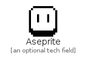|[simpleicons-4.1/A/Aseprite](../simpleicons-4.1/A/Aseprite.md)
||[simpleicons-4.1/A/Askfm](../simpleicons-4.1/A/Askfm.md)
||[simpleicons-4.1/A/Asus](../simpleicons-4.1/A/Asus.md)
||[simpleicons-4.1/A/AtAndT](../simpleicons-4.1/A/AtAndT.md)
|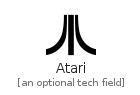|[simpleicons-4.1/A/Atari](../simpleicons-4.1/A/Atari.md)
||[simpleicons-4.1/A/Atlassian](../simpleicons-4.1/A/Atlassian.md)
||[simpleicons-4.1/A/Atom](../simpleicons-4.1/A/Atom.md)
||[simpleicons-4.1/A/Audacity](../simpleicons-4.1/A/Audacity.md)
|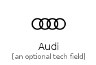|[simpleicons-4.1/A/Audi](../simpleicons-4.1/A/Audi.md)
||[simpleicons-4.1/A/Audible](../simpleicons-4.1/A/Audible.md)
||[simpleicons-4.1/A/Audioboom](../simpleicons-4.1/A/Audioboom.md)
||[simpleicons-4.1/A/Audiomack](../simpleicons-4.1/A/Audiomack.md)
||[simpleicons-4.1/A/AudioTechnica](../simpleicons-4.1/A/AudioTechnica.md)
||[simpleicons-4.1/A/Aurelia](../simpleicons-4.1/A/Aurelia.md)
||[simpleicons-4.1/A/Auth0](../simpleicons-4.1/A/Auth0.md)
||[simpleicons-4.1/A/Authy](../simpleicons-4.1/A/Authy.md)
||[simpleicons-4.1/A/Autodesk](../simpleicons-4.1/A/Autodesk.md)
||[simpleicons-4.1/A/Automatic](../simpleicons-4.1/A/Automatic.md)
||[simpleicons-4.1/A/Autotask](../simpleicons-4.1/A/Autotask.md)
||[simpleicons-4.1/A/Aventrix](../simpleicons-4.1/A/Aventrix.md)
||[simpleicons-4.1/A/Awesomelists](../simpleicons-4.1/A/Awesomelists.md)
||[simpleicons-4.1/A/Awesomewm](../simpleicons-4.1/A/Awesomewm.md)
||[simpleicons-4.1/A/Azureartifacts](../simpleicons-4.1/A/Azureartifacts.md)
||[simpleicons-4.1/A/Azuredataexplorer](../simpleicons-4.1/A/Azuredataexplorer.md)
||[simpleicons-4.1/A/Azuredevops](../simpleicons-4.1/A/Azuredevops.md)
||[simpleicons-4.1/A/Azurefunctions](../simpleicons-4.1/A/Azurefunctions.md)
||[simpleicons-4.1/A/Azurepipelines](../simpleicons-4.1/A/Azurepipelines.md)

