# C

The module C contains 97 entries.

| |Name|
|:---:|---|
|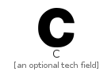|[simpleicons-4.1/C/C](../simpleicons-4.1/C/C.md)
||[simpleicons-4.1/C/Cairometro](../simpleicons-4.1/C/Cairometro.md)
||[simpleicons-4.1/C/Cakephp](../simpleicons-4.1/C/Cakephp.md)
||[simpleicons-4.1/C/Campaignmonitor](../simpleicons-4.1/C/Campaignmonitor.md)
||[simpleicons-4.1/C/Canonical](../simpleicons-4.1/C/Canonical.md)
||[simpleicons-4.1/C/Canva](../simpleicons-4.1/C/Canva.md)
||[simpleicons-4.1/C/Carthrottle](../simpleicons-4.1/C/Carthrottle.md)
||[simpleicons-4.1/C/Carto](../simpleicons-4.1/C/Carto.md)
||[simpleicons-4.1/C/Cashapp](../simpleicons-4.1/C/Cashapp.md)
||[simpleicons-4.1/C/Castbox](../simpleicons-4.1/C/Castbox.md)
||[simpleicons-4.1/C/Castorama](../simpleicons-4.1/C/Castorama.md)
||[simpleicons-4.1/C/Castro](../simpleicons-4.1/C/Castro.md)
||[simpleicons-4.1/C/Caterpillar](../simpleicons-4.1/C/Caterpillar.md)
|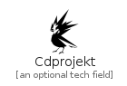|[simpleicons-4.1/C/Cdprojekt](../simpleicons-4.1/C/Cdprojekt.md)
||[simpleicons-4.1/C/Celery](../simpleicons-4.1/C/Celery.md)
|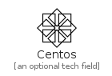|[simpleicons-4.1/C/Centos](../simpleicons-4.1/C/Centos.md)
||[simpleicons-4.1/C/Cesium](../simpleicons-4.1/C/Cesium.md)
|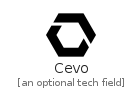|[simpleicons-4.1/C/Cevo](../simpleicons-4.1/C/Cevo.md)
||[simpleicons-4.1/C/Chartmogul](../simpleicons-4.1/C/Chartmogul.md)
||[simpleicons-4.1/C/Chase](../simpleicons-4.1/C/Chase.md)
||[simpleicons-4.1/C/Checkmarx](../simpleicons-4.1/C/Checkmarx.md)
||[simpleicons-4.1/C/Chef](../simpleicons-4.1/C/Chef.md)
||[simpleicons-4.1/C/Chocolatey](../simpleicons-4.1/C/Chocolatey.md)
||[simpleicons-4.1/C/Chupachups](../simpleicons-4.1/C/Chupachups.md)
||[simpleicons-4.1/C/Cinema4D](../simpleicons-4.1/C/Cinema4D.md)
||[simpleicons-4.1/C/Circle](../simpleicons-4.1/C/Circle.md)
|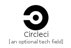|[simpleicons-4.1/C/Circleci](../simpleicons-4.1/C/Circleci.md)
||[simpleicons-4.1/C/Cirrusci](../simpleicons-4.1/C/Cirrusci.md)
||[simpleicons-4.1/C/Cisco](../simpleicons-4.1/C/Cisco.md)
||[simpleicons-4.1/C/Citrix](../simpleicons-4.1/C/Citrix.md)
||[simpleicons-4.1/C/Citroen](../simpleicons-4.1/C/Citroen.md)
|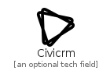|[simpleicons-4.1/C/Civicrm](../simpleicons-4.1/C/Civicrm.md)
||[simpleicons-4.1/C/Claris](../simpleicons-4.1/C/Claris.md)
||[simpleicons-4.1/C/Clickup](../simpleicons-4.1/C/Clickup.md)
||[simpleicons-4.1/C/Cliqz](../simpleicons-4.1/C/Cliqz.md)
||[simpleicons-4.1/C/Clockify](../simpleicons-4.1/C/Clockify.md)
||[simpleicons-4.1/C/Clojure](../simpleicons-4.1/C/Clojure.md)
||[simpleicons-4.1/C/Cloud66](../simpleicons-4.1/C/Cloud66.md)
||[simpleicons-4.1/C/Cloudbees](../simpleicons-4.1/C/Cloudbees.md)
||[simpleicons-4.1/C/Cloudcannon](../simpleicons-4.1/C/Cloudcannon.md)
||[simpleicons-4.1/C/Cloudflare](../simpleicons-4.1/C/Cloudflare.md)
||[simpleicons-4.1/C/Cloudsmith](../simpleicons-4.1/C/Cloudsmith.md)
||[simpleicons-4.1/C/Clubhouse](../simpleicons-4.1/C/Clubhouse.md)
|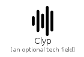|[simpleicons-4.1/C/Clyp](../simpleicons-4.1/C/Clyp.md)
||[simpleicons-4.1/C/Cmake](../simpleicons-4.1/C/Cmake.md)
||[simpleicons-4.1/C/Cnn](../simpleicons-4.1/C/Cnn.md)
|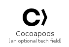|[simpleicons-4.1/C/Cocoapods](../simpleicons-4.1/C/Cocoapods.md)
|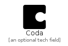|[simpleicons-4.1/C/Coda](../simpleicons-4.1/C/Coda.md)
||[simpleicons-4.1/C/Codacy](../simpleicons-4.1/C/Codacy.md)
||[simpleicons-4.1/C/Codecademy](../simpleicons-4.1/C/Codecademy.md)
||[simpleicons-4.1/C/Codechef](../simpleicons-4.1/C/Codechef.md)
|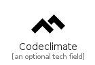|[simpleicons-4.1/C/Codeclimate](../simpleicons-4.1/C/Codeclimate.md)
||[simpleicons-4.1/C/Codecov](../simpleicons-4.1/C/Codecov.md)
|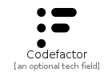|[simpleicons-4.1/C/Codefactor](../simpleicons-4.1/C/Codefactor.md)
|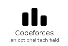|[simpleicons-4.1/C/Codeforces](../simpleicons-4.1/C/Codeforces.md)
||[simpleicons-4.1/C/Codeigniter](../simpleicons-4.1/C/Codeigniter.md)
|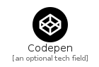|[simpleicons-4.1/C/Codepen](../simpleicons-4.1/C/Codepen.md)
||[simpleicons-4.1/C/Codersrank](../simpleicons-4.1/C/Codersrank.md)
||[simpleicons-4.1/C/Coderwall](../simpleicons-4.1/C/Coderwall.md)
||[simpleicons-4.1/C/Codesandbox](../simpleicons-4.1/C/Codesandbox.md)
||[simpleicons-4.1/C/Codeship](../simpleicons-4.1/C/Codeship.md)
|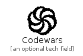|[simpleicons-4.1/C/Codewars](../simpleicons-4.1/C/Codewars.md)
||[simpleicons-4.1/C/Codio](../simpleicons-4.1/C/Codio.md)
||[simpleicons-4.1/C/Coffeescript](../simpleicons-4.1/C/Coffeescript.md)
||[simpleicons-4.1/C/Coinbase](../simpleicons-4.1/C/Coinbase.md)
||[simpleicons-4.1/C/Commonworkflowlanguage](../simpleicons-4.1/C/Commonworkflowlanguage.md)
||[simpleicons-4.1/C/Composer](../simpleicons-4.1/C/Composer.md)
||[simpleicons-4.1/C/Compropago](../simpleicons-4.1/C/Compropago.md)
||[simpleicons-4.1/C/Concourse](../simpleicons-4.1/C/Concourse.md)
||[simpleicons-4.1/C/CondaForge](../simpleicons-4.1/C/CondaForge.md)
||[simpleicons-4.1/C/Conekta](../simpleicons-4.1/C/Conekta.md)
||[simpleicons-4.1/C/Confluence](../simpleicons-4.1/C/Confluence.md)
||[simpleicons-4.1/C/Consul](../simpleicons-4.1/C/Consul.md)
||[simpleicons-4.1/C/Contactlesspayment](../simpleicons-4.1/C/Contactlesspayment.md)
||[simpleicons-4.1/C/Convertio](../simpleicons-4.1/C/Convertio.md)
||[simpleicons-4.1/C/CoOp](../simpleicons-4.1/C/CoOp.md)
||[simpleicons-4.1/C/Coronaengine](../simpleicons-4.1/C/Coronaengine.md)
||[simpleicons-4.1/C/Coronarenderer](../simpleicons-4.1/C/Coronarenderer.md)
||[simpleicons-4.1/C/Couchbase](../simpleicons-4.1/C/Couchbase.md)
||[simpleicons-4.1/C/CounterStrike](../simpleicons-4.1/C/CounterStrike.md)
||[simpleicons-4.1/C/Coursera](../simpleicons-4.1/C/Coursera.md)
||[simpleicons-4.1/C/Coveralls](../simpleicons-4.1/C/Coveralls.md)
||[simpleicons-4.1/C/Cpanel](../simpleicons-4.1/C/Cpanel.md)
||[simpleicons-4.1/C/Cplusplus](../simpleicons-4.1/C/Cplusplus.md)
||[simpleicons-4.1/C/Craftcms](../simpleicons-4.1/C/Craftcms.md)
||[simpleicons-4.1/C/Creativecommons](../simpleicons-4.1/C/Creativecommons.md)
||[simpleicons-4.1/C/Crehana](../simpleicons-4.1/C/Crehana.md)
||[simpleicons-4.1/C/Crowdin](../simpleicons-4.1/C/Crowdin.md)
||[simpleicons-4.1/C/Crunchbase](../simpleicons-4.1/C/Crunchbase.md)
||[simpleicons-4.1/C/Crunchyroll](../simpleicons-4.1/C/Crunchyroll.md)
|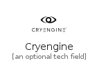|[simpleicons-4.1/C/Cryengine](../simpleicons-4.1/C/Cryengine.md)
|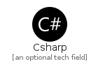|[simpleicons-4.1/C/Csharp](../simpleicons-4.1/C/Csharp.md)
||[simpleicons-4.1/C/Css3](../simpleicons-4.1/C/Css3.md)
||[simpleicons-4.1/C/Csswizardry](../simpleicons-4.1/C/Csswizardry.md)
||[simpleicons-4.1/C/Curl](../simpleicons-4.1/C/Curl.md)
||[simpleicons-4.1/C/Curseforge](../simpleicons-4.1/C/Curseforge.md)
||[simpleicons-4.1/C/Cypress](../simpleicons-4.1/C/Cypress.md)

