# F

The module F contains 59 entries.

| |Name|
|:---:|---|
||[simpleicons-4.1/F/Facebook](../simpleicons-4.1/F/Facebook.md)
||[simpleicons-4.1/F/Facebookgaming](../simpleicons-4.1/F/Facebookgaming.md)
||[simpleicons-4.1/F/Facebooklive](../simpleicons-4.1/F/Facebooklive.md)
||[simpleicons-4.1/F/Faceit](../simpleicons-4.1/F/Faceit.md)
||[simpleicons-4.1/F/Fandango](../simpleicons-4.1/F/Fandango.md)
||[simpleicons-4.1/F/Fandom](../simpleicons-4.1/F/Fandom.md)
||[simpleicons-4.1/F/Farfetch](../simpleicons-4.1/F/Farfetch.md)
||[simpleicons-4.1/F/Fastapi](../simpleicons-4.1/F/Fastapi.md)
||[simpleicons-4.1/F/Fastify](../simpleicons-4.1/F/Fastify.md)
||[simpleicons-4.1/F/Fastly](../simpleicons-4.1/F/Fastly.md)
||[simpleicons-4.1/F/Favro](../simpleicons-4.1/F/Favro.md)
||[simpleicons-4.1/F/FDroid](../simpleicons-4.1/F/FDroid.md)
||[simpleicons-4.1/F/Feathub](../simpleicons-4.1/F/Feathub.md)
||[simpleicons-4.1/F/Fedora](../simpleicons-4.1/F/Fedora.md)
||[simpleicons-4.1/F/Fedramp](../simpleicons-4.1/F/Fedramp.md)
||[simpleicons-4.1/F/Feedly](../simpleicons-4.1/F/Feedly.md)
||[simpleicons-4.1/F/Ferrari](../simpleicons-4.1/F/Ferrari.md)
|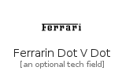|[simpleicons-4.1/F/FerrarinDotVDot](../simpleicons-4.1/F/FerrarinDotVDot.md)
||[simpleicons-4.1/F/Fiat](../simpleicons-4.1/F/Fiat.md)
||[simpleicons-4.1/F/Fidoalliance](../simpleicons-4.1/F/Fidoalliance.md)
|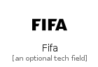|[simpleicons-4.1/F/Fifa](../simpleicons-4.1/F/Fifa.md)
|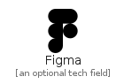|[simpleicons-4.1/F/Figma](../simpleicons-4.1/F/Figma.md)
||[simpleicons-4.1/F/Figshare](../simpleicons-4.1/F/Figshare.md)
|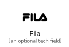|[simpleicons-4.1/F/Fila](../simpleicons-4.1/F/Fila.md)
||[simpleicons-4.1/F/Filezilla](../simpleicons-4.1/F/Filezilla.md)
||[simpleicons-4.1/F/Firebase](../simpleicons-4.1/F/Firebase.md)
||[simpleicons-4.1/F/Firefox](../simpleicons-4.1/F/Firefox.md)
||[simpleicons-4.1/F/Firefoxbrowser](../simpleicons-4.1/F/Firefoxbrowser.md)
|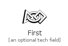|[simpleicons-4.1/F/First](../simpleicons-4.1/F/First.md)
||[simpleicons-4.1/F/Fitbit](../simpleicons-4.1/F/Fitbit.md)
|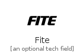|[simpleicons-4.1/F/Fite](../simpleicons-4.1/F/Fite.md)
||[simpleicons-4.1/F/Fiverr](../simpleicons-4.1/F/Fiverr.md)
|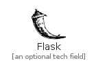|[simpleicons-4.1/F/Flask](../simpleicons-4.1/F/Flask.md)
||[simpleicons-4.1/F/Flathub](../simpleicons-4.1/F/Flathub.md)
|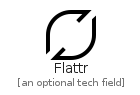|[simpleicons-4.1/F/Flattr](../simpleicons-4.1/F/Flattr.md)
|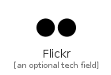|[simpleicons-4.1/F/Flickr](../simpleicons-4.1/F/Flickr.md)
||[simpleicons-4.1/F/Flipboard](../simpleicons-4.1/F/Flipboard.md)
||[simpleicons-4.1/F/Floatplane](../simpleicons-4.1/F/Floatplane.md)
|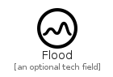|[simpleicons-4.1/F/Flood](../simpleicons-4.1/F/Flood.md)
||[simpleicons-4.1/F/Fluentd](../simpleicons-4.1/F/Fluentd.md)
||[simpleicons-4.1/F/Flutter](../simpleicons-4.1/F/Flutter.md)
|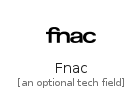|[simpleicons-4.1/F/Fnac](../simpleicons-4.1/F/Fnac.md)
||[simpleicons-4.1/F/Fontawesome](../simpleicons-4.1/F/Fontawesome.md)
||[simpleicons-4.1/F/Ford](../simpleicons-4.1/F/Ford.md)
||[simpleicons-4.1/F/Formstack](../simpleicons-4.1/F/Formstack.md)
|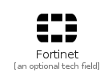|[simpleicons-4.1/F/Fortinet](../simpleicons-4.1/F/Fortinet.md)
||[simpleicons-4.1/F/Fossa](../simpleicons-4.1/F/Fossa.md)
||[simpleicons-4.1/F/Fossilscm](../simpleicons-4.1/F/Fossilscm.md)
||[simpleicons-4.1/F/Foursquare](../simpleicons-4.1/F/Foursquare.md)
||[simpleicons-4.1/F/Framer](../simpleicons-4.1/F/Framer.md)
||[simpleicons-4.1/F/Freebsd](../simpleicons-4.1/F/Freebsd.md)
||[simpleicons-4.1/F/Freecodecamp](../simpleicons-4.1/F/Freecodecamp.md)
||[simpleicons-4.1/F/FreedesktopDotOrg](../simpleicons-4.1/F/FreedesktopDotOrg.md)
||[simpleicons-4.1/F/Freelancer](../simpleicons-4.1/F/Freelancer.md)
||[simpleicons-4.1/F/FSecure](../simpleicons-4.1/F/FSecure.md)
|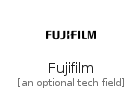|[simpleicons-4.1/F/Fujifilm](../simpleicons-4.1/F/Fujifilm.md)
|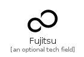|[simpleicons-4.1/F/Fujitsu](../simpleicons-4.1/F/Fujitsu.md)
||[simpleicons-4.1/F/Furaffinity](../simpleicons-4.1/F/Furaffinity.md)
||[simpleicons-4.1/F/Furrynetwork](../simpleicons-4.1/F/Furrynetwork.md)

