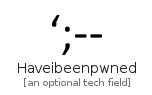
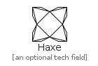
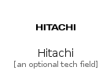
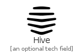

# H

The module H contains 52 entries.

| |Name|
|:---:|---|
||[simpleicons-4.1/H/Habr](../simpleicons-4.1/H/Habr.md)
||[simpleicons-4.1/H/Hackaday](../simpleicons-4.1/H/Hackaday.md)
||[simpleicons-4.1/H/Hackclub](../simpleicons-4.1/H/Hackclub.md)
||[simpleicons-4.1/H/Hackerearth](../simpleicons-4.1/H/Hackerearth.md)
||[simpleicons-4.1/H/Hackerone](../simpleicons-4.1/H/Hackerone.md)
||[simpleicons-4.1/H/Hackerrank](../simpleicons-4.1/H/Hackerrank.md)
||[simpleicons-4.1/H/Hackhands](../simpleicons-4.1/H/Hackhands.md)
||[simpleicons-4.1/H/Hackster](../simpleicons-4.1/H/Hackster.md)
||[simpleicons-4.1/H/Happycow](../simpleicons-4.1/H/Happycow.md)
||[simpleicons-4.1/H/Harbor](../simpleicons-4.1/H/Harbor.md)
||[simpleicons-4.1/H/Hashnode](../simpleicons-4.1/H/Hashnode.md)
||[simpleicons-4.1/H/Haskell](../simpleicons-4.1/H/Haskell.md)
||[simpleicons-4.1/H/Hatenabookmark](../simpleicons-4.1/H/Hatenabookmark.md)
||[simpleicons-4.1/H/Haveibeenpwned](../simpleicons-4.1/H/Haveibeenpwned.md)
||[simpleicons-4.1/H/Haxe](../simpleicons-4.1/H/Haxe.md)
||[simpleicons-4.1/H/Hbo](../simpleicons-4.1/H/Hbo.md)
||[simpleicons-4.1/H/Hcl](../simpleicons-4.1/H/Hcl.md)
||[simpleicons-4.1/H/Hellofresh](../simpleicons-4.1/H/Hellofresh.md)
||[simpleicons-4.1/H/Hellyhansen](../simpleicons-4.1/H/Hellyhansen.md)
||[simpleicons-4.1/H/Helm](../simpleicons-4.1/H/Helm.md)
||[simpleicons-4.1/H/Here](../simpleicons-4.1/H/Here.md)
||[simpleicons-4.1/H/Heroku](../simpleicons-4.1/H/Heroku.md)
||[simpleicons-4.1/H/Hexo](../simpleicons-4.1/H/Hexo.md)
||[simpleicons-4.1/H/Hey](../simpleicons-4.1/H/Hey.md)
||[simpleicons-4.1/H/Highly](../simpleicons-4.1/H/Highly.md)
||[simpleicons-4.1/H/Hilton](../simpleicons-4.1/H/Hilton.md)
||[simpleicons-4.1/H/Hipchat](../simpleicons-4.1/H/Hipchat.md)
||[simpleicons-4.1/H/Hitachi](../simpleicons-4.1/H/Hitachi.md)
||[simpleicons-4.1/H/Hive](../simpleicons-4.1/H/Hive.md)
||[simpleicons-4.1/H/Hockeyapp](../simpleicons-4.1/H/Hockeyapp.md)
||[simpleicons-4.1/H/Homeadvisor](../simpleicons-4.1/H/Homeadvisor.md)
||[simpleicons-4.1/H/Homeassistant](../simpleicons-4.1/H/Homeassistant.md)
||[simpleicons-4.1/H/Homebrew](../simpleicons-4.1/H/Homebrew.md)
||[simpleicons-4.1/H/Homify](../simpleicons-4.1/H/Homify.md)
||[simpleicons-4.1/H/Honda](../simpleicons-4.1/H/Honda.md)
||[simpleicons-4.1/H/Hootsuite](../simpleicons-4.1/H/Hootsuite.md)
||[simpleicons-4.1/H/Hoppscotch](../simpleicons-4.1/H/Hoppscotch.md)
||[simpleicons-4.1/H/HotelsDotCom](../simpleicons-4.1/H/HotelsDotCom.md)
||[simpleicons-4.1/H/Houdini](../simpleicons-4.1/H/Houdini.md)
||[simpleicons-4.1/H/Houzz](../simpleicons-4.1/H/Houzz.md)
||[simpleicons-4.1/H/Hp](../simpleicons-4.1/H/Hp.md)
||[simpleicons-4.1/H/Html5](../simpleicons-4.1/H/Html5.md)
||[simpleicons-4.1/H/Htmlacademy](../simpleicons-4.1/H/Htmlacademy.md)
||[simpleicons-4.1/H/Huawei](../simpleicons-4.1/H/Huawei.md)
||[simpleicons-4.1/H/Hubspot](../simpleicons-4.1/H/Hubspot.md)
||[simpleicons-4.1/H/Hugo](../simpleicons-4.1/H/Hugo.md)
||[simpleicons-4.1/H/Hulu](../simpleicons-4.1/H/Hulu.md)
||[simpleicons-4.1/H/Humblebundle](../simpleicons-4.1/H/Humblebundle.md)
||[simpleicons-4.1/H/Hurriyetemlak](../simpleicons-4.1/H/Hurriyetemlak.md)
||[simpleicons-4.1/H/Husqvarna](../simpleicons-4.1/H/Husqvarna.md)
||[simpleicons-4.1/H/Hypothesis](../simpleicons-4.1/H/Hypothesis.md)
||[simpleicons-4.1/H/Hyundai](../simpleicons-4.1/H/Hyundai.md)

