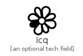
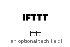
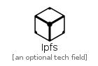

# I

The module I contains 40 entries.

| |Name|
|:---:|---|
||[simpleicons-4.1/I/Iata](../simpleicons-4.1/I/Iata.md)
||[simpleicons-4.1/I/Ibeacon](../simpleicons-4.1/I/Ibeacon.md)
||[simpleicons-4.1/I/Ibm](../simpleicons-4.1/I/Ibm.md)
||[simpleicons-4.1/I/Icloud](../simpleicons-4.1/I/Icloud.md)
||[simpleicons-4.1/I/Icomoon](../simpleicons-4.1/I/Icomoon.md)
||[simpleicons-4.1/I/Icon](../simpleicons-4.1/I/Icon.md)
||[simpleicons-4.1/I/Iconfinder](../simpleicons-4.1/I/Iconfinder.md)
||[simpleicons-4.1/I/Iconify](../simpleicons-4.1/I/Iconify.md)
||[simpleicons-4.1/I/Iconjar](../simpleicons-4.1/I/Iconjar.md)
||[simpleicons-4.1/I/Icq](../simpleicons-4.1/I/Icq.md)
||[simpleicons-4.1/I/Ideal](../simpleicons-4.1/I/Ideal.md)
||[simpleicons-4.1/I/Ifixit](../simpleicons-4.1/I/Ifixit.md)
||[simpleicons-4.1/I/Ifood](../simpleicons-4.1/I/Ifood.md)
||[simpleicons-4.1/I/Ifttt](../simpleicons-4.1/I/Ifttt.md)
||[simpleicons-4.1/I/Iheartradio](../simpleicons-4.1/I/Iheartradio.md)
||[simpleicons-4.1/I/Imdb](../simpleicons-4.1/I/Imdb.md)
||[simpleicons-4.1/I/Imgur](../simpleicons-4.1/I/Imgur.md)
||[simpleicons-4.1/I/Indeed](../simpleicons-4.1/I/Indeed.md)
||[simpleicons-4.1/I/Influxdb](../simpleicons-4.1/I/Influxdb.md)
||[simpleicons-4.1/I/Inkscape](../simpleicons-4.1/I/Inkscape.md)
||[simpleicons-4.1/I/Insomnia](../simpleicons-4.1/I/Insomnia.md)
||[simpleicons-4.1/I/Instacart](../simpleicons-4.1/I/Instacart.md)
||[simpleicons-4.1/I/Instagram](../simpleicons-4.1/I/Instagram.md)
||[simpleicons-4.1/I/Instapaper](../simpleicons-4.1/I/Instapaper.md)
||[simpleicons-4.1/I/Instructables](../simpleicons-4.1/I/Instructables.md)
||[simpleicons-4.1/I/Intel](../simpleicons-4.1/I/Intel.md)
||[simpleicons-4.1/I/Intellijidea](../simpleicons-4.1/I/Intellijidea.md)
||[simpleicons-4.1/I/Intercom](../simpleicons-4.1/I/Intercom.md)
||[simpleicons-4.1/I/Internetarchive](../simpleicons-4.1/I/Internetarchive.md)
||[simpleicons-4.1/I/Internetexplorer](../simpleicons-4.1/I/Internetexplorer.md)
||[simpleicons-4.1/I/Invision](../simpleicons-4.1/I/Invision.md)
||[simpleicons-4.1/I/Invoiceninja](../simpleicons-4.1/I/Invoiceninja.md)
||[simpleicons-4.1/I/Iobroker](../simpleicons-4.1/I/Iobroker.md)
||[simpleicons-4.1/I/Ionic](../simpleicons-4.1/I/Ionic.md)
||[simpleicons-4.1/I/Ios](../simpleicons-4.1/I/Ios.md)
||[simpleicons-4.1/I/Ipfs](../simpleicons-4.1/I/Ipfs.md)
||[simpleicons-4.1/I/Issuu](../simpleicons-4.1/I/Issuu.md)
||[simpleicons-4.1/I/ItchDotIo](../simpleicons-4.1/I/ItchDotIo.md)
||[simpleicons-4.1/I/Itunes](../simpleicons-4.1/I/Itunes.md)
||[simpleicons-4.1/I/Iveco](../simpleicons-4.1/I/Iveco.md)

