# K

The module K contains 33 entries.

| |Name|
|:---:|---|
||[simpleicons-4.1/K/Kaggle](../simpleicons-4.1/K/Kaggle.md)
||[simpleicons-4.1/K/Kahoot](../simpleicons-4.1/K/Kahoot.md)
|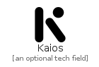|[simpleicons-4.1/K/Kaios](../simpleicons-4.1/K/Kaios.md)
|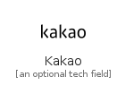|[simpleicons-4.1/K/Kakao](../simpleicons-4.1/K/Kakao.md)
|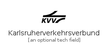|[simpleicons-4.1/K/Karlsruherverkehrsverbund](../simpleicons-4.1/K/Karlsruherverkehrsverbund.md)
|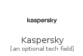|[simpleicons-4.1/K/Kaspersky](../simpleicons-4.1/K/Kaspersky.md)
||[simpleicons-4.1/K/Katana](../simpleicons-4.1/K/Katana.md)
|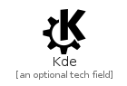|[simpleicons-4.1/K/Kde](../simpleicons-4.1/K/Kde.md)
||[simpleicons-4.1/K/Keepassxc](../simpleicons-4.1/K/Keepassxc.md)
||[simpleicons-4.1/K/Kentico](../simpleicons-4.1/K/Kentico.md)
|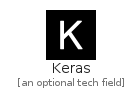|[simpleicons-4.1/K/Keras](../simpleicons-4.1/K/Keras.md)
|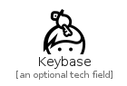|[simpleicons-4.1/K/Keybase](../simpleicons-4.1/K/Keybase.md)
||[simpleicons-4.1/K/Keycdn](../simpleicons-4.1/K/Keycdn.md)
||[simpleicons-4.1/K/Khanacademy](../simpleicons-4.1/K/Khanacademy.md)
||[simpleicons-4.1/K/Khronosgroup](../simpleicons-4.1/K/Khronosgroup.md)
|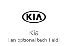|[simpleicons-4.1/K/Kia](../simpleicons-4.1/K/Kia.md)
||[simpleicons-4.1/K/Kibana](../simpleicons-4.1/K/Kibana.md)
||[simpleicons-4.1/K/Kickstarter](../simpleicons-4.1/K/Kickstarter.md)
||[simpleicons-4.1/K/Kik](../simpleicons-4.1/K/Kik.md)
|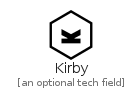|[simpleicons-4.1/K/Kirby](../simpleicons-4.1/K/Kirby.md)
||[simpleicons-4.1/K/Klm](../simpleicons-4.1/K/Klm.md)
|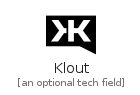|[simpleicons-4.1/K/Klout](../simpleicons-4.1/K/Klout.md)
||[simpleicons-4.1/K/Known](../simpleicons-4.1/K/Known.md)
||[simpleicons-4.1/K/Kodi](../simpleicons-4.1/K/Kodi.md)
||[simpleicons-4.1/K/Koding](../simpleicons-4.1/K/Koding.md)
||[simpleicons-4.1/K/Kofax](../simpleicons-4.1/K/Kofax.md)
|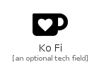|[simpleicons-4.1/K/KoFi](../simpleicons-4.1/K/KoFi.md)
||[simpleicons-4.1/K/Komoot](../simpleicons-4.1/K/Komoot.md)
||[simpleicons-4.1/K/Kotlin](../simpleicons-4.1/K/Kotlin.md)
|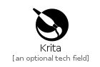|[simpleicons-4.1/K/Krita](../simpleicons-4.1/K/Krita.md)
|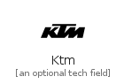|[simpleicons-4.1/K/Ktm](../simpleicons-4.1/K/Ktm.md)
||[simpleicons-4.1/K/Kubernetes](../simpleicons-4.1/K/Kubernetes.md)
||[simpleicons-4.1/K/Kyocera](../simpleicons-4.1/K/Kyocera.md)

