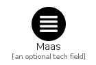
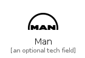
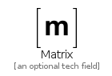
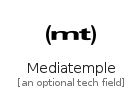
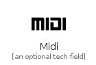
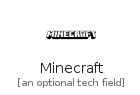
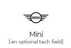
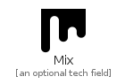
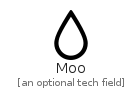
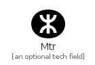

# M

The module M contains 93 entries.

| |Name|
|:---:|---|
||[simpleicons-4.1/M/Maas](../simpleicons-4.1/M/Maas.md)
||[simpleicons-4.1/M/Macys](../simpleicons-4.1/M/Macys.md)
||[simpleicons-4.1/M/Magento](../simpleicons-4.1/M/Magento.md)
||[simpleicons-4.1/M/Magisk](../simpleicons-4.1/M/Magisk.md)
||[simpleicons-4.1/M/Mailchimp](../simpleicons-4.1/M/Mailchimp.md)
||[simpleicons-4.1/M/MailDotRu](../simpleicons-4.1/M/MailDotRu.md)
||[simpleicons-4.1/M/Makerbot](../simpleicons-4.1/M/Makerbot.md)
||[simpleicons-4.1/M/Man](../simpleicons-4.1/M/Man.md)
||[simpleicons-4.1/M/Manageiq](../simpleicons-4.1/M/Manageiq.md)
||[simpleicons-4.1/M/Manjaro](../simpleicons-4.1/M/Manjaro.md)
||[simpleicons-4.1/M/Mapbox](../simpleicons-4.1/M/Mapbox.md)
||[simpleicons-4.1/M/Mariadb](../simpleicons-4.1/M/Mariadb.md)
||[simpleicons-4.1/M/Mariadbfoundation](../simpleicons-4.1/M/Mariadbfoundation.md)
||[simpleicons-4.1/M/Markdown](../simpleicons-4.1/M/Markdown.md)
||[simpleicons-4.1/M/Marketo](../simpleicons-4.1/M/Marketo.md)
||[simpleicons-4.1/M/Marriott](../simpleicons-4.1/M/Marriott.md)
||[simpleicons-4.1/M/Maserati](../simpleicons-4.1/M/Maserati.md)
||[simpleicons-4.1/M/Mastercard](../simpleicons-4.1/M/Mastercard.md)
||[simpleicons-4.1/M/Mastodon](../simpleicons-4.1/M/Mastodon.md)
||[simpleicons-4.1/M/Materialdesign](../simpleicons-4.1/M/Materialdesign.md)
||[simpleicons-4.1/M/Materialdesignicons](../simpleicons-4.1/M/Materialdesignicons.md)
||[simpleicons-4.1/M/MaterialUi](../simpleicons-4.1/M/MaterialUi.md)
||[simpleicons-4.1/M/Mathworks](../simpleicons-4.1/M/Mathworks.md)
||[simpleicons-4.1/M/Matrix](../simpleicons-4.1/M/Matrix.md)
||[simpleicons-4.1/M/Mattermost](../simpleicons-4.1/M/Mattermost.md)
||[simpleicons-4.1/M/Matternet](../simpleicons-4.1/M/Matternet.md)
||[simpleicons-4.1/M/Maytag](../simpleicons-4.1/M/Maytag.md)
||[simpleicons-4.1/M/Mazda](../simpleicons-4.1/M/Mazda.md)
||[simpleicons-4.1/M/Mcafee](../simpleicons-4.1/M/Mcafee.md)
||[simpleicons-4.1/M/Mcdonalds](../simpleicons-4.1/M/Mcdonalds.md)
||[simpleicons-4.1/M/Mdnwebdocs](../simpleicons-4.1/M/Mdnwebdocs.md)
||[simpleicons-4.1/M/Mediafire](../simpleicons-4.1/M/Mediafire.md)
||[simpleicons-4.1/M/Mediatemple](../simpleicons-4.1/M/Mediatemple.md)
||[simpleicons-4.1/M/Medium](../simpleicons-4.1/M/Medium.md)
||[simpleicons-4.1/M/Meetup](../simpleicons-4.1/M/Meetup.md)
||[simpleicons-4.1/M/Mega](../simpleicons-4.1/M/Mega.md)
||[simpleicons-4.1/M/Mendeley](../simpleicons-4.1/M/Mendeley.md)
||[simpleicons-4.1/M/Mercedes](../simpleicons-4.1/M/Mercedes.md)
||[simpleicons-4.1/M/Messenger](../simpleicons-4.1/M/Messenger.md)
||[simpleicons-4.1/M/Meteor](../simpleicons-4.1/M/Meteor.md)
||[simpleicons-4.1/M/Metrodelaciudaddemexico](../simpleicons-4.1/M/Metrodelaciudaddemexico.md)
||[simpleicons-4.1/M/Metrodemadrid](../simpleicons-4.1/M/Metrodemadrid.md)
||[simpleicons-4.1/M/Metrodeparis](../simpleicons-4.1/M/Metrodeparis.md)
||[simpleicons-4.1/M/Microbit](../simpleicons-4.1/M/Microbit.md)
||[simpleicons-4.1/M/MicroDotBlog](../simpleicons-4.1/M/MicroDotBlog.md)
||[simpleicons-4.1/M/Microgenetics](../simpleicons-4.1/M/Microgenetics.md)
||[simpleicons-4.1/M/Microsoft](../simpleicons-4.1/M/Microsoft.md)
||[simpleicons-4.1/M/Microsoftacademic](../simpleicons-4.1/M/Microsoftacademic.md)
||[simpleicons-4.1/M/Microsoftaccess](../simpleicons-4.1/M/Microsoftaccess.md)
||[simpleicons-4.1/M/Microsoftazure](../simpleicons-4.1/M/Microsoftazure.md)
||[simpleicons-4.1/M/Microsoftedge](../simpleicons-4.1/M/Microsoftedge.md)
||[simpleicons-4.1/M/Microsoftexcel](../simpleicons-4.1/M/Microsoftexcel.md)
||[simpleicons-4.1/M/Microsoftexchange](../simpleicons-4.1/M/Microsoftexchange.md)
||[simpleicons-4.1/M/Microsoftoffice](../simpleicons-4.1/M/Microsoftoffice.md)
||[simpleicons-4.1/M/Microsoftonedrive](../simpleicons-4.1/M/Microsoftonedrive.md)
||[simpleicons-4.1/M/Microsoftonenote](../simpleicons-4.1/M/Microsoftonenote.md)
||[simpleicons-4.1/M/Microsoftoutlook](../simpleicons-4.1/M/Microsoftoutlook.md)
||[simpleicons-4.1/M/Microsoftpowerpoint](../simpleicons-4.1/M/Microsoftpowerpoint.md)
||[simpleicons-4.1/M/Microsoftsharepoint](../simpleicons-4.1/M/Microsoftsharepoint.md)
||[simpleicons-4.1/M/Microsoftsqlserver](../simpleicons-4.1/M/Microsoftsqlserver.md)
||[simpleicons-4.1/M/Microsoftteams](../simpleicons-4.1/M/Microsoftteams.md)
||[simpleicons-4.1/M/Microsoftvisio](../simpleicons-4.1/M/Microsoftvisio.md)
||[simpleicons-4.1/M/Microsoftword](../simpleicons-4.1/M/Microsoftword.md)
||[simpleicons-4.1/M/Microstrategy](../simpleicons-4.1/M/Microstrategy.md)
||[simpleicons-4.1/M/Midi](../simpleicons-4.1/M/Midi.md)
||[simpleicons-4.1/M/Minds](../simpleicons-4.1/M/Minds.md)
||[simpleicons-4.1/M/Minecraft](../simpleicons-4.1/M/Minecraft.md)
||[simpleicons-4.1/M/Minetest](../simpleicons-4.1/M/Minetest.md)
||[simpleicons-4.1/M/Mini](../simpleicons-4.1/M/Mini.md)
||[simpleicons-4.1/M/Minutemailer](../simpleicons-4.1/M/Minutemailer.md)
||[simpleicons-4.1/M/Mitsubishi](../simpleicons-4.1/M/Mitsubishi.md)
||[simpleicons-4.1/M/Mix](../simpleicons-4.1/M/Mix.md)
||[simpleicons-4.1/M/Mixcloud](../simpleicons-4.1/M/Mixcloud.md)
||[simpleicons-4.1/M/Mocha](../simpleicons-4.1/M/Mocha.md)
||[simpleicons-4.1/M/Mojangstudios](../simpleicons-4.1/M/Mojangstudios.md)
||[simpleicons-4.1/M/Moleculer](../simpleicons-4.1/M/Moleculer.md)
||[simpleicons-4.1/M/Monero](../simpleicons-4.1/M/Monero.md)
||[simpleicons-4.1/M/Mongodb](../simpleicons-4.1/M/Mongodb.md)
||[simpleicons-4.1/M/Monkeytie](../simpleicons-4.1/M/Monkeytie.md)
||[simpleicons-4.1/M/Monogram](../simpleicons-4.1/M/Monogram.md)
||[simpleicons-4.1/M/Monster](../simpleicons-4.1/M/Monster.md)
||[simpleicons-4.1/M/Monzo](../simpleicons-4.1/M/Monzo.md)
||[simpleicons-4.1/M/Moo](../simpleicons-4.1/M/Moo.md)
||[simpleicons-4.1/M/Moscowmetro](../simpleicons-4.1/M/Moscowmetro.md)
||[simpleicons-4.1/M/Mozilla](../simpleicons-4.1/M/Mozilla.md)
||[simpleicons-4.1/M/Mta](../simpleicons-4.1/M/Mta.md)
||[simpleicons-4.1/M/Mtr](../simpleicons-4.1/M/Mtr.md)
||[simpleicons-4.1/M/Musescore](../simpleicons-4.1/M/Musescore.md)
||[simpleicons-4.1/M/Musicbrainz](../simpleicons-4.1/M/Musicbrainz.md)
||[simpleicons-4.1/M/Mxlinux](../simpleicons-4.1/M/Mxlinux.md)
||[simpleicons-4.1/M/Myob](../simpleicons-4.1/M/Myob.md)
||[simpleicons-4.1/M/Myspace](../simpleicons-4.1/M/Myspace.md)
||[simpleicons-4.1/M/Mysql](../simpleicons-4.1/M/Mysql.md)

