# P

The module P contains 92 entries.

| |Name|
|:---:|---|
||[simpleicons-4.1/P/Pagekit](../simpleicons-4.1/P/Pagekit.md)
||[simpleicons-4.1/P/Pagerduty](../simpleicons-4.1/P/Pagerduty.md)
||[simpleicons-4.1/P/Pagseguro](../simpleicons-4.1/P/Pagseguro.md)
||[simpleicons-4.1/P/Palantir](../simpleicons-4.1/P/Palantir.md)
||[simpleicons-4.1/P/Paloaltosoftware](../simpleicons-4.1/P/Paloaltosoftware.md)
||[simpleicons-4.1/P/Pandas](../simpleicons-4.1/P/Pandas.md)
||[simpleicons-4.1/P/Pandora](../simpleicons-4.1/P/Pandora.md)
||[simpleicons-4.1/P/Pantheon](../simpleicons-4.1/P/Pantheon.md)
||[simpleicons-4.1/P/Paritysubstrate](../simpleicons-4.1/P/Paritysubstrate.md)
||[simpleicons-4.1/P/ParseDotLy](../simpleicons-4.1/P/ParseDotLy.md)
|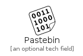|[simpleicons-4.1/P/Pastebin](../simpleicons-4.1/P/Pastebin.md)
||[simpleicons-4.1/P/Patreon](../simpleicons-4.1/P/Patreon.md)
||[simpleicons-4.1/P/Payoneer](../simpleicons-4.1/P/Payoneer.md)
||[simpleicons-4.1/P/Paypal](../simpleicons-4.1/P/Paypal.md)
||[simpleicons-4.1/P/Peertube](../simpleicons-4.1/P/Peertube.md)
||[simpleicons-4.1/P/Pelican](../simpleicons-4.1/P/Pelican.md)
|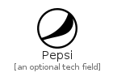|[simpleicons-4.1/P/Pepsi](../simpleicons-4.1/P/Pepsi.md)
||[simpleicons-4.1/P/Periscope](../simpleicons-4.1/P/Periscope.md)
|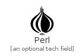|[simpleicons-4.1/P/Perl](../simpleicons-4.1/P/Perl.md)
||[simpleicons-4.1/P/Peugeot](../simpleicons-4.1/P/Peugeot.md)
||[simpleicons-4.1/P/Pexels](../simpleicons-4.1/P/Pexels.md)
|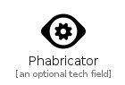|[simpleicons-4.1/P/Phabricator](../simpleicons-4.1/P/Phabricator.md)
||[simpleicons-4.1/P/Philipshue](../simpleicons-4.1/P/Philipshue.md)
||[simpleicons-4.1/P/Photocrowd](../simpleicons-4.1/P/Photocrowd.md)
||[simpleicons-4.1/P/Php](../simpleicons-4.1/P/Php.md)
|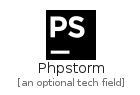|[simpleicons-4.1/P/Phpstorm](../simpleicons-4.1/P/Phpstorm.md)
||[simpleicons-4.1/P/PicartoDotTv](../simpleicons-4.1/P/PicartoDotTv.md)
||[simpleicons-4.1/P/Picpay](../simpleicons-4.1/P/Picpay.md)
||[simpleicons-4.1/P/PiHole](../simpleicons-4.1/P/PiHole.md)
|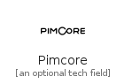|[simpleicons-4.1/P/Pimcore](../simpleicons-4.1/P/Pimcore.md)
||[simpleicons-4.1/P/Pinboard](../simpleicons-4.1/P/Pinboard.md)
||[simpleicons-4.1/P/Pingdom](../simpleicons-4.1/P/Pingdom.md)
||[simpleicons-4.1/P/Pingup](../simpleicons-4.1/P/Pingup.md)
||[simpleicons-4.1/P/Pinterest](../simpleicons-4.1/P/Pinterest.md)
||[simpleicons-4.1/P/Pivotaltracker](../simpleicons-4.1/P/Pivotaltracker.md)
||[simpleicons-4.1/P/Piwigo](../simpleicons-4.1/P/Piwigo.md)
||[simpleicons-4.1/P/Pixabay](../simpleicons-4.1/P/Pixabay.md)
|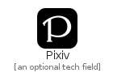|[simpleicons-4.1/P/Pixiv](../simpleicons-4.1/P/Pixiv.md)
|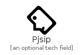|[simpleicons-4.1/P/Pjsip](../simpleicons-4.1/P/Pjsip.md)
||[simpleicons-4.1/P/Planet](../simpleicons-4.1/P/Planet.md)
||[simpleicons-4.1/P/Plangrid](../simpleicons-4.1/P/Plangrid.md)
||[simpleicons-4.1/P/Platzi](../simpleicons-4.1/P/Platzi.md)
||[simpleicons-4.1/P/PlayerDotMe](../simpleicons-4.1/P/PlayerDotMe.md)
||[simpleicons-4.1/P/Playerfm](../simpleicons-4.1/P/Playerfm.md)
||[simpleicons-4.1/P/Playstation](../simpleicons-4.1/P/Playstation.md)
|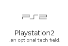|[simpleicons-4.1/P/Playstation2](../simpleicons-4.1/P/Playstation2.md)
||[simpleicons-4.1/P/Playstation3](../simpleicons-4.1/P/Playstation3.md)
||[simpleicons-4.1/P/Playstation4](../simpleicons-4.1/P/Playstation4.md)
||[simpleicons-4.1/P/Playstationvita](../simpleicons-4.1/P/Playstationvita.md)
||[simpleicons-4.1/P/Pleroma](../simpleicons-4.1/P/Pleroma.md)
|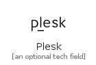|[simpleicons-4.1/P/Plesk](../simpleicons-4.1/P/Plesk.md)
||[simpleicons-4.1/P/Plex](../simpleicons-4.1/P/Plex.md)
||[simpleicons-4.1/P/Pluralsight](../simpleicons-4.1/P/Pluralsight.md)
|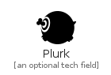|[simpleicons-4.1/P/Plurk](../simpleicons-4.1/P/Plurk.md)
|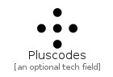|[simpleicons-4.1/P/Pluscodes](../simpleicons-4.1/P/Pluscodes.md)
||[simpleicons-4.1/P/Pocket](../simpleicons-4.1/P/Pocket.md)
||[simpleicons-4.1/P/Pocketcasts](../simpleicons-4.1/P/Pocketcasts.md)
|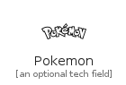|[simpleicons-4.1/P/Pokemon](../simpleicons-4.1/P/Pokemon.md)
||[simpleicons-4.1/P/Poly](../simpleicons-4.1/P/Poly.md)
||[simpleicons-4.1/P/Polymerproject](../simpleicons-4.1/P/Polymerproject.md)
||[simpleicons-4.1/P/Porsche](../simpleicons-4.1/P/Porsche.md)
||[simpleicons-4.1/P/Postcss](../simpleicons-4.1/P/Postcss.md)
||[simpleicons-4.1/P/Postgresql](../simpleicons-4.1/P/Postgresql.md)
||[simpleicons-4.1/P/Postman](../simpleicons-4.1/P/Postman.md)
||[simpleicons-4.1/P/Powerbi](../simpleicons-4.1/P/Powerbi.md)
|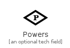|[simpleicons-4.1/P/Powers](../simpleicons-4.1/P/Powers.md)
||[simpleicons-4.1/P/Powershell](../simpleicons-4.1/P/Powershell.md)
||[simpleicons-4.1/P/PrDotCo](../simpleicons-4.1/P/PrDotCo.md)
||[simpleicons-4.1/P/PreCommit](../simpleicons-4.1/P/PreCommit.md)
||[simpleicons-4.1/P/Prestashop](../simpleicons-4.1/P/Prestashop.md)
||[simpleicons-4.1/P/Prettier](../simpleicons-4.1/P/Prettier.md)
||[simpleicons-4.1/P/Prezi](../simpleicons-4.1/P/Prezi.md)
||[simpleicons-4.1/P/Prime](../simpleicons-4.1/P/Prime.md)
||[simpleicons-4.1/P/Primevideo](../simpleicons-4.1/P/Primevideo.md)
||[simpleicons-4.1/P/Prismic](../simpleicons-4.1/P/Prismic.md)
||[simpleicons-4.1/P/Probot](../simpleicons-4.1/P/Probot.md)
||[simpleicons-4.1/P/Processwire](../simpleicons-4.1/P/Processwire.md)
||[simpleicons-4.1/P/Producthunt](../simpleicons-4.1/P/Producthunt.md)
||[simpleicons-4.1/P/Prometheus](../simpleicons-4.1/P/Prometheus.md)
||[simpleicons-4.1/P/Prosieben](../simpleicons-4.1/P/Prosieben.md)
||[simpleicons-4.1/P/ProtocolsDotIo](../simpleicons-4.1/P/ProtocolsDotIo.md)
||[simpleicons-4.1/P/ProtoDotIo](../simpleicons-4.1/P/ProtoDotIo.md)
||[simpleicons-4.1/P/Protonmail](../simpleicons-4.1/P/Protonmail.md)
||[simpleicons-4.1/P/Proxmox](../simpleicons-4.1/P/Proxmox.md)
||[simpleicons-4.1/P/Publons](../simpleicons-4.1/P/Publons.md)
|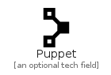|[simpleicons-4.1/P/Puppet](../simpleicons-4.1/P/Puppet.md)
|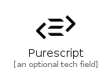|[simpleicons-4.1/P/Purescript](../simpleicons-4.1/P/Purescript.md)
||[simpleicons-4.1/P/Pycharm](../simpleicons-4.1/P/Pycharm.md)
|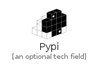|[simpleicons-4.1/P/Pypi](../simpleicons-4.1/P/Pypi.md)
|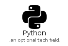|[simpleicons-4.1/P/Python](../simpleicons-4.1/P/Python.md)
|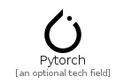|[simpleicons-4.1/P/Pytorch](../simpleicons-4.1/P/Pytorch.md)
||[simpleicons-4.1/P/Pyup](../simpleicons-4.1/P/Pyup.md)

