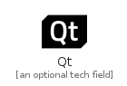
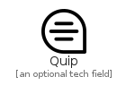

# Q

The module Q contains 19 entries.

| |Name|
|:---:|---|
||[simpleicons-4.1/Q/Qantas](../simpleicons-4.1/Q/Qantas.md)
||[simpleicons-4.1/Q/Qemu](../simpleicons-4.1/Q/Qemu.md)
||[simpleicons-4.1/Q/Qgis](../simpleicons-4.1/Q/Qgis.md)
||[simpleicons-4.1/Q/Qi](../simpleicons-4.1/Q/Qi.md)
||[simpleicons-4.1/Q/Qiita](../simpleicons-4.1/Q/Qiita.md)
||[simpleicons-4.1/Q/Qiwi](../simpleicons-4.1/Q/Qiwi.md)
||[simpleicons-4.1/Q/Qt](../simpleicons-4.1/Q/Qt.md)
||[simpleicons-4.1/Q/Qualcomm](../simpleicons-4.1/Q/Qualcomm.md)
||[simpleicons-4.1/Q/Qualtrics](../simpleicons-4.1/Q/Qualtrics.md)
||[simpleicons-4.1/Q/Quantcast](../simpleicons-4.1/Q/Quantcast.md)
||[simpleicons-4.1/Q/Quantopian](../simpleicons-4.1/Q/Quantopian.md)
||[simpleicons-4.1/Q/Quarkus](../simpleicons-4.1/Q/Quarkus.md)
||[simpleicons-4.1/Q/Quasar](../simpleicons-4.1/Q/Quasar.md)
||[simpleicons-4.1/Q/Quest](../simpleicons-4.1/Q/Quest.md)
||[simpleicons-4.1/Q/Quicktime](../simpleicons-4.1/Q/Quicktime.md)
||[simpleicons-4.1/Q/Quip](../simpleicons-4.1/Q/Quip.md)
||[simpleicons-4.1/Q/Quora](../simpleicons-4.1/Q/Quora.md)
||[simpleicons-4.1/Q/Qwiklabs](../simpleicons-4.1/Q/Qwiklabs.md)
||[simpleicons-4.1/Q/Qzone](../simpleicons-4.1/Q/Qzone.md)

