# R

The module R contains 54 entries.

| |Name|
|:---:|---|
|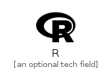|[simpleicons-4.1/R/R](../simpleicons-4.1/R/R.md)
||[simpleicons-4.1/R/Rabbitmq](../simpleicons-4.1/R/Rabbitmq.md)
||[simpleicons-4.1/R/Radiopublic](../simpleicons-4.1/R/Radiopublic.md)
|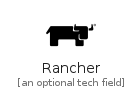|[simpleicons-4.1/R/Rancher](../simpleicons-4.1/R/Rancher.md)
|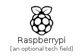|[simpleicons-4.1/R/Raspberrypi](../simpleicons-4.1/R/Raspberrypi.md)
|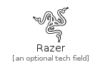|[simpleicons-4.1/R/Razer](../simpleicons-4.1/R/Razer.md)
||[simpleicons-4.1/R/React](../simpleicons-4.1/R/React.md)
||[simpleicons-4.1/R/Reactivex](../simpleicons-4.1/R/Reactivex.md)
||[simpleicons-4.1/R/Reactos](../simpleicons-4.1/R/Reactos.md)
|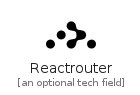|[simpleicons-4.1/R/Reactrouter](../simpleicons-4.1/R/Reactrouter.md)
||[simpleicons-4.1/R/Readthedocs](../simpleicons-4.1/R/Readthedocs.md)
|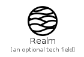|[simpleicons-4.1/R/Realm](../simpleicons-4.1/R/Realm.md)
||[simpleicons-4.1/R/Reason](../simpleicons-4.1/R/Reason.md)
||[simpleicons-4.1/R/Reasonstudios](../simpleicons-4.1/R/Reasonstudios.md)
||[simpleicons-4.1/R/Redbubble](../simpleicons-4.1/R/Redbubble.md)
||[simpleicons-4.1/R/Reddit](../simpleicons-4.1/R/Reddit.md)
||[simpleicons-4.1/R/Redhat](../simpleicons-4.1/R/Redhat.md)
||[simpleicons-4.1/R/Redhatopenshift](../simpleicons-4.1/R/Redhatopenshift.md)
|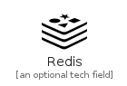|[simpleicons-4.1/R/Redis](../simpleicons-4.1/R/Redis.md)
||[simpleicons-4.1/R/Redux](../simpleicons-4.1/R/Redux.md)
||[simpleicons-4.1/R/Renault](../simpleicons-4.1/R/Renault.md)
||[simpleicons-4.1/R/Renovatebot](../simpleicons-4.1/R/Renovatebot.md)
||[simpleicons-4.1/R/Renpy](../simpleicons-4.1/R/Renpy.md)
|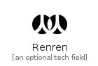|[simpleicons-4.1/R/Renren](../simpleicons-4.1/R/Renren.md)
||[simpleicons-4.1/R/ReplDotIt](../simpleicons-4.1/R/ReplDotIt.md)
||[simpleicons-4.1/R/Researchgate](../simpleicons-4.1/R/Researchgate.md)
|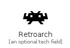|[simpleicons-4.1/R/Retroarch](../simpleicons-4.1/R/Retroarch.md)
|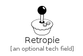|[simpleicons-4.1/R/Retropie](../simpleicons-4.1/R/Retropie.md)
||[simpleicons-4.1/R/Reverbnation](../simpleicons-4.1/R/Reverbnation.md)
||[simpleicons-4.1/R/Revolut](../simpleicons-4.1/R/Revolut.md)
|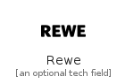|[simpleicons-4.1/R/Rewe](../simpleicons-4.1/R/Rewe.md)
||[simpleicons-4.1/R/Rhinoceros](../simpleicons-4.1/R/Rhinoceros.md)
||[simpleicons-4.1/R/Ring](../simpleicons-4.1/R/Ring.md)
||[simpleicons-4.1/R/Riotgames](../simpleicons-4.1/R/Riotgames.md)
||[simpleicons-4.1/R/Ripple](../simpleicons-4.1/R/Ripple.md)
||[simpleicons-4.1/R/Riseup](../simpleicons-4.1/R/Riseup.md)
||[simpleicons-4.1/R/Roku](../simpleicons-4.1/R/Roku.md)
||[simpleicons-4.1/R/RollupDotJs](../simpleicons-4.1/R/RollupDotJs.md)
||[simpleicons-4.1/R/Roots](../simpleicons-4.1/R/Roots.md)
||[simpleicons-4.1/R/Rootsbedrock](../simpleicons-4.1/R/Rootsbedrock.md)
||[simpleicons-4.1/R/Rootssage](../simpleicons-4.1/R/Rootssage.md)
||[simpleicons-4.1/R/Roundcube](../simpleicons-4.1/R/Roundcube.md)
||[simpleicons-4.1/R/Rss](../simpleicons-4.1/R/Rss.md)
||[simpleicons-4.1/R/Rstudio](../simpleicons-4.1/R/Rstudio.md)
||[simpleicons-4.1/R/Rte](../simpleicons-4.1/R/Rte.md)
|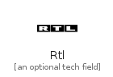|[simpleicons-4.1/R/Rtl](../simpleicons-4.1/R/Rtl.md)
||[simpleicons-4.1/R/Rtlzwei](../simpleicons-4.1/R/Rtlzwei.md)
||[simpleicons-4.1/R/Ruby](../simpleicons-4.1/R/Ruby.md)
||[simpleicons-4.1/R/Rubygems](../simpleicons-4.1/R/Rubygems.md)
||[simpleicons-4.1/R/Rubyonrails](../simpleicons-4.1/R/Rubyonrails.md)
||[simpleicons-4.1/R/Runkeeper](../simpleicons-4.1/R/Runkeeper.md)
||[simpleicons-4.1/R/Runkit](../simpleicons-4.1/R/Runkit.md)
||[simpleicons-4.1/R/Rust](../simpleicons-4.1/R/Rust.md)
||[simpleicons-4.1/R/Ryanair](../simpleicons-4.1/R/Ryanair.md)

