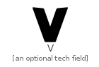
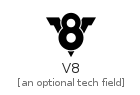
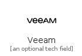
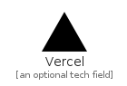
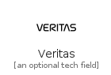
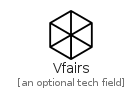
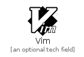
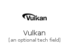

# V

The module V contains 37 entries.

| |Name|
|:---:|---|
||[simpleicons-4.1/V/V](../simpleicons-4.1/V/V.md)
||[simpleicons-4.1/V/V8](../simpleicons-4.1/V/V8.md)
||[simpleicons-4.1/V/Vagrant](../simpleicons-4.1/V/Vagrant.md)
||[simpleicons-4.1/V/Valve](../simpleicons-4.1/V/Valve.md)
||[simpleicons-4.1/V/Vauxhall](../simpleicons-4.1/V/Vauxhall.md)
||[simpleicons-4.1/V/Vbulletin](../simpleicons-4.1/V/Vbulletin.md)
||[simpleicons-4.1/V/Veeam](../simpleicons-4.1/V/Veeam.md)
||[simpleicons-4.1/V/Venmo](../simpleicons-4.1/V/Venmo.md)
||[simpleicons-4.1/V/Vercel](../simpleicons-4.1/V/Vercel.md)
||[simpleicons-4.1/V/Veritas](../simpleicons-4.1/V/Veritas.md)
||[simpleicons-4.1/V/Verizon](../simpleicons-4.1/V/Verizon.md)
||[simpleicons-4.1/V/Vfairs](../simpleicons-4.1/V/Vfairs.md)
||[simpleicons-4.1/V/Viadeo](../simpleicons-4.1/V/Viadeo.md)
||[simpleicons-4.1/V/Viber](../simpleicons-4.1/V/Viber.md)
||[simpleicons-4.1/V/Vim](../simpleicons-4.1/V/Vim.md)
||[simpleicons-4.1/V/Vimeo](../simpleicons-4.1/V/Vimeo.md)
||[simpleicons-4.1/V/Vine](../simpleicons-4.1/V/Vine.md)
||[simpleicons-4.1/V/Virb](../simpleicons-4.1/V/Virb.md)
||[simpleicons-4.1/V/Virtualbox](../simpleicons-4.1/V/Virtualbox.md)
||[simpleicons-4.1/V/Virustotal](../simpleicons-4.1/V/Virustotal.md)
||[simpleicons-4.1/V/Visa](../simpleicons-4.1/V/Visa.md)
||[simpleicons-4.1/V/Visualstudio](../simpleicons-4.1/V/Visualstudio.md)
||[simpleicons-4.1/V/Visualstudiocode](../simpleicons-4.1/V/Visualstudiocode.md)
||[simpleicons-4.1/V/Vivaldi](../simpleicons-4.1/V/Vivaldi.md)
||[simpleicons-4.1/V/Vivino](../simpleicons-4.1/V/Vivino.md)
||[simpleicons-4.1/V/Vk](../simpleicons-4.1/V/Vk.md)
||[simpleicons-4.1/V/Vlcmediaplayer](../simpleicons-4.1/V/Vlcmediaplayer.md)
||[simpleicons-4.1/V/Vmware](../simpleicons-4.1/V/Vmware.md)
||[simpleicons-4.1/V/Vodafone](../simpleicons-4.1/V/Vodafone.md)
||[simpleicons-4.1/V/Volkswagen](../simpleicons-4.1/V/Volkswagen.md)
||[simpleicons-4.1/V/Volvo](../simpleicons-4.1/V/Volvo.md)
||[simpleicons-4.1/V/Vonage](../simpleicons-4.1/V/Vonage.md)
||[simpleicons-4.1/V/Vsco](../simpleicons-4.1/V/Vsco.md)
||[simpleicons-4.1/V/VueDotJs](../simpleicons-4.1/V/VueDotJs.md)
||[simpleicons-4.1/V/Vuetify](../simpleicons-4.1/V/Vuetify.md)
||[simpleicons-4.1/V/Vulkan](../simpleicons-4.1/V/Vulkan.md)
||[simpleicons-4.1/V/Vultr](../simpleicons-4.1/V/Vultr.md)

