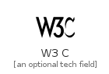
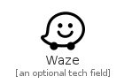
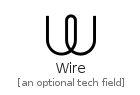

# W

The module W contains 48 entries.

| |Name|
|:---:|---|
||[simpleicons-4.1/W/W3C](../simpleicons-4.1/W/W3C.md)
||[simpleicons-4.1/W/Wagtail](../simpleicons-4.1/W/Wagtail.md)
||[simpleicons-4.1/W/Wakatime](../simpleicons-4.1/W/Wakatime.md)
||[simpleicons-4.1/W/WarnerbrosDot](../simpleicons-4.1/W/WarnerbrosDot.md)
||[simpleicons-4.1/W/Wattpad](../simpleicons-4.1/W/Wattpad.md)
||[simpleicons-4.1/W/Waze](../simpleicons-4.1/W/Waze.md)
||[simpleicons-4.1/W/Wearos](../simpleicons-4.1/W/Wearos.md)
||[simpleicons-4.1/W/Weasyl](../simpleicons-4.1/W/Weasyl.md)
||[simpleicons-4.1/W/Webassembly](../simpleicons-4.1/W/Webassembly.md)
||[simpleicons-4.1/W/Webauthn](../simpleicons-4.1/W/Webauthn.md)
||[simpleicons-4.1/W/WebcomponentsDotOrg](../simpleicons-4.1/W/WebcomponentsDotOrg.md)
||[simpleicons-4.1/W/Webgl](../simpleicons-4.1/W/Webgl.md)
||[simpleicons-4.1/W/Webmin](../simpleicons-4.1/W/Webmin.md)
||[simpleicons-4.1/W/Webmoney](../simpleicons-4.1/W/Webmoney.md)
||[simpleicons-4.1/W/Webpack](../simpleicons-4.1/W/Webpack.md)
||[simpleicons-4.1/W/Webrtc](../simpleicons-4.1/W/Webrtc.md)
||[simpleicons-4.1/W/Webstorm](../simpleicons-4.1/W/Webstorm.md)
||[simpleicons-4.1/W/Wechat](../simpleicons-4.1/W/Wechat.md)
||[simpleicons-4.1/W/Wemo](../simpleicons-4.1/W/Wemo.md)
||[simpleicons-4.1/W/Whatsapp](../simpleicons-4.1/W/Whatsapp.md)
||[simpleicons-4.1/W/Wheniwork](../simpleicons-4.1/W/Wheniwork.md)
||[simpleicons-4.1/W/Whitesource](../simpleicons-4.1/W/Whitesource.md)
||[simpleicons-4.1/W/Wii](../simpleicons-4.1/W/Wii.md)
||[simpleicons-4.1/W/Wiiu](../simpleicons-4.1/W/Wiiu.md)
||[simpleicons-4.1/W/Wikimediacommons](../simpleicons-4.1/W/Wikimediacommons.md)
||[simpleicons-4.1/W/Wikipedia](../simpleicons-4.1/W/Wikipedia.md)
||[simpleicons-4.1/W/Windows](../simpleicons-4.1/W/Windows.md)
||[simpleicons-4.1/W/Windows95](../simpleicons-4.1/W/Windows95.md)
||[simpleicons-4.1/W/Windowsxp](../simpleicons-4.1/W/Windowsxp.md)
||[simpleicons-4.1/W/Wire](../simpleicons-4.1/W/Wire.md)
||[simpleicons-4.1/W/Wireguard](../simpleicons-4.1/W/Wireguard.md)
||[simpleicons-4.1/W/Wireshark](../simpleicons-4.1/W/Wireshark.md)
||[simpleicons-4.1/W/Wish](../simpleicons-4.1/W/Wish.md)
||[simpleicons-4.1/W/Wistia](../simpleicons-4.1/W/Wistia.md)
||[simpleicons-4.1/W/Wix](../simpleicons-4.1/W/Wix.md)
||[simpleicons-4.1/W/Wizzair](../simpleicons-4.1/W/Wizzair.md)
||[simpleicons-4.1/W/Wolfram](../simpleicons-4.1/W/Wolfram.md)
||[simpleicons-4.1/W/Wolframlanguage](../simpleicons-4.1/W/Wolframlanguage.md)
||[simpleicons-4.1/W/Wolframmathematica](../simpleicons-4.1/W/Wolframmathematica.md)
||[simpleicons-4.1/W/Woo](../simpleicons-4.1/W/Woo.md)
||[simpleicons-4.1/W/Woocommerce](../simpleicons-4.1/W/Woocommerce.md)
||[simpleicons-4.1/W/Wordpress](../simpleicons-4.1/W/Wordpress.md)
||[simpleicons-4.1/W/Workplace](../simpleicons-4.1/W/Workplace.md)
||[simpleicons-4.1/W/Worldhealthorganization](../simpleicons-4.1/W/Worldhealthorganization.md)
||[simpleicons-4.1/W/Wpengine](../simpleicons-4.1/W/Wpengine.md)
||[simpleicons-4.1/W/Wprocket](../simpleicons-4.1/W/Wprocket.md)
||[simpleicons-4.1/W/WriteDotAs](../simpleicons-4.1/W/WriteDotAs.md)
||[simpleicons-4.1/W/Wwe](../simpleicons-4.1/W/Wwe.md)

