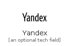

# Y

The module Y contains 14 entries.

| |Name|
|:---:|---|
||[simpleicons-4.1/Y/Yahoo](../simpleicons-4.1/Y/Yahoo.md)
||[simpleicons-4.1/Y/Yamahacorporation](../simpleicons-4.1/Y/Yamahacorporation.md)
||[simpleicons-4.1/Y/Yamahamotorcorporation](../simpleicons-4.1/Y/Yamahamotorcorporation.md)
||[simpleicons-4.1/Y/Yammer](../simpleicons-4.1/Y/Yammer.md)
||[simpleicons-4.1/Y/Yandex](../simpleicons-4.1/Y/Yandex.md)
||[simpleicons-4.1/Y/Yarn](../simpleicons-4.1/Y/Yarn.md)
||[simpleicons-4.1/Y/Ycombinator](../simpleicons-4.1/Y/Ycombinator.md)
||[simpleicons-4.1/Y/Yelp](../simpleicons-4.1/Y/Yelp.md)
||[simpleicons-4.1/Y/Yoast](../simpleicons-4.1/Y/Yoast.md)
||[simpleicons-4.1/Y/Youtube](../simpleicons-4.1/Y/Youtube.md)
||[simpleicons-4.1/Y/Youtubegaming](../simpleicons-4.1/Y/Youtubegaming.md)
||[simpleicons-4.1/Y/Youtubemusic](../simpleicons-4.1/Y/Youtubemusic.md)
||[simpleicons-4.1/Y/Youtubestudio](../simpleicons-4.1/Y/Youtubestudio.md)
||[simpleicons-4.1/Y/Youtubetv](../simpleicons-4.1/Y/Youtubetv.md)

