# Z

The module Z contains 16 entries.

| |Name|
|:---:|---|
|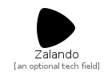|[simpleicons-4.1/Z/Zalando](../simpleicons-4.1/Z/Zalando.md)
|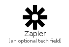|[simpleicons-4.1/Z/Zapier](../simpleicons-4.1/Z/Zapier.md)
|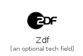|[simpleicons-4.1/Z/Zdf](../simpleicons-4.1/Z/Zdf.md)
||[simpleicons-4.1/Z/Zend](../simpleicons-4.1/Z/Zend.md)
||[simpleicons-4.1/Z/Zendesk](../simpleicons-4.1/Z/Zendesk.md)
|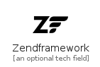|[simpleicons-4.1/Z/Zendframework](../simpleicons-4.1/Z/Zendframework.md)
|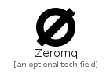|[simpleicons-4.1/Z/Zeromq](../simpleicons-4.1/Z/Zeromq.md)
|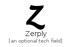|[simpleicons-4.1/Z/Zerply](../simpleicons-4.1/Z/Zerply.md)
|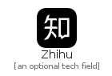|[simpleicons-4.1/Z/Zhihu](../simpleicons-4.1/Z/Zhihu.md)
||[simpleicons-4.1/Z/Zigbee](../simpleicons-4.1/Z/Zigbee.md)
|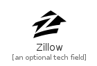|[simpleicons-4.1/Z/Zillow](../simpleicons-4.1/Z/Zillow.md)
|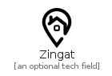|[simpleicons-4.1/Z/Zingat](../simpleicons-4.1/Z/Zingat.md)
|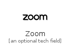|[simpleicons-4.1/Z/Zoom](../simpleicons-4.1/Z/Zoom.md)
|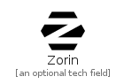|[simpleicons-4.1/Z/Zorin](../simpleicons-4.1/Z/Zorin.md)
|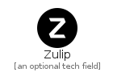|[simpleicons-4.1/Z/Zulip](../simpleicons-4.1/Z/Zulip.md)
||[simpleicons-4.1/Z/ZWave](../simpleicons-4.1/Z/ZWave.md)

