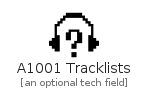

# A1001 Tracklists

```text
simpleicons-4/A/A1001Tracklists
```

```text
include('simpleicons-4/A/A1001Tracklists')
```

|icon|element|
|---|---|
|||


## element
### Load remotely
```plantuml
@startuml
' configures the library
!global $LIB_BASE_LOCATION="https://raw.githubusercontent.com/tmorin/plantuml-libs/master/dist"
' loads the library
!include $LIB_BASE_LOCATION/bootstrap.puml
' loads the simpleicons-4 bootstrap
include('simpleicons-4/bootstrap')
' loads the A1001Tracklists element
include('simpleicons-4/A/A1001Tracklists')
A1001Tracklists('a_1001_tracklists', 'A1001 Tracklists', 'an optional tech field')
@enduml
```
### Load locally
```plantuml
@startuml
' configures the library
!global $INCLUSION_MODE="local"
!global $LIB_BASE_LOCATION="../.."
' loads the library
!include $LIB_BASE_LOCATION/bootstrap.puml
' loads the simpleicons-4 bootstrap
include('simpleicons-4/bootstrap')
' loads the A1001Tracklists element
include('simpleicons-4/A/A1001Tracklists')
A1001Tracklists('a_1001_tracklists', 'A1001 Tracklists', 'an optional tech field')
@enduml
```

