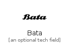
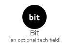
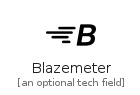
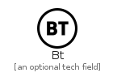
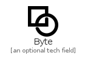

# B

The module B contains 72 entries.

| |Name|
|:---:|---|
||[simpleicons-4/B/Babel](../simpleicons-4/B/Babel.md)
||[simpleicons-4/B/Badgr](../simpleicons-4/B/Badgr.md)
||[simpleicons-4/B/Badoo](../simpleicons-4/B/Badoo.md)
||[simpleicons-4/B/Baidu](../simpleicons-4/B/Baidu.md)
||[simpleicons-4/B/Bamboo](../simpleicons-4/B/Bamboo.md)
||[simpleicons-4/B/Bancontact](../simpleicons-4/B/Bancontact.md)
||[simpleicons-4/B/Bandcamp](../simpleicons-4/B/Bandcamp.md)
||[simpleicons-4/B/Bandlab](../simpleicons-4/B/Bandlab.md)
||[simpleicons-4/B/BAndRautomation](../simpleicons-4/B/BAndRautomation.md)
||[simpleicons-4/B/Bandsintown](../simpleicons-4/B/Bandsintown.md)
||[simpleicons-4/B/Bankofamerica](../simpleicons-4/B/Bankofamerica.md)
||[simpleicons-4/B/Basecamp](../simpleicons-4/B/Basecamp.md)
||[simpleicons-4/B/Bata](../simpleicons-4/B/Bata.md)
||[simpleicons-4/B/Bathasu](../simpleicons-4/B/Bathasu.md)
||[simpleicons-4/B/BattleDotNet](../simpleicons-4/B/BattleDotNet.md)
||[simpleicons-4/B/Bbc](../simpleicons-4/B/Bbc.md)
||[simpleicons-4/B/Bbciplayer](../simpleicons-4/B/Bbciplayer.md)
||[simpleicons-4/B/Beatport](../simpleicons-4/B/Beatport.md)
||[simpleicons-4/B/Beats](../simpleicons-4/B/Beats.md)
||[simpleicons-4/B/Beatsbydre](../simpleicons-4/B/Beatsbydre.md)
||[simpleicons-4/B/Behance](../simpleicons-4/B/Behance.md)
||[simpleicons-4/B/Beijingsubway](../simpleicons-4/B/Beijingsubway.md)
||[simpleicons-4/B/Bentley](../simpleicons-4/B/Bentley.md)
||[simpleicons-4/B/Bigbasket](../simpleicons-4/B/Bigbasket.md)
||[simpleicons-4/B/Bigcartel](../simpleicons-4/B/Bigcartel.md)
||[simpleicons-4/B/Bigcommerce](../simpleicons-4/B/Bigcommerce.md)
||[simpleicons-4/B/Bilibili](../simpleicons-4/B/Bilibili.md)
||[simpleicons-4/B/Bing](../simpleicons-4/B/Bing.md)
||[simpleicons-4/B/Bit](../simpleicons-4/B/Bit.md)
||[simpleicons-4/B/Bitbucket](../simpleicons-4/B/Bitbucket.md)
||[simpleicons-4/B/Bitcoin](../simpleicons-4/B/Bitcoin.md)
||[simpleicons-4/B/Bitdefender](../simpleicons-4/B/Bitdefender.md)
||[simpleicons-4/B/Bitly](../simpleicons-4/B/Bitly.md)
||[simpleicons-4/B/Bitrise](../simpleicons-4/B/Bitrise.md)
||[simpleicons-4/B/Bitwarden](../simpleicons-4/B/Bitwarden.md)
||[simpleicons-4/B/Blackberry](../simpleicons-4/B/Blackberry.md)
||[simpleicons-4/B/Blazemeter](../simpleicons-4/B/Blazemeter.md)
||[simpleicons-4/B/Blazor](../simpleicons-4/B/Blazor.md)
||[simpleicons-4/B/Blender](../simpleicons-4/B/Blender.md)
||[simpleicons-4/B/BlockchainDotCom](../simpleicons-4/B/BlockchainDotCom.md)
||[simpleicons-4/B/Blogger](../simpleicons-4/B/Blogger.md)
||[simpleicons-4/B/Bloglovin](../simpleicons-4/B/Bloglovin.md)
||[simpleicons-4/B/Blueprint](../simpleicons-4/B/Blueprint.md)
||[simpleicons-4/B/Bluetooth](../simpleicons-4/B/Bluetooth.md)
||[simpleicons-4/B/Bmcsoftware](../simpleicons-4/B/Bmcsoftware.md)
||[simpleicons-4/B/Bmw](../simpleicons-4/B/Bmw.md)
||[simpleicons-4/B/Boeing](../simpleicons-4/B/Boeing.md)
||[simpleicons-4/B/Bookmeter](../simpleicons-4/B/Bookmeter.md)
||[simpleicons-4/B/Boost](../simpleicons-4/B/Boost.md)
||[simpleicons-4/B/Bootstrap](../simpleicons-4/B/Bootstrap.md)
||[simpleicons-4/B/Bosch](../simpleicons-4/B/Bosch.md)
||[simpleicons-4/B/Bose](../simpleicons-4/B/Bose.md)
||[simpleicons-4/B/Bower](../simpleicons-4/B/Bower.md)
||[simpleicons-4/B/Box](../simpleicons-4/B/Box.md)
||[simpleicons-4/B/BrandDotAi](../simpleicons-4/B/BrandDotAi.md)
||[simpleicons-4/B/Brandfolder](../simpleicons-4/B/Brandfolder.md)
||[simpleicons-4/B/Brave](../simpleicons-4/B/Brave.md)
||[simpleicons-4/B/Breaker](../simpleicons-4/B/Breaker.md)
||[simpleicons-4/B/Broadcom](../simpleicons-4/B/Broadcom.md)
||[simpleicons-4/B/Bt](../simpleicons-4/B/Bt.md)
||[simpleicons-4/B/Buddy](../simpleicons-4/B/Buddy.md)
||[simpleicons-4/B/Buefy](../simpleicons-4/B/Buefy.md)
||[simpleicons-4/B/Buffer](../simpleicons-4/B/Buffer.md)
||[simpleicons-4/B/Bugatti](../simpleicons-4/B/Bugatti.md)
||[simpleicons-4/B/Bugcrowd](../simpleicons-4/B/Bugcrowd.md)
||[simpleicons-4/B/Bugsnag](../simpleicons-4/B/Bugsnag.md)
||[simpleicons-4/B/Buildkite](../simpleicons-4/B/Buildkite.md)
||[simpleicons-4/B/Bulma](../simpleicons-4/B/Bulma.md)
||[simpleicons-4/B/Bunq](../simpleicons-4/B/Bunq.md)
||[simpleicons-4/B/Buymeacoffee](../simpleicons-4/B/Buymeacoffee.md)
||[simpleicons-4/B/Buzzfeed](../simpleicons-4/B/Buzzfeed.md)
||[simpleicons-4/B/Byte](../simpleicons-4/B/Byte.md)

