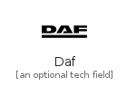
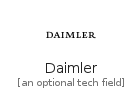
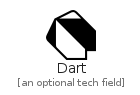
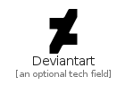
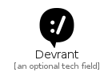
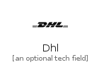
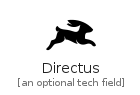
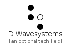
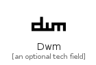

# D

The module D contains 74 entries.

| |Name|
|:---:|---|
||[simpleicons-4/D/D3DotJs](../simpleicons-4/D/D3DotJs.md)
||[simpleicons-4/D/Dacia](../simpleicons-4/D/Dacia.md)
||[simpleicons-4/D/Daf](../simpleicons-4/D/Daf.md)
||[simpleicons-4/D/Dailymotion](../simpleicons-4/D/Dailymotion.md)
||[simpleicons-4/D/Daimler](../simpleicons-4/D/Daimler.md)
||[simpleicons-4/D/Darkreader](../simpleicons-4/D/Darkreader.md)
||[simpleicons-4/D/Dart](../simpleicons-4/D/Dart.md)
||[simpleicons-4/D/Daserste](../simpleicons-4/D/Daserste.md)
||[simpleicons-4/D/Dash](../simpleicons-4/D/Dash.md)
||[simpleicons-4/D/Dashlane](../simpleicons-4/D/Dashlane.md)
||[simpleicons-4/D/Dassaultsystemes](../simpleicons-4/D/Dassaultsystemes.md)
||[simpleicons-4/D/Datacamp](../simpleicons-4/D/Datacamp.md)
||[simpleicons-4/D/Datadog](../simpleicons-4/D/Datadog.md)
||[simpleicons-4/D/Datastax](../simpleicons-4/D/Datastax.md)
||[simpleicons-4/D/Dazn](../simpleicons-4/D/Dazn.md)
||[simpleicons-4/D/Dblp](../simpleicons-4/D/Dblp.md)
||[simpleicons-4/D/Dcentertainment](../simpleicons-4/D/Dcentertainment.md)
||[simpleicons-4/D/Debian](../simpleicons-4/D/Debian.md)
||[simpleicons-4/D/Deepin](../simpleicons-4/D/Deepin.md)
||[simpleicons-4/D/Deepnote](../simpleicons-4/D/Deepnote.md)
||[simpleicons-4/D/Deezer](../simpleicons-4/D/Deezer.md)
||[simpleicons-4/D/Delicious](../simpleicons-4/D/Delicious.md)
||[simpleicons-4/D/Deliveroo](../simpleicons-4/D/Deliveroo.md)
||[simpleicons-4/D/Dell](../simpleicons-4/D/Dell.md)
||[simpleicons-4/D/Delonghi](../simpleicons-4/D/Delonghi.md)
||[simpleicons-4/D/Delphi](../simpleicons-4/D/Delphi.md)
||[simpleicons-4/D/Delta](../simpleicons-4/D/Delta.md)
||[simpleicons-4/D/Deno](../simpleicons-4/D/Deno.md)
||[simpleicons-4/D/Dependabot](../simpleicons-4/D/Dependabot.md)
||[simpleicons-4/D/Derspiegel](../simpleicons-4/D/Derspiegel.md)
||[simpleicons-4/D/Designernews](../simpleicons-4/D/Designernews.md)
||[simpleicons-4/D/Deutschebahn](../simpleicons-4/D/Deutschebahn.md)
||[simpleicons-4/D/DevDotTo](../simpleicons-4/D/DevDotTo.md)
||[simpleicons-4/D/Deviantart](../simpleicons-4/D/Deviantart.md)
||[simpleicons-4/D/Devpost](../simpleicons-4/D/Devpost.md)
||[simpleicons-4/D/Devrant](../simpleicons-4/D/Devrant.md)
||[simpleicons-4/D/Dhl](../simpleicons-4/D/Dhl.md)
||[simpleicons-4/D/DiagramsDotNet](../simpleicons-4/D/DiagramsDotNet.md)
||[simpleicons-4/D/Dialogflow](../simpleicons-4/D/Dialogflow.md)
||[simpleicons-4/D/Diaspora](../simpleicons-4/D/Diaspora.md)
||[simpleicons-4/D/Digg](../simpleicons-4/D/Digg.md)
||[simpleicons-4/D/DigiKeyelectronics](../simpleicons-4/D/DigiKeyelectronics.md)
||[simpleicons-4/D/Digitalocean](../simpleicons-4/D/Digitalocean.md)
||[simpleicons-4/D/Dior](../simpleicons-4/D/Dior.md)
||[simpleicons-4/D/Directus](../simpleicons-4/D/Directus.md)
||[simpleicons-4/D/Discogs](../simpleicons-4/D/Discogs.md)
||[simpleicons-4/D/Discord](../simpleicons-4/D/Discord.md)
||[simpleicons-4/D/Discourse](../simpleicons-4/D/Discourse.md)
||[simpleicons-4/D/Discover](../simpleicons-4/D/Discover.md)
||[simpleicons-4/D/Disqus](../simpleicons-4/D/Disqus.md)
||[simpleicons-4/D/Disroot](../simpleicons-4/D/Disroot.md)
||[simpleicons-4/D/Django](../simpleicons-4/D/Django.md)
||[simpleicons-4/D/Dlna](../simpleicons-4/D/Dlna.md)
||[simpleicons-4/D/Docker](../simpleicons-4/D/Docker.md)
||[simpleicons-4/D/Docusign](../simpleicons-4/D/Docusign.md)
||[simpleicons-4/D/Dolby](../simpleicons-4/D/Dolby.md)
||[simpleicons-4/D/Doordash](../simpleicons-4/D/Doordash.md)
||[simpleicons-4/D/DotNet](../simpleicons-4/D/DotNet.md)
||[simpleicons-4/D/Douban](../simpleicons-4/D/Douban.md)
||[simpleicons-4/D/DraugiemDotLv](../simpleicons-4/D/DraugiemDotLv.md)
||[simpleicons-4/D/Dribbble](../simpleicons-4/D/Dribbble.md)
||[simpleicons-4/D/Drone](../simpleicons-4/D/Drone.md)
||[simpleicons-4/D/Drooble](../simpleicons-4/D/Drooble.md)
||[simpleicons-4/D/Dropbox](../simpleicons-4/D/Dropbox.md)
||[simpleicons-4/D/Drupal](../simpleicons-4/D/Drupal.md)
||[simpleicons-4/D/Dsautomobiles](../simpleicons-4/D/Dsautomobiles.md)
||[simpleicons-4/D/Dtube](../simpleicons-4/D/Dtube.md)
||[simpleicons-4/D/Duckduckgo](../simpleicons-4/D/Duckduckgo.md)
||[simpleicons-4/D/Dunked](../simpleicons-4/D/Dunked.md)
||[simpleicons-4/D/Duolingo](../simpleicons-4/D/Duolingo.md)
||[simpleicons-4/D/DWavesystems](../simpleicons-4/D/DWavesystems.md)
||[simpleicons-4/D/Dwm](../simpleicons-4/D/Dwm.md)
||[simpleicons-4/D/Dynamics365](../simpleicons-4/D/Dynamics365.md)
||[simpleicons-4/D/Dynatrace](../simpleicons-4/D/Dynatrace.md)

