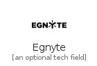
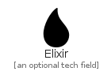
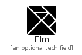
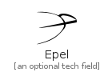
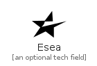
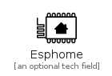
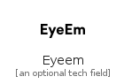

# E

The module E contains 50 entries.

| |Name|
|:---:|---|
||[simpleicons-4/E/Ea](../simpleicons-4/E/Ea.md)
||[simpleicons-4/E/Easyjet](../simpleicons-4/E/Easyjet.md)
||[simpleicons-4/E/Ebay](../simpleicons-4/E/Ebay.md)
||[simpleicons-4/E/Eclipseide](../simpleicons-4/E/Eclipseide.md)
||[simpleicons-4/E/Eclipsemosquitto](../simpleicons-4/E/Eclipsemosquitto.md)
||[simpleicons-4/E/EclipsevertDotX](../simpleicons-4/E/EclipsevertDotX.md)
||[simpleicons-4/E/Edx](../simpleicons-4/E/Edx.md)
||[simpleicons-4/E/Egghead](../simpleicons-4/E/Egghead.md)
||[simpleicons-4/E/Egnyte](../simpleicons-4/E/Egnyte.md)
||[simpleicons-4/E/Eightsleep](../simpleicons-4/E/Eightsleep.md)
||[simpleicons-4/E/Elastic](../simpleicons-4/E/Elastic.md)
||[simpleicons-4/E/Elasticcloud](../simpleicons-4/E/Elasticcloud.md)
||[simpleicons-4/E/Elasticsearch](../simpleicons-4/E/Elasticsearch.md)
||[simpleicons-4/E/Elasticstack](../simpleicons-4/E/Elasticstack.md)
||[simpleicons-4/E/Electron](../simpleicons-4/E/Electron.md)
||[simpleicons-4/E/Element](../simpleicons-4/E/Element.md)
||[simpleicons-4/E/Elementary](../simpleicons-4/E/Elementary.md)
||[simpleicons-4/E/Eleventy](../simpleicons-4/E/Eleventy.md)
||[simpleicons-4/E/Elixir](../simpleicons-4/E/Elixir.md)
||[simpleicons-4/E/Eljueves](../simpleicons-4/E/Eljueves.md)
||[simpleicons-4/E/Ello](../simpleicons-4/E/Ello.md)
||[simpleicons-4/E/Elm](../simpleicons-4/E/Elm.md)
||[simpleicons-4/E/Elsevier](../simpleicons-4/E/Elsevier.md)
||[simpleicons-4/E/Embarcadero](../simpleicons-4/E/Embarcadero.md)
||[simpleicons-4/E/EmberDotJs](../simpleicons-4/E/EmberDotJs.md)
||[simpleicons-4/E/Emby](../simpleicons-4/E/Emby.md)
||[simpleicons-4/E/Emlakjet](../simpleicons-4/E/Emlakjet.md)
||[simpleicons-4/E/Empirekred](../simpleicons-4/E/Empirekred.md)
||[simpleicons-4/E/Envato](../simpleicons-4/E/Envato.md)
||[simpleicons-4/E/Epel](../simpleicons-4/E/Epel.md)
||[simpleicons-4/E/Epicgames](../simpleicons-4/E/Epicgames.md)
||[simpleicons-4/E/Epson](../simpleicons-4/E/Epson.md)
||[simpleicons-4/E/Erlang](../simpleicons-4/E/Erlang.md)
||[simpleicons-4/E/Esea](../simpleicons-4/E/Esea.md)
||[simpleicons-4/E/Eslgaming](../simpleicons-4/E/Eslgaming.md)
||[simpleicons-4/E/Eslint](../simpleicons-4/E/Eslint.md)
||[simpleicons-4/E/Esphome](../simpleicons-4/E/Esphome.md)
||[simpleicons-4/E/Espressif](../simpleicons-4/E/Espressif.md)
||[simpleicons-4/E/Ethereum](../simpleicons-4/E/Ethereum.md)
||[simpleicons-4/E/Etsy](../simpleicons-4/E/Etsy.md)
||[simpleicons-4/E/Eventbrite](../simpleicons-4/E/Eventbrite.md)
||[simpleicons-4/E/Eventstore](../simpleicons-4/E/Eventstore.md)
||[simpleicons-4/E/Evernote](../simpleicons-4/E/Evernote.md)
||[simpleicons-4/E/Everplaces](../simpleicons-4/E/Everplaces.md)
||[simpleicons-4/E/Evry](../simpleicons-4/E/Evry.md)
||[simpleicons-4/E/Exercism](../simpleicons-4/E/Exercism.md)
||[simpleicons-4/E/Expertsexchange](../simpleicons-4/E/Expertsexchange.md)
||[simpleicons-4/E/Expo](../simpleicons-4/E/Expo.md)
||[simpleicons-4/E/Express](../simpleicons-4/E/Express.md)
||[simpleicons-4/E/Eyeem](../simpleicons-4/E/Eyeem.md)

