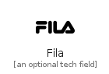
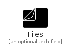
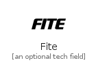
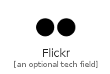
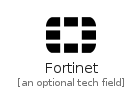

# F

The module F contains 75 entries.

| |Name|
|:---:|---|
||[simpleicons-4/F/Facebook](../simpleicons-4/F/Facebook.md)
||[simpleicons-4/F/Facebookgaming](../simpleicons-4/F/Facebookgaming.md)
||[simpleicons-4/F/Facebooklive](../simpleicons-4/F/Facebooklive.md)
||[simpleicons-4/F/Faceit](../simpleicons-4/F/Faceit.md)
||[simpleicons-4/F/Facepunch](../simpleicons-4/F/Facepunch.md)
||[simpleicons-4/F/Falcon](../simpleicons-4/F/Falcon.md)
||[simpleicons-4/F/Fandango](../simpleicons-4/F/Fandango.md)
||[simpleicons-4/F/Fandom](../simpleicons-4/F/Fandom.md)
||[simpleicons-4/F/Farfetch](../simpleicons-4/F/Farfetch.md)
||[simpleicons-4/F/Fastapi](../simpleicons-4/F/Fastapi.md)
||[simpleicons-4/F/Fastify](../simpleicons-4/F/Fastify.md)
||[simpleicons-4/F/Fastlane](../simpleicons-4/F/Fastlane.md)
||[simpleicons-4/F/Fastly](../simpleicons-4/F/Fastly.md)
||[simpleicons-4/F/Fathom](../simpleicons-4/F/Fathom.md)
||[simpleicons-4/F/Favro](../simpleicons-4/F/Favro.md)
||[simpleicons-4/F/FDroid](../simpleicons-4/F/FDroid.md)
||[simpleicons-4/F/Feathub](../simpleicons-4/F/Feathub.md)
||[simpleicons-4/F/Fedex](../simpleicons-4/F/Fedex.md)
||[simpleicons-4/F/Fedora](../simpleicons-4/F/Fedora.md)
||[simpleicons-4/F/Fedramp](../simpleicons-4/F/Fedramp.md)
||[simpleicons-4/F/Feedly](../simpleicons-4/F/Feedly.md)
||[simpleicons-4/F/Ferrari](../simpleicons-4/F/Ferrari.md)
||[simpleicons-4/F/FerrarinDotVDot](../simpleicons-4/F/FerrarinDotVDot.md)
||[simpleicons-4/F/Fiat](../simpleicons-4/F/Fiat.md)
||[simpleicons-4/F/Fidoalliance](../simpleicons-4/F/Fidoalliance.md)
||[simpleicons-4/F/Fifa](../simpleicons-4/F/Fifa.md)
||[simpleicons-4/F/Figma](../simpleicons-4/F/Figma.md)
||[simpleicons-4/F/Figshare](../simpleicons-4/F/Figshare.md)
||[simpleicons-4/F/Fila](../simpleicons-4/F/Fila.md)
||[simpleicons-4/F/Files](../simpleicons-4/F/Files.md)
||[simpleicons-4/F/Filezilla](../simpleicons-4/F/Filezilla.md)
||[simpleicons-4/F/Fing](../simpleicons-4/F/Fing.md)
||[simpleicons-4/F/Firebase](../simpleicons-4/F/Firebase.md)
||[simpleicons-4/F/Firefox](../simpleicons-4/F/Firefox.md)
||[simpleicons-4/F/Firefoxbrowser](../simpleicons-4/F/Firefoxbrowser.md)
||[simpleicons-4/F/First](../simpleicons-4/F/First.md)
||[simpleicons-4/F/Fitbit](../simpleicons-4/F/Fitbit.md)
||[simpleicons-4/F/Fite](../simpleicons-4/F/Fite.md)
||[simpleicons-4/F/Fiverr](../simpleicons-4/F/Fiverr.md)
||[simpleicons-4/F/Flask](../simpleicons-4/F/Flask.md)
||[simpleicons-4/F/Flathub](../simpleicons-4/F/Flathub.md)
||[simpleicons-4/F/Flattr](../simpleicons-4/F/Flattr.md)
||[simpleicons-4/F/Flickr](../simpleicons-4/F/Flickr.md)
||[simpleicons-4/F/Flipboard](../simpleicons-4/F/Flipboard.md)
||[simpleicons-4/F/Flipkart](../simpleicons-4/F/Flipkart.md)
||[simpleicons-4/F/Floatplane](../simpleicons-4/F/Floatplane.md)
||[simpleicons-4/F/Flood](../simpleicons-4/F/Flood.md)
||[simpleicons-4/F/Fluentd](../simpleicons-4/F/Fluentd.md)
||[simpleicons-4/F/Flutter](../simpleicons-4/F/Flutter.md)
||[simpleicons-4/F/Fnac](../simpleicons-4/F/Fnac.md)
||[simpleicons-4/F/Folium](../simpleicons-4/F/Folium.md)
||[simpleicons-4/F/Fontawesome](../simpleicons-4/F/Fontawesome.md)
||[simpleicons-4/F/Foodpanda](../simpleicons-4/F/Foodpanda.md)
||[simpleicons-4/F/Ford](../simpleicons-4/F/Ford.md)
||[simpleicons-4/F/Formstack](../simpleicons-4/F/Formstack.md)
||[simpleicons-4/F/Fortinet](../simpleicons-4/F/Fortinet.md)
||[simpleicons-4/F/Fortran](../simpleicons-4/F/Fortran.md)
||[simpleicons-4/F/Fossa](../simpleicons-4/F/Fossa.md)
||[simpleicons-4/F/Fossilscm](../simpleicons-4/F/Fossilscm.md)
||[simpleicons-4/F/Foursquare](../simpleicons-4/F/Foursquare.md)
||[simpleicons-4/F/Foxtel](../simpleicons-4/F/Foxtel.md)
||[simpleicons-4/F/Fozzy](../simpleicons-4/F/Fozzy.md)
||[simpleicons-4/F/Framer](../simpleicons-4/F/Framer.md)
||[simpleicons-4/F/FraunhoferGesellschaft](../simpleicons-4/F/FraunhoferGesellschaft.md)
||[simpleicons-4/F/Freebsd](../simpleicons-4/F/Freebsd.md)
||[simpleicons-4/F/Freecodecamp](../simpleicons-4/F/Freecodecamp.md)
||[simpleicons-4/F/FreedesktopDotOrg](../simpleicons-4/F/FreedesktopDotOrg.md)
||[simpleicons-4/F/Freelancer](../simpleicons-4/F/Freelancer.md)
||[simpleicons-4/F/Freenas](../simpleicons-4/F/Freenas.md)
||[simpleicons-4/F/FSecure](../simpleicons-4/F/FSecure.md)
||[simpleicons-4/F/Fujifilm](../simpleicons-4/F/Fujifilm.md)
||[simpleicons-4/F/Fujitsu](../simpleicons-4/F/Fujitsu.md)
||[simpleicons-4/F/Furaffinity](../simpleicons-4/F/Furaffinity.md)
||[simpleicons-4/F/Furrynetwork](../simpleicons-4/F/Furrynetwork.md)
||[simpleicons-4/F/Futurelearn](../simpleicons-4/F/Futurelearn.md)

