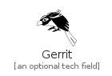
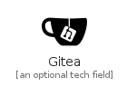
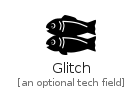

# G

The module G contains 102 entries.

| |Name|
|:---:|---|
||[simpleicons-4/G/G2A](../simpleicons-4/G/G2A.md)
||[simpleicons-4/G/Gamejolt](../simpleicons-4/G/Gamejolt.md)
||[simpleicons-4/G/Garmin](../simpleicons-4/G/Garmin.md)
||[simpleicons-4/G/Gatling](../simpleicons-4/G/Gatling.md)
||[simpleicons-4/G/Gatsby](../simpleicons-4/G/Gatsby.md)
||[simpleicons-4/G/Gauges](../simpleicons-4/G/Gauges.md)
||[simpleicons-4/G/Geeksforgeeks](../simpleicons-4/G/Geeksforgeeks.md)
||[simpleicons-4/G/Generalelectric](../simpleicons-4/G/Generalelectric.md)
||[simpleicons-4/G/Generalmotors](../simpleicons-4/G/Generalmotors.md)
||[simpleicons-4/G/Genius](../simpleicons-4/G/Genius.md)
||[simpleicons-4/G/Gentoo](../simpleicons-4/G/Gentoo.md)
||[simpleicons-4/G/Geocaching](../simpleicons-4/G/Geocaching.md)
||[simpleicons-4/G/Gerrit](../simpleicons-4/G/Gerrit.md)
||[simpleicons-4/G/Ghost](../simpleicons-4/G/Ghost.md)
||[simpleicons-4/G/Ghostery](../simpleicons-4/G/Ghostery.md)
||[simpleicons-4/G/Gimp](../simpleicons-4/G/Gimp.md)
||[simpleicons-4/G/Giphy](../simpleicons-4/G/Giphy.md)
||[simpleicons-4/G/Git](../simpleicons-4/G/Git.md)
||[simpleicons-4/G/Gitbook](../simpleicons-4/G/Gitbook.md)
||[simpleicons-4/G/Gitea](../simpleicons-4/G/Gitea.md)
||[simpleicons-4/G/Gitee](../simpleicons-4/G/Gitee.md)
||[simpleicons-4/G/Github](../simpleicons-4/G/Github.md)
||[simpleicons-4/G/Githubactions](../simpleicons-4/G/Githubactions.md)
||[simpleicons-4/G/Githubsponsors](../simpleicons-4/G/Githubsponsors.md)
||[simpleicons-4/G/Gitkraken](../simpleicons-4/G/Gitkraken.md)
||[simpleicons-4/G/Gitlab](../simpleicons-4/G/Gitlab.md)
||[simpleicons-4/G/Gitlfs](../simpleicons-4/G/Gitlfs.md)
||[simpleicons-4/G/Gitpod](../simpleicons-4/G/Gitpod.md)
||[simpleicons-4/G/Gitter](../simpleicons-4/G/Gitter.md)
||[simpleicons-4/G/Glassdoor](../simpleicons-4/G/Glassdoor.md)
||[simpleicons-4/G/Glitch](../simpleicons-4/G/Glitch.md)
||[simpleicons-4/G/Gmail](../simpleicons-4/G/Gmail.md)
||[simpleicons-4/G/Gnome](../simpleicons-4/G/Gnome.md)
||[simpleicons-4/G/Gnu](../simpleicons-4/G/Gnu.md)
||[simpleicons-4/G/Gnubash](../simpleicons-4/G/Gnubash.md)
||[simpleicons-4/G/Gnuemacs](../simpleicons-4/G/Gnuemacs.md)
||[simpleicons-4/G/Gnuicecat](../simpleicons-4/G/Gnuicecat.md)
||[simpleicons-4/G/Gnuprivacyguard](../simpleicons-4/G/Gnuprivacyguard.md)
||[simpleicons-4/G/Gnusocial](../simpleicons-4/G/Gnusocial.md)
||[simpleicons-4/G/Go](../simpleicons-4/G/Go.md)
||[simpleicons-4/G/Godotengine](../simpleicons-4/G/Godotengine.md)
||[simpleicons-4/G/Gofundme](../simpleicons-4/G/Gofundme.md)
||[simpleicons-4/G/GogDotCom](../simpleicons-4/G/GogDotCom.md)
||[simpleicons-4/G/Goldenline](../simpleicons-4/G/Goldenline.md)
||[simpleicons-4/G/Goodreads](../simpleicons-4/G/Goodreads.md)
||[simpleicons-4/G/Google](../simpleicons-4/G/Google.md)
||[simpleicons-4/G/Googleads](../simpleicons-4/G/Googleads.md)
||[simpleicons-4/G/Googleadsense](../simpleicons-4/G/Googleadsense.md)
||[simpleicons-4/G/Googleanalytics](../simpleicons-4/G/Googleanalytics.md)
||[simpleicons-4/G/Googleassistant](../simpleicons-4/G/Googleassistant.md)
||[simpleicons-4/G/Googlecalendar](../simpleicons-4/G/Googlecalendar.md)
||[simpleicons-4/G/Googlecardboard](../simpleicons-4/G/Googlecardboard.md)
||[simpleicons-4/G/Googlecast](../simpleicons-4/G/Googlecast.md)
||[simpleicons-4/G/Googlechat](../simpleicons-4/G/Googlechat.md)
||[simpleicons-4/G/Googlechrome](../simpleicons-4/G/Googlechrome.md)
||[simpleicons-4/G/Googleclassroom](../simpleicons-4/G/Googleclassroom.md)
||[simpleicons-4/G/Googlecloud](../simpleicons-4/G/Googlecloud.md)
||[simpleicons-4/G/Googlecolab](../simpleicons-4/G/Googlecolab.md)
||[simpleicons-4/G/Googledomains](../simpleicons-4/G/Googledomains.md)
||[simpleicons-4/G/Googledrive](../simpleicons-4/G/Googledrive.md)
||[simpleicons-4/G/Googleearth](../simpleicons-4/G/Googleearth.md)
||[simpleicons-4/G/Googlefit](../simpleicons-4/G/Googlefit.md)
||[simpleicons-4/G/Googlehangouts](../simpleicons-4/G/Googlehangouts.md)
||[simpleicons-4/G/Googlekeep](../simpleicons-4/G/Googlekeep.md)
||[simpleicons-4/G/Googlelens](../simpleicons-4/G/Googlelens.md)
||[simpleicons-4/G/Googlemaps](../simpleicons-4/G/Googlemaps.md)
||[simpleicons-4/G/Googlemeet](../simpleicons-4/G/Googlemeet.md)
||[simpleicons-4/G/Googlemessages](../simpleicons-4/G/Googlemessages.md)
||[simpleicons-4/G/Googlemybusiness](../simpleicons-4/G/Googlemybusiness.md)
||[simpleicons-4/G/Googlenearby](../simpleicons-4/G/Googlenearby.md)
||[simpleicons-4/G/Googlenews](../simpleicons-4/G/Googlenews.md)
||[simpleicons-4/G/Googleoptimize](../simpleicons-4/G/Googleoptimize.md)
||[simpleicons-4/G/Googlepay](../simpleicons-4/G/Googlepay.md)
||[simpleicons-4/G/Googlephotos](../simpleicons-4/G/Googlephotos.md)
||[simpleicons-4/G/Googleplay](../simpleicons-4/G/Googleplay.md)
||[simpleicons-4/G/Googlepodcasts](../simpleicons-4/G/Googlepodcasts.md)
||[simpleicons-4/G/Googlescholar](../simpleicons-4/G/Googlescholar.md)
||[simpleicons-4/G/Googlesearchconsole](../simpleicons-4/G/Googlesearchconsole.md)
||[simpleicons-4/G/Googlesheets](../simpleicons-4/G/Googlesheets.md)
||[simpleicons-4/G/Googlestreetview](../simpleicons-4/G/Googlestreetview.md)
||[simpleicons-4/G/Googletagmanager](../simpleicons-4/G/Googletagmanager.md)
||[simpleicons-4/G/Googletranslate](../simpleicons-4/G/Googletranslate.md)
||[simpleicons-4/G/Gotomeeting](../simpleicons-4/G/Gotomeeting.md)
||[simpleicons-4/G/GovDotUk](../simpleicons-4/G/GovDotUk.md)
||[simpleicons-4/G/Gradle](../simpleicons-4/G/Gradle.md)
||[simpleicons-4/G/Grafana](../simpleicons-4/G/Grafana.md)
||[simpleicons-4/G/Grammarly](../simpleicons-4/G/Grammarly.md)
||[simpleicons-4/G/Graphcool](../simpleicons-4/G/Graphcool.md)
||[simpleicons-4/G/Graphql](../simpleicons-4/G/Graphql.md)
||[simpleicons-4/G/Grav](../simpleicons-4/G/Grav.md)
||[simpleicons-4/G/Gravatar](../simpleicons-4/G/Gravatar.md)
||[simpleicons-4/G/Graylog](../simpleicons-4/G/Graylog.md)
||[simpleicons-4/G/Greensock](../simpleicons-4/G/Greensock.md)
||[simpleicons-4/G/Gridsome](../simpleicons-4/G/Gridsome.md)
||[simpleicons-4/G/Groupon](../simpleicons-4/G/Groupon.md)
||[simpleicons-4/G/Grubhub](../simpleicons-4/G/Grubhub.md)
||[simpleicons-4/G/Grunt](../simpleicons-4/G/Grunt.md)
||[simpleicons-4/G/Guangzhoumetro](../simpleicons-4/G/Guangzhoumetro.md)
||[simpleicons-4/G/Gulp](../simpleicons-4/G/Gulp.md)
||[simpleicons-4/G/Gumroad](../simpleicons-4/G/Gumroad.md)
||[simpleicons-4/G/Gumtree](../simpleicons-4/G/Gumtree.md)
||[simpleicons-4/G/Gutenberg](../simpleicons-4/G/Gutenberg.md)

