# L

The module L contains 55 entries.

| |Name|
|:---:|---|
|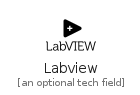|[simpleicons-4/L/Labview](../simpleicons-4/L/Labview.md)
|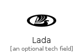|[simpleicons-4/L/Lada](../simpleicons-4/L/Lada.md)
|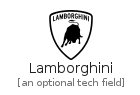|[simpleicons-4/L/Lamborghini](../simpleicons-4/L/Lamborghini.md)
||[simpleicons-4/L/Landrover](../simpleicons-4/L/Landrover.md)
||[simpleicons-4/L/Laragon](../simpleicons-4/L/Laragon.md)
|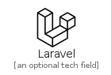|[simpleicons-4/L/Laravel](../simpleicons-4/L/Laravel.md)
||[simpleicons-4/L/Laravelhorizon](../simpleicons-4/L/Laravelhorizon.md)
||[simpleicons-4/L/Laravelnova](../simpleicons-4/L/Laravelnova.md)
||[simpleicons-4/L/LastDotFm](../simpleicons-4/L/LastDotFm.md)
|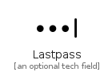|[simpleicons-4/L/Lastpass](../simpleicons-4/L/Lastpass.md)
|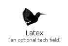|[simpleicons-4/L/Latex](../simpleicons-4/L/Latex.md)
||[simpleicons-4/L/Launchpad](../simpleicons-4/L/Launchpad.md)
|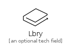|[simpleicons-4/L/Lbry](../simpleicons-4/L/Lbry.md)
||[simpleicons-4/L/Leaflet](../simpleicons-4/L/Leaflet.md)
||[simpleicons-4/L/Leanpub](../simpleicons-4/L/Leanpub.md)
|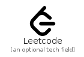|[simpleicons-4/L/Leetcode](../simpleicons-4/L/Leetcode.md)
|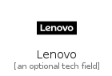|[simpleicons-4/L/Lenovo](../simpleicons-4/L/Lenovo.md)
|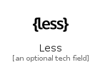|[simpleicons-4/L/Less](../simpleicons-4/L/Less.md)
||[simpleicons-4/L/Letsencrypt](../simpleicons-4/L/Letsencrypt.md)
||[simpleicons-4/L/Letterboxd](../simpleicons-4/L/Letterboxd.md)
|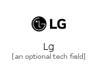|[simpleicons-4/L/Lg](../simpleicons-4/L/Lg.md)
|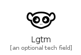|[simpleicons-4/L/Lgtm](../simpleicons-4/L/Lgtm.md)
||[simpleicons-4/L/Liberapay](../simpleicons-4/L/Liberapay.md)
||[simpleicons-4/L/Librarything](../simpleicons-4/L/Librarything.md)
||[simpleicons-4/L/Libreoffice](../simpleicons-4/L/Libreoffice.md)
|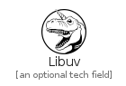|[simpleicons-4/L/Libuv](../simpleicons-4/L/Libuv.md)
|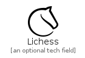|[simpleicons-4/L/Lichess](../simpleicons-4/L/Lichess.md)
||[simpleicons-4/L/Lighthouse](../simpleicons-4/L/Lighthouse.md)
||[simpleicons-4/L/Line](../simpleicons-4/L/Line.md)
|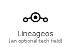|[simpleicons-4/L/Lineageos](../simpleicons-4/L/Lineageos.md)
||[simpleicons-4/L/Linewebtoon](../simpleicons-4/L/Linewebtoon.md)
||[simpleicons-4/L/Linkedin](../simpleicons-4/L/Linkedin.md)
|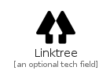|[simpleicons-4/L/Linktree](../simpleicons-4/L/Linktree.md)
|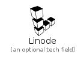|[simpleicons-4/L/Linode](../simpleicons-4/L/Linode.md)
|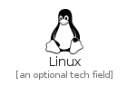|[simpleicons-4/L/Linux](../simpleicons-4/L/Linux.md)
||[simpleicons-4/L/Linuxfoundation](../simpleicons-4/L/Linuxfoundation.md)
||[simpleicons-4/L/Linuxmint](../simpleicons-4/L/Linuxmint.md)
||[simpleicons-4/L/Litecoin](../simpleicons-4/L/Litecoin.md)
||[simpleicons-4/L/Livejournal](../simpleicons-4/L/Livejournal.md)
||[simpleicons-4/L/Livestream](../simpleicons-4/L/Livestream.md)
|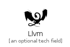|[simpleicons-4/L/Llvm](../simpleicons-4/L/Llvm.md)
|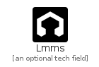|[simpleicons-4/L/Lmms](../simpleicons-4/L/Lmms.md)
||[simpleicons-4/L/Logitech](../simpleicons-4/L/Logitech.md)
||[simpleicons-4/L/Logmein](../simpleicons-4/L/Logmein.md)
||[simpleicons-4/L/Logstash](../simpleicons-4/L/Logstash.md)
||[simpleicons-4/L/Looker](../simpleicons-4/L/Looker.md)
|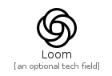|[simpleicons-4/L/Loom](../simpleicons-4/L/Loom.md)
|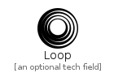|[simpleicons-4/L/Loop](../simpleicons-4/L/Loop.md)
|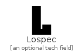|[simpleicons-4/L/Lospec](../simpleicons-4/L/Lospec.md)
|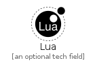|[simpleicons-4/L/Lua](../simpleicons-4/L/Lua.md)
||[simpleicons-4/L/Lubuntu](../simpleicons-4/L/Lubuntu.md)
||[simpleicons-4/L/Lufthansa](../simpleicons-4/L/Lufthansa.md)
|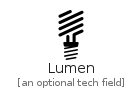|[simpleicons-4/L/Lumen](../simpleicons-4/L/Lumen.md)
|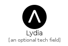|[simpleicons-4/L/Lydia](../simpleicons-4/L/Lydia.md)
||[simpleicons-4/L/Lyft](../simpleicons-4/L/Lyft.md)

