# N

The module N contains 50 entries.

| |Name|
|:---:|---|
|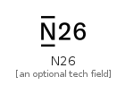|[simpleicons-4/N/N26](../simpleicons-4/N/N26.md)
||[simpleicons-4/N/Namecheap](../simpleicons-4/N/Namecheap.md)
|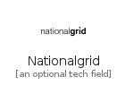|[simpleicons-4/N/Nationalgrid](../simpleicons-4/N/Nationalgrid.md)
||[simpleicons-4/N/Nativescript](../simpleicons-4/N/Nativescript.md)
|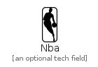|[simpleicons-4/N/Nba](../simpleicons-4/N/Nba.md)
|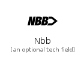|[simpleicons-4/N/Nbb](../simpleicons-4/N/Nbb.md)
|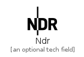|[simpleicons-4/N/Ndr](../simpleicons-4/N/Ndr.md)
|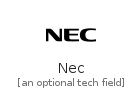|[simpleicons-4/N/Nec](../simpleicons-4/N/Nec.md)
|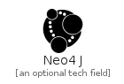|[simpleicons-4/N/Neo4J](../simpleicons-4/N/Neo4J.md)
|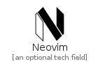|[simpleicons-4/N/Neovim](../simpleicons-4/N/Neovim.md)
|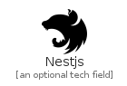|[simpleicons-4/N/Nestjs](../simpleicons-4/N/Nestjs.md)
||[simpleicons-4/N/Netapp](../simpleicons-4/N/Netapp.md)
||[simpleicons-4/N/Netflix](../simpleicons-4/N/Netflix.md)
||[simpleicons-4/N/Netlify](../simpleicons-4/N/Netlify.md)
||[simpleicons-4/N/NewjapanproWrestling](../simpleicons-4/N/NewjapanproWrestling.md)
|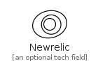|[simpleicons-4/N/Newrelic](../simpleicons-4/N/Newrelic.md)
||[simpleicons-4/N/Newyorktimes](../simpleicons-4/N/Newyorktimes.md)
||[simpleicons-4/N/Nextcloud](../simpleicons-4/N/Nextcloud.md)
|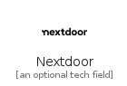|[simpleicons-4/N/Nextdoor](../simpleicons-4/N/Nextdoor.md)
||[simpleicons-4/N/NextDotJs](../simpleicons-4/N/NextDotJs.md)
|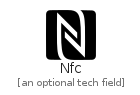|[simpleicons-4/N/Nfc](../simpleicons-4/N/Nfc.md)
||[simpleicons-4/N/Nginx](../simpleicons-4/N/Nginx.md)
||[simpleicons-4/N/Ngrok](../simpleicons-4/N/Ngrok.md)
||[simpleicons-4/N/Niconico](../simpleicons-4/N/Niconico.md)
|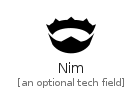|[simpleicons-4/N/Nim](../simpleicons-4/N/Nim.md)
|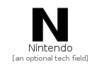|[simpleicons-4/N/Nintendo](../simpleicons-4/N/Nintendo.md)
|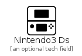|[simpleicons-4/N/Nintendo3Ds](../simpleicons-4/N/Nintendo3Ds.md)
||[simpleicons-4/N/Nintendogamecube](../simpleicons-4/N/Nintendogamecube.md)
||[simpleicons-4/N/Nintendonetwork](../simpleicons-4/N/Nintendonetwork.md)
||[simpleicons-4/N/Nintendoswitch](../simpleicons-4/N/Nintendoswitch.md)
||[simpleicons-4/N/Nissan](../simpleicons-4/N/Nissan.md)
|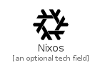|[simpleicons-4/N/Nixos](../simpleicons-4/N/Nixos.md)
||[simpleicons-4/N/NodeDotJs](../simpleicons-4/N/NodeDotJs.md)
||[simpleicons-4/N/Nodemon](../simpleicons-4/N/Nodemon.md)
|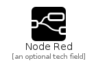|[simpleicons-4/N/NodeRed](../simpleicons-4/N/NodeRed.md)
|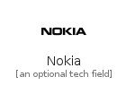|[simpleicons-4/N/Nokia](../simpleicons-4/N/Nokia.md)
||[simpleicons-4/N/Notepadplusplus](../simpleicons-4/N/Notepadplusplus.md)
|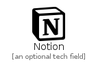|[simpleicons-4/N/Notion](../simpleicons-4/N/Notion.md)
||[simpleicons-4/N/Notist](../simpleicons-4/N/Notist.md)
|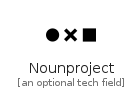|[simpleicons-4/N/Nounproject](../simpleicons-4/N/Nounproject.md)
|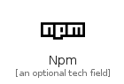|[simpleicons-4/N/Npm](../simpleicons-4/N/Npm.md)
||[simpleicons-4/N/Nubank](../simpleicons-4/N/Nubank.md)
||[simpleicons-4/N/Nucleo](../simpleicons-4/N/Nucleo.md)
|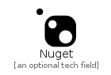|[simpleicons-4/N/Nuget](../simpleicons-4/N/Nuget.md)
|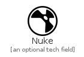|[simpleicons-4/N/Nuke](../simpleicons-4/N/Nuke.md)
||[simpleicons-4/N/Numba](../simpleicons-4/N/Numba.md)
|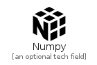|[simpleicons-4/N/Numpy](../simpleicons-4/N/Numpy.md)
||[simpleicons-4/N/Nutanix](../simpleicons-4/N/Nutanix.md)
||[simpleicons-4/N/NuxtDotJs](../simpleicons-4/N/NuxtDotJs.md)
|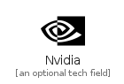|[simpleicons-4/N/Nvidia](../simpleicons-4/N/Nvidia.md)

