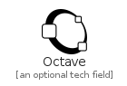
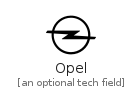
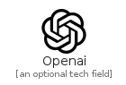
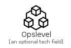

# O

The module O contains 44 entries.

| |Name|
|:---:|---|
||[simpleicons-4/O/Observable](../simpleicons-4/O/Observable.md)
||[simpleicons-4/O/Obsstudio](../simpleicons-4/O/Obsstudio.md)
||[simpleicons-4/O/Ocaml](../simpleicons-4/O/Ocaml.md)
||[simpleicons-4/O/Octave](../simpleicons-4/O/Octave.md)
||[simpleicons-4/O/Octopusdeploy](../simpleicons-4/O/Octopusdeploy.md)
||[simpleicons-4/O/Oculus](../simpleicons-4/O/Oculus.md)
||[simpleicons-4/O/Odnoklassniki](../simpleicons-4/O/Odnoklassniki.md)
||[simpleicons-4/O/Okcupid](../simpleicons-4/O/Okcupid.md)
||[simpleicons-4/O/Oneplus](../simpleicons-4/O/Oneplus.md)
||[simpleicons-4/O/Onstar](../simpleicons-4/O/Onstar.md)
||[simpleicons-4/O/Opel](../simpleicons-4/O/Opel.md)
||[simpleicons-4/O/Openaccess](../simpleicons-4/O/Openaccess.md)
||[simpleicons-4/O/Openai](../simpleicons-4/O/Openai.md)
||[simpleicons-4/O/Openaigym](../simpleicons-4/O/Openaigym.md)
||[simpleicons-4/O/Openapiinitiative](../simpleicons-4/O/Openapiinitiative.md)
||[simpleicons-4/O/Openbadges](../simpleicons-4/O/Openbadges.md)
||[simpleicons-4/O/Openbsd](../simpleicons-4/O/Openbsd.md)
||[simpleicons-4/O/Openbugbounty](../simpleicons-4/O/Openbugbounty.md)
||[simpleicons-4/O/Opencollective](../simpleicons-4/O/Opencollective.md)
||[simpleicons-4/O/Opencontainersinitiative](../simpleicons-4/O/Opencontainersinitiative.md)
||[simpleicons-4/O/Opencv](../simpleicons-4/O/Opencv.md)
||[simpleicons-4/O/Opengl](../simpleicons-4/O/Opengl.md)
||[simpleicons-4/O/Openid](../simpleicons-4/O/Openid.md)
||[simpleicons-4/O/Openlayers](../simpleicons-4/O/Openlayers.md)
||[simpleicons-4/O/Opennebula](../simpleicons-4/O/Opennebula.md)
||[simpleicons-4/O/Opensourceinitiative](../simpleicons-4/O/Opensourceinitiative.md)
||[simpleicons-4/O/Openssl](../simpleicons-4/O/Openssl.md)
||[simpleicons-4/O/Openstack](../simpleicons-4/O/Openstack.md)
||[simpleicons-4/O/Openstreetmap](../simpleicons-4/O/Openstreetmap.md)
||[simpleicons-4/O/Opensuse](../simpleicons-4/O/Opensuse.md)
||[simpleicons-4/O/Openvpn](../simpleicons-4/O/Openvpn.md)
||[simpleicons-4/O/Opera](../simpleicons-4/O/Opera.md)
||[simpleicons-4/O/Opsgenie](../simpleicons-4/O/Opsgenie.md)
||[simpleicons-4/O/Opslevel](../simpleicons-4/O/Opslevel.md)
||[simpleicons-4/O/Oracle](../simpleicons-4/O/Oracle.md)
||[simpleicons-4/O/Orcid](../simpleicons-4/O/Orcid.md)
||[simpleicons-4/O/Origin](../simpleicons-4/O/Origin.md)
||[simpleicons-4/O/Osano](../simpleicons-4/O/Osano.md)
||[simpleicons-4/O/Oshkosh](../simpleicons-4/O/Oshkosh.md)
||[simpleicons-4/O/Osmc](../simpleicons-4/O/Osmc.md)
||[simpleicons-4/O/Overcast](../simpleicons-4/O/Overcast.md)
||[simpleicons-4/O/Overleaf](../simpleicons-4/O/Overleaf.md)
||[simpleicons-4/O/Ovh](../simpleicons-4/O/Ovh.md)
||[simpleicons-4/O/Owasp](../simpleicons-4/O/Owasp.md)

