# P

The module P contains 130 entries.

| |Name|
|:---:|---|
||[simpleicons-4/P/P5DotJs](../simpleicons-4/P/P5DotJs.md)
||[simpleicons-4/P/Packagist](../simpleicons-4/P/Packagist.md)
||[simpleicons-4/P/Pagekit](../simpleicons-4/P/Pagekit.md)
||[simpleicons-4/P/Pagerduty](../simpleicons-4/P/Pagerduty.md)
||[simpleicons-4/P/Pagespeedinsights](../simpleicons-4/P/Pagespeedinsights.md)
||[simpleicons-4/P/Pagseguro](../simpleicons-4/P/Pagseguro.md)
||[simpleicons-4/P/Palantir](../simpleicons-4/P/Palantir.md)
||[simpleicons-4/P/Paloaltosoftware](../simpleicons-4/P/Paloaltosoftware.md)
||[simpleicons-4/P/Pandas](../simpleicons-4/P/Pandas.md)
||[simpleicons-4/P/Pandora](../simpleicons-4/P/Pandora.md)
||[simpleicons-4/P/Pantheon](../simpleicons-4/P/Pantheon.md)
||[simpleicons-4/P/Paritysubstrate](../simpleicons-4/P/Paritysubstrate.md)
||[simpleicons-4/P/ParseDotLy](../simpleicons-4/P/ParseDotLy.md)
||[simpleicons-4/P/Passport](../simpleicons-4/P/Passport.md)
|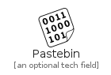|[simpleicons-4/P/Pastebin](../simpleicons-4/P/Pastebin.md)
||[simpleicons-4/P/Patreon](../simpleicons-4/P/Patreon.md)
||[simpleicons-4/P/Payoneer](../simpleicons-4/P/Payoneer.md)
||[simpleicons-4/P/Paypal](../simpleicons-4/P/Paypal.md)
||[simpleicons-4/P/Paytm](../simpleicons-4/P/Paytm.md)
||[simpleicons-4/P/Pcgamingwiki](../simpleicons-4/P/Pcgamingwiki.md)
||[simpleicons-4/P/Peertube](../simpleicons-4/P/Peertube.md)
||[simpleicons-4/P/Pegasusairlines](../simpleicons-4/P/Pegasusairlines.md)
||[simpleicons-4/P/Pelican](../simpleicons-4/P/Pelican.md)
||[simpleicons-4/P/Peloton](../simpleicons-4/P/Peloton.md)
|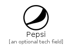|[simpleicons-4/P/Pepsi](../simpleicons-4/P/Pepsi.md)
||[simpleicons-4/P/Periscope](../simpleicons-4/P/Periscope.md)
|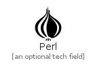|[simpleicons-4/P/Perl](../simpleicons-4/P/Perl.md)
||[simpleicons-4/P/Peugeot](../simpleicons-4/P/Peugeot.md)
||[simpleicons-4/P/Pexels](../simpleicons-4/P/Pexels.md)
||[simpleicons-4/P/Pfsense](../simpleicons-4/P/Pfsense.md)
||[simpleicons-4/P/Phabricator](../simpleicons-4/P/Phabricator.md)
||[simpleicons-4/P/Philipshue](../simpleicons-4/P/Philipshue.md)
||[simpleicons-4/P/Phonepe](../simpleicons-4/P/Phonepe.md)
||[simpleicons-4/P/Photobucket](../simpleicons-4/P/Photobucket.md)
||[simpleicons-4/P/Photocrowd](../simpleicons-4/P/Photocrowd.md)
||[simpleicons-4/P/Photopea](../simpleicons-4/P/Photopea.md)
||[simpleicons-4/P/Php](../simpleicons-4/P/Php.md)
|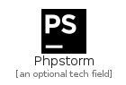|[simpleicons-4/P/Phpstorm](../simpleicons-4/P/Phpstorm.md)
||[simpleicons-4/P/PicartoDotTv](../simpleicons-4/P/PicartoDotTv.md)
|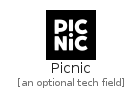|[simpleicons-4/P/Picnic](../simpleicons-4/P/Picnic.md)
||[simpleicons-4/P/Picpay](../simpleicons-4/P/Picpay.md)
||[simpleicons-4/P/PiHole](../simpleicons-4/P/PiHole.md)
|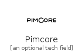|[simpleicons-4/P/Pimcore](../simpleicons-4/P/Pimcore.md)
||[simpleicons-4/P/Pinboard](../simpleicons-4/P/Pinboard.md)
||[simpleicons-4/P/Pingdom](../simpleicons-4/P/Pingdom.md)
||[simpleicons-4/P/Pingup](../simpleicons-4/P/Pingup.md)
||[simpleicons-4/P/Pinterest](../simpleicons-4/P/Pinterest.md)
||[simpleicons-4/P/Pioneerdj](../simpleicons-4/P/Pioneerdj.md)
||[simpleicons-4/P/Pivotaltracker](../simpleicons-4/P/Pivotaltracker.md)
||[simpleicons-4/P/Piwigo](../simpleicons-4/P/Piwigo.md)
||[simpleicons-4/P/Pixabay](../simpleicons-4/P/Pixabay.md)
|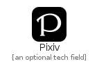|[simpleicons-4/P/Pixiv](../simpleicons-4/P/Pixiv.md)
||[simpleicons-4/P/Pjsip](../simpleicons-4/P/Pjsip.md)
||[simpleicons-4/P/Planet](../simpleicons-4/P/Planet.md)
||[simpleicons-4/P/Plangrid](../simpleicons-4/P/Plangrid.md)
||[simpleicons-4/P/Platzi](../simpleicons-4/P/Platzi.md)
||[simpleicons-4/P/Playcanvas](../simpleicons-4/P/Playcanvas.md)
||[simpleicons-4/P/PlayerDotMe](../simpleicons-4/P/PlayerDotMe.md)
||[simpleicons-4/P/Playerfm](../simpleicons-4/P/Playerfm.md)
||[simpleicons-4/P/Playstation](../simpleicons-4/P/Playstation.md)
||[simpleicons-4/P/Playstation2](../simpleicons-4/P/Playstation2.md)
||[simpleicons-4/P/Playstation3](../simpleicons-4/P/Playstation3.md)
||[simpleicons-4/P/Playstation4](../simpleicons-4/P/Playstation4.md)
|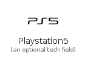|[simpleicons-4/P/Playstation5](../simpleicons-4/P/Playstation5.md)
|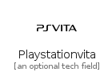|[simpleicons-4/P/Playstationvita](../simpleicons-4/P/Playstationvita.md)
||[simpleicons-4/P/Pleroma](../simpleicons-4/P/Pleroma.md)
|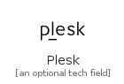|[simpleicons-4/P/Plesk](../simpleicons-4/P/Plesk.md)
||[simpleicons-4/P/Plex](../simpleicons-4/P/Plex.md)
||[simpleicons-4/P/Plotly](../simpleicons-4/P/Plotly.md)
||[simpleicons-4/P/Pluralsight](../simpleicons-4/P/Pluralsight.md)
||[simpleicons-4/P/Plurk](../simpleicons-4/P/Plurk.md)
|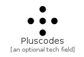|[simpleicons-4/P/Pluscodes](../simpleicons-4/P/Pluscodes.md)
||[simpleicons-4/P/Pm2](../simpleicons-4/P/Pm2.md)
||[simpleicons-4/P/Pnpm](../simpleicons-4/P/Pnpm.md)
||[simpleicons-4/P/Pocket](../simpleicons-4/P/Pocket.md)
||[simpleicons-4/P/Pocketcasts](../simpleicons-4/P/Pocketcasts.md)
||[simpleicons-4/P/Podcastaddict](../simpleicons-4/P/Podcastaddict.md)
||[simpleicons-4/P/Podman](../simpleicons-4/P/Podman.md)
||[simpleicons-4/P/Pointy](../simpleicons-4/P/Pointy.md)
|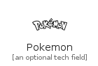|[simpleicons-4/P/Pokemon](../simpleicons-4/P/Pokemon.md)
||[simpleicons-4/P/Poly](../simpleicons-4/P/Poly.md)
||[simpleicons-4/P/Polymerproject](../simpleicons-4/P/Polymerproject.md)
|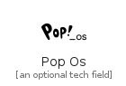|[simpleicons-4/P/PopOs](../simpleicons-4/P/PopOs.md)
||[simpleicons-4/P/Porsche](../simpleicons-4/P/Porsche.md)
||[simpleicons-4/P/Postcss](../simpleicons-4/P/Postcss.md)
||[simpleicons-4/P/Postgresql](../simpleicons-4/P/Postgresql.md)
||[simpleicons-4/P/Postman](../simpleicons-4/P/Postman.md)
||[simpleicons-4/P/Postmates](../simpleicons-4/P/Postmates.md)
||[simpleicons-4/P/Powerbi](../simpleicons-4/P/Powerbi.md)
|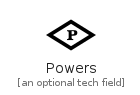|[simpleicons-4/P/Powers](../simpleicons-4/P/Powers.md)
||[simpleicons-4/P/Powershell](../simpleicons-4/P/Powershell.md)
||[simpleicons-4/P/PrDotCo](../simpleicons-4/P/PrDotCo.md)
||[simpleicons-4/P/PreCommit](../simpleicons-4/P/PreCommit.md)
||[simpleicons-4/P/Premierleague](../simpleicons-4/P/Premierleague.md)
||[simpleicons-4/P/Prestashop](../simpleicons-4/P/Prestashop.md)
||[simpleicons-4/P/Presto](../simpleicons-4/P/Presto.md)
||[simpleicons-4/P/Prettier](../simpleicons-4/P/Prettier.md)
||[simpleicons-4/P/Prezi](../simpleicons-4/P/Prezi.md)
||[simpleicons-4/P/Prime](../simpleicons-4/P/Prime.md)
||[simpleicons-4/P/Primevideo](../simpleicons-4/P/Primevideo.md)
|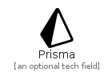|[simpleicons-4/P/Prisma](../simpleicons-4/P/Prisma.md)
||[simpleicons-4/P/Prismic](../simpleicons-4/P/Prismic.md)
||[simpleicons-4/P/Privateinternetaccess](../simpleicons-4/P/Privateinternetaccess.md)
||[simpleicons-4/P/Probot](../simpleicons-4/P/Probot.md)
||[simpleicons-4/P/Processwire](../simpleicons-4/P/Processwire.md)
||[simpleicons-4/P/Producthunt](../simpleicons-4/P/Producthunt.md)
||[simpleicons-4/P/Progate](../simpleicons-4/P/Progate.md)
||[simpleicons-4/P/Progress](../simpleicons-4/P/Progress.md)
||[simpleicons-4/P/Prometheus](../simpleicons-4/P/Prometheus.md)
||[simpleicons-4/P/Prosieben](../simpleicons-4/P/Prosieben.md)
||[simpleicons-4/P/ProtocolsDotIo](../simpleicons-4/P/ProtocolsDotIo.md)
||[simpleicons-4/P/ProtoDotIo](../simpleicons-4/P/ProtoDotIo.md)
||[simpleicons-4/P/Protondb](../simpleicons-4/P/Protondb.md)
||[simpleicons-4/P/Protonmail](../simpleicons-4/P/Protonmail.md)
||[simpleicons-4/P/Protonvpn](../simpleicons-4/P/Protonvpn.md)
||[simpleicons-4/P/Protools](../simpleicons-4/P/Protools.md)
||[simpleicons-4/P/Proxmox](../simpleicons-4/P/Proxmox.md)
||[simpleicons-4/P/Publons](../simpleicons-4/P/Publons.md)
||[simpleicons-4/P/Pubmed](../simpleicons-4/P/Pubmed.md)
|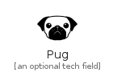|[simpleicons-4/P/Pug](../simpleicons-4/P/Pug.md)
|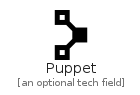|[simpleicons-4/P/Puppet](../simpleicons-4/P/Puppet.md)
|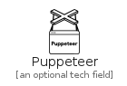|[simpleicons-4/P/Puppeteer](../simpleicons-4/P/Puppeteer.md)
||[simpleicons-4/P/Purescript](../simpleicons-4/P/Purescript.md)
||[simpleicons-4/P/Purgecss](../simpleicons-4/P/Purgecss.md)
||[simpleicons-4/P/Pycharm](../simpleicons-4/P/Pycharm.md)
|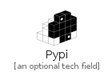|[simpleicons-4/P/Pypi](../simpleicons-4/P/Pypi.md)
||[simpleicons-4/P/Pypy](../simpleicons-4/P/Pypy.md)
|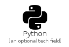|[simpleicons-4/P/Python](../simpleicons-4/P/Python.md)
||[simpleicons-4/P/Pytorch](../simpleicons-4/P/Pytorch.md)
||[simpleicons-4/P/Pyup](../simpleicons-4/P/Pyup.md)

