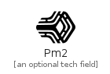

# Pm2

```text
simpleicons-4/P/Pm2
```

```text
include('simpleicons-4/P/Pm2')
```

|icon|element|
|---|---|
|||


## element
### Load remotely
```plantuml
@startuml
' configures the library
!global $LIB_BASE_LOCATION="https://raw.githubusercontent.com/tmorin/plantuml-libs/master/dist"
' loads the library
!include $LIB_BASE_LOCATION/bootstrap.puml
' loads the simpleicons-4 bootstrap
include('simpleicons-4/bootstrap')
' loads the Pm2 element
include('simpleicons-4/P/Pm2')
Pm2('pm_2', 'Pm2', 'an optional tech field')
@enduml
```
### Load locally
```plantuml
@startuml
' configures the library
!global $INCLUSION_MODE="local"
!global $LIB_BASE_LOCATION="../.."
' loads the library
!include $LIB_BASE_LOCATION/bootstrap.puml
' loads the simpleicons-4 bootstrap
include('simpleicons-4/bootstrap')
' loads the Pm2 element
include('simpleicons-4/P/Pm2')
Pm2('pm_2', 'Pm2', 'an optional tech field')
@enduml
```

