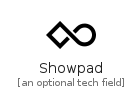
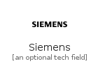
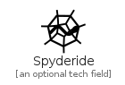
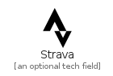
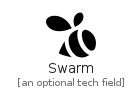
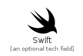

# S

The module S contains 173 entries.

| |Name|
|:---:|---|
||[simpleicons-4/S/Safari](../simpleicons-4/S/Safari.md)
||[simpleicons-4/S/Sahibinden](../simpleicons-4/S/Sahibinden.md)
||[simpleicons-4/S/Salesforce](../simpleicons-4/S/Salesforce.md)
||[simpleicons-4/S/Saltstack](../simpleicons-4/S/Saltstack.md)
||[simpleicons-4/S/Samsung](../simpleicons-4/S/Samsung.md)
||[simpleicons-4/S/Samsungpay](../simpleicons-4/S/Samsungpay.md)
||[simpleicons-4/S/Sanfranciscomunicipalrailway](../simpleicons-4/S/Sanfranciscomunicipalrailway.md)
||[simpleicons-4/S/Saopaulometro](../simpleicons-4/S/Saopaulometro.md)
||[simpleicons-4/S/Sap](../simpleicons-4/S/Sap.md)
||[simpleicons-4/S/Sass](../simpleicons-4/S/Sass.md)
||[simpleicons-4/S/SatDot1](../simpleicons-4/S/SatDot1.md)
||[simpleicons-4/S/Saucelabs](../simpleicons-4/S/Saucelabs.md)
||[simpleicons-4/S/Scala](../simpleicons-4/S/Scala.md)
||[simpleicons-4/S/Scaleway](../simpleicons-4/S/Scaleway.md)
||[simpleicons-4/S/Scania](../simpleicons-4/S/Scania.md)
||[simpleicons-4/S/ScikitLearn](../simpleicons-4/S/ScikitLearn.md)
||[simpleicons-4/S/Scipy](../simpleicons-4/S/Scipy.md)
||[simpleicons-4/S/Scopus](../simpleicons-4/S/Scopus.md)
||[simpleicons-4/S/Scratch](../simpleicons-4/S/Scratch.md)
||[simpleicons-4/S/Scribd](../simpleicons-4/S/Scribd.md)
||[simpleicons-4/S/Scrimba](../simpleicons-4/S/Scrimba.md)
||[simpleicons-4/S/Scrutinizerci](../simpleicons-4/S/Scrutinizerci.md)
||[simpleicons-4/S/Seagate](../simpleicons-4/S/Seagate.md)
||[simpleicons-4/S/Seat](../simpleicons-4/S/Seat.md)
||[simpleicons-4/S/Sega](../simpleicons-4/S/Sega.md)
||[simpleicons-4/S/Selenium](../simpleicons-4/S/Selenium.md)
||[simpleicons-4/S/Sellfy](../simpleicons-4/S/Sellfy.md)
||[simpleicons-4/S/Semanticuireact](../simpleicons-4/S/Semanticuireact.md)
||[simpleicons-4/S/Semanticweb](../simpleicons-4/S/Semanticweb.md)
||[simpleicons-4/S/Semaphoreci](../simpleicons-4/S/Semaphoreci.md)
||[simpleicons-4/S/Semver](../simpleicons-4/S/Semver.md)
||[simpleicons-4/S/Sencha](../simpleicons-4/S/Sencha.md)
||[simpleicons-4/S/Sennheiser](../simpleicons-4/S/Sennheiser.md)
||[simpleicons-4/S/Sensu](../simpleicons-4/S/Sensu.md)
||[simpleicons-4/S/Sentry](../simpleicons-4/S/Sentry.md)
||[simpleicons-4/S/Sepa](../simpleicons-4/S/Sepa.md)
||[simpleicons-4/S/Serverfault](../simpleicons-4/S/Serverfault.md)
||[simpleicons-4/S/Serverless](../simpleicons-4/S/Serverless.md)
||[simpleicons-4/S/Shanghaimetro](../simpleicons-4/S/Shanghaimetro.md)
||[simpleicons-4/S/Shazam](../simpleicons-4/S/Shazam.md)
||[simpleicons-4/S/Shell](../simpleicons-4/S/Shell.md)
||[simpleicons-4/S/Shenzhenmetro](../simpleicons-4/S/Shenzhenmetro.md)
||[simpleicons-4/S/ShieldsDotIo](../simpleicons-4/S/ShieldsDotIo.md)
||[simpleicons-4/S/Shikimori](../simpleicons-4/S/Shikimori.md)
||[simpleicons-4/S/Shopify](../simpleicons-4/S/Shopify.md)
||[simpleicons-4/S/Shopware](../simpleicons-4/S/Shopware.md)
||[simpleicons-4/S/Showpad](../simpleicons-4/S/Showpad.md)
||[simpleicons-4/S/Shutterstock](../simpleicons-4/S/Shutterstock.md)
||[simpleicons-4/S/Siemens](../simpleicons-4/S/Siemens.md)
||[simpleicons-4/S/Signal](../simpleicons-4/S/Signal.md)
||[simpleicons-4/S/Simpleicons](../simpleicons-4/S/Simpleicons.md)
||[simpleicons-4/S/Sinaweibo](../simpleicons-4/S/Sinaweibo.md)
||[simpleicons-4/S/Singlestore](../simpleicons-4/S/Singlestore.md)
||[simpleicons-4/S/Sitepoint](../simpleicons-4/S/Sitepoint.md)
||[simpleicons-4/S/Sketch](../simpleicons-4/S/Sketch.md)
||[simpleicons-4/S/Sketchfab](../simpleicons-4/S/Sketchfab.md)
||[simpleicons-4/S/Sketchup](../simpleicons-4/S/Sketchup.md)
||[simpleicons-4/S/Skillshare](../simpleicons-4/S/Skillshare.md)
||[simpleicons-4/S/Skoda](../simpleicons-4/S/Skoda.md)
||[simpleicons-4/S/Sky](../simpleicons-4/S/Sky.md)
||[simpleicons-4/S/Skyliner](../simpleicons-4/S/Skyliner.md)
||[simpleicons-4/S/Skype](../simpleicons-4/S/Skype.md)
||[simpleicons-4/S/Skypeforbusiness](../simpleicons-4/S/Skypeforbusiness.md)
||[simpleicons-4/S/Slack](../simpleicons-4/S/Slack.md)
||[simpleicons-4/S/Slackware](../simpleicons-4/S/Slackware.md)
||[simpleicons-4/S/Slashdot](../simpleicons-4/S/Slashdot.md)
||[simpleicons-4/S/Slickpic](../simpleicons-4/S/Slickpic.md)
||[simpleicons-4/S/Slides](../simpleicons-4/S/Slides.md)
||[simpleicons-4/S/Slideshare](../simpleicons-4/S/Slideshare.md)
||[simpleicons-4/S/Smart](../simpleicons-4/S/Smart.md)
||[simpleicons-4/S/Smartthings](../simpleicons-4/S/Smartthings.md)
||[simpleicons-4/S/Smashingmagazine](../simpleicons-4/S/Smashingmagazine.md)
||[simpleicons-4/S/Smrt](../simpleicons-4/S/Smrt.md)
||[simpleicons-4/S/Smugmug](../simpleicons-4/S/Smugmug.md)
||[simpleicons-4/S/Snapchat](../simpleicons-4/S/Snapchat.md)
||[simpleicons-4/S/Snapcraft](../simpleicons-4/S/Snapcraft.md)
||[simpleicons-4/S/Snowflake](../simpleicons-4/S/Snowflake.md)
||[simpleicons-4/S/Snyk](../simpleicons-4/S/Snyk.md)
||[simpleicons-4/S/Society6](../simpleicons-4/S/Society6.md)
||[simpleicons-4/S/SocketDotIo](../simpleicons-4/S/SocketDotIo.md)
||[simpleicons-4/S/Sogou](../simpleicons-4/S/Sogou.md)
||[simpleicons-4/S/Solidity](../simpleicons-4/S/Solidity.md)
||[simpleicons-4/S/Sololearn](../simpleicons-4/S/Sololearn.md)
||[simpleicons-4/S/Solus](../simpleicons-4/S/Solus.md)
||[simpleicons-4/S/Sonarcloud](../simpleicons-4/S/Sonarcloud.md)
||[simpleicons-4/S/Sonarlint](../simpleicons-4/S/Sonarlint.md)
||[simpleicons-4/S/Sonarqube](../simpleicons-4/S/Sonarqube.md)
||[simpleicons-4/S/Sonarsource](../simpleicons-4/S/Sonarsource.md)
||[simpleicons-4/S/Songkick](../simpleicons-4/S/Songkick.md)
||[simpleicons-4/S/Songoda](../simpleicons-4/S/Songoda.md)
||[simpleicons-4/S/Sonicwall](../simpleicons-4/S/Sonicwall.md)
||[simpleicons-4/S/Sonos](../simpleicons-4/S/Sonos.md)
||[simpleicons-4/S/Soundcloud](../simpleicons-4/S/Soundcloud.md)
||[simpleicons-4/S/Sourceengine](../simpleicons-4/S/Sourceengine.md)
||[simpleicons-4/S/Sourceforge](../simpleicons-4/S/Sourceforge.md)
||[simpleicons-4/S/Sourcegraph](../simpleicons-4/S/Sourcegraph.md)
||[simpleicons-4/S/Southwestairlines](../simpleicons-4/S/Southwestairlines.md)
||[simpleicons-4/S/Spacemacs](../simpleicons-4/S/Spacemacs.md)
||[simpleicons-4/S/Spacex](../simpleicons-4/S/Spacex.md)
||[simpleicons-4/S/Sparkar](../simpleicons-4/S/Sparkar.md)
||[simpleicons-4/S/Sparkfun](../simpleicons-4/S/Sparkfun.md)
||[simpleicons-4/S/Sparkpost](../simpleicons-4/S/Sparkpost.md)
||[simpleicons-4/S/Spdx](../simpleicons-4/S/Spdx.md)
||[simpleicons-4/S/Speakerdeck](../simpleicons-4/S/Speakerdeck.md)
||[simpleicons-4/S/Spectrum](../simpleicons-4/S/Spectrum.md)
||[simpleicons-4/S/Speedtest](../simpleicons-4/S/Speedtest.md)
||[simpleicons-4/S/Spinnaker](../simpleicons-4/S/Spinnaker.md)
||[simpleicons-4/S/Spinrilla](../simpleicons-4/S/Spinrilla.md)
||[simpleicons-4/S/Splunk](../simpleicons-4/S/Splunk.md)
||[simpleicons-4/S/Spotify](../simpleicons-4/S/Spotify.md)
||[simpleicons-4/S/Spotlight](../simpleicons-4/S/Spotlight.md)
||[simpleicons-4/S/Spreaker](../simpleicons-4/S/Spreaker.md)
||[simpleicons-4/S/Spring](../simpleicons-4/S/Spring.md)
||[simpleicons-4/S/Sprint](../simpleicons-4/S/Sprint.md)
||[simpleicons-4/S/Spyderide](../simpleicons-4/S/Spyderide.md)
||[simpleicons-4/S/Sqlite](../simpleicons-4/S/Sqlite.md)
||[simpleicons-4/S/Square](../simpleicons-4/S/Square.md)
||[simpleicons-4/S/Squareenix](../simpleicons-4/S/Squareenix.md)
||[simpleicons-4/S/Squarespace](../simpleicons-4/S/Squarespace.md)
||[simpleicons-4/S/Ssrn](../simpleicons-4/S/Ssrn.md)
||[simpleicons-4/S/Stackbit](../simpleicons-4/S/Stackbit.md)
||[simpleicons-4/S/Stackexchange](../simpleicons-4/S/Stackexchange.md)
||[simpleicons-4/S/Stackoverflow](../simpleicons-4/S/Stackoverflow.md)
||[simpleicons-4/S/Stackpath](../simpleicons-4/S/Stackpath.md)
||[simpleicons-4/S/Stackshare](../simpleicons-4/S/Stackshare.md)
||[simpleicons-4/S/Stadia](../simpleicons-4/S/Stadia.md)
||[simpleicons-4/S/Staffbase](../simpleicons-4/S/Staffbase.md)
||[simpleicons-4/S/Starlingbank](../simpleicons-4/S/Starlingbank.md)
||[simpleicons-4/S/Starship](../simpleicons-4/S/Starship.md)
||[simpleicons-4/S/Startrek](../simpleicons-4/S/Startrek.md)
||[simpleicons-4/S/Starz](../simpleicons-4/S/Starz.md)
||[simpleicons-4/S/Statamic](../simpleicons-4/S/Statamic.md)
||[simpleicons-4/S/Staticman](../simpleicons-4/S/Staticman.md)
||[simpleicons-4/S/Statuspage](../simpleicons-4/S/Statuspage.md)
||[simpleicons-4/S/Steam](../simpleicons-4/S/Steam.md)
||[simpleicons-4/S/Steamdb](../simpleicons-4/S/Steamdb.md)
||[simpleicons-4/S/Steamworks](../simpleicons-4/S/Steamworks.md)
||[simpleicons-4/S/Steem](../simpleicons-4/S/Steem.md)
||[simpleicons-4/S/Steemit](../simpleicons-4/S/Steemit.md)
||[simpleicons-4/S/Steinberg](../simpleicons-4/S/Steinberg.md)
||[simpleicons-4/S/Stellar](../simpleicons-4/S/Stellar.md)
||[simpleicons-4/S/Stencyl](../simpleicons-4/S/Stencyl.md)
||[simpleicons-4/S/Stitcher](../simpleicons-4/S/Stitcher.md)
||[simpleicons-4/S/Stmicroelectronics](../simpleicons-4/S/Stmicroelectronics.md)
||[simpleicons-4/S/Storify](../simpleicons-4/S/Storify.md)
||[simpleicons-4/S/Storybook](../simpleicons-4/S/Storybook.md)
||[simpleicons-4/S/Strapi](../simpleicons-4/S/Strapi.md)
||[simpleicons-4/S/Strava](../simpleicons-4/S/Strava.md)
||[simpleicons-4/S/Streamlit](../simpleicons-4/S/Streamlit.md)
||[simpleicons-4/S/Stripe](../simpleicons-4/S/Stripe.md)
||[simpleicons-4/S/Strongswan](../simpleicons-4/S/Strongswan.md)
||[simpleicons-4/S/Stubhub](../simpleicons-4/S/Stubhub.md)
||[simpleicons-4/S/StyledComponents](../simpleicons-4/S/StyledComponents.md)
||[simpleicons-4/S/Styleshare](../simpleicons-4/S/Styleshare.md)
||[simpleicons-4/S/Stylus](../simpleicons-4/S/Stylus.md)
||[simpleicons-4/S/Subaru](../simpleicons-4/S/Subaru.md)
||[simpleicons-4/S/Sublimetext](../simpleicons-4/S/Sublimetext.md)
||[simpleicons-4/S/Substack](../simpleicons-4/S/Substack.md)
||[simpleicons-4/S/Subversion](../simpleicons-4/S/Subversion.md)
||[simpleicons-4/S/Sumologic](../simpleicons-4/S/Sumologic.md)
||[simpleicons-4/S/Superuser](../simpleicons-4/S/Superuser.md)
||[simpleicons-4/S/Suzuki](../simpleicons-4/S/Suzuki.md)
||[simpleicons-4/S/Svelte](../simpleicons-4/S/Svelte.md)
||[simpleicons-4/S/Svg](../simpleicons-4/S/Svg.md)
||[simpleicons-4/S/Svgo](../simpleicons-4/S/Svgo.md)
||[simpleicons-4/S/Swagger](../simpleicons-4/S/Swagger.md)
||[simpleicons-4/S/Swarm](../simpleicons-4/S/Swarm.md)
||[simpleicons-4/S/Swift](../simpleicons-4/S/Swift.md)
||[simpleicons-4/S/Swiper](../simpleicons-4/S/Swiper.md)
||[simpleicons-4/S/Symantec](../simpleicons-4/S/Symantec.md)
||[simpleicons-4/S/Symfony](../simpleicons-4/S/Symfony.md)
||[simpleicons-4/S/Symphony](../simpleicons-4/S/Symphony.md)
||[simpleicons-4/S/Synology](../simpleicons-4/S/Synology.md)

