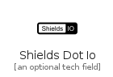

# Shields Dot Io

```text
simpleicons-4/S/ShieldsDotIo
```

```text
include('simpleicons-4/S/ShieldsDotIo')
```

|icon|element|
|---|---|
|||


## element
### Load remotely
```plantuml
@startuml
' configures the library
!global $LIB_BASE_LOCATION="https://raw.githubusercontent.com/tmorin/plantuml-libs/master/dist"
' loads the library
!include $LIB_BASE_LOCATION/bootstrap.puml
' loads the simpleicons-4 bootstrap
include('simpleicons-4/bootstrap')
' loads the ShieldsDotIo element
include('simpleicons-4/S/ShieldsDotIo')
ShieldsDotIo('shields_dot_io', 'Shields Dot Io', 'an optional tech field')
@enduml
```
### Load locally
```plantuml
@startuml
' configures the library
!global $INCLUSION_MODE="local"
!global $LIB_BASE_LOCATION="../.."
' loads the library
!include $LIB_BASE_LOCATION/bootstrap.puml
' loads the simpleicons-4 bootstrap
include('simpleicons-4/bootstrap')
' loads the ShieldsDotIo element
include('simpleicons-4/S/ShieldsDotIo')
ShieldsDotIo('shields_dot_io', 'Shields Dot Io', 'an optional tech field')
@enduml
```

