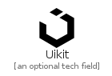
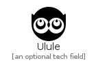
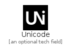
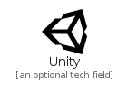
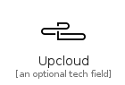
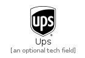
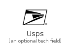

# U

The module U contains 28 entries.

| |Name|
|:---:|---|
||[simpleicons-4/U/Uber](../simpleicons-4/U/Uber.md)
||[simpleicons-4/U/Ubereats](../simpleicons-4/U/Ubereats.md)
||[simpleicons-4/U/Ubiquiti](../simpleicons-4/U/Ubiquiti.md)
||[simpleicons-4/U/Ubisoft](../simpleicons-4/U/Ubisoft.md)
||[simpleicons-4/U/Ublockorigin](../simpleicons-4/U/Ublockorigin.md)
||[simpleicons-4/U/Ubuntu](../simpleicons-4/U/Ubuntu.md)
||[simpleicons-4/U/Udacity](../simpleicons-4/U/Udacity.md)
||[simpleicons-4/U/Udemy](../simpleicons-4/U/Udemy.md)
||[simpleicons-4/U/Uikit](../simpleicons-4/U/Uikit.md)
||[simpleicons-4/U/Ulule](../simpleicons-4/U/Ulule.md)
||[simpleicons-4/U/Umbraco](../simpleicons-4/U/Umbraco.md)
||[simpleicons-4/U/Unacademy](../simpleicons-4/U/Unacademy.md)
||[simpleicons-4/U/Undertale](../simpleicons-4/U/Undertale.md)
||[simpleicons-4/U/Unicode](../simpleicons-4/U/Unicode.md)
||[simpleicons-4/U/Unilever](../simpleicons-4/U/Unilever.md)
||[simpleicons-4/U/Unitedairlines](../simpleicons-4/U/Unitedairlines.md)
||[simpleicons-4/U/Unity](../simpleicons-4/U/Unity.md)
||[simpleicons-4/U/Unraid](../simpleicons-4/U/Unraid.md)
||[simpleicons-4/U/Unrealengine](../simpleicons-4/U/Unrealengine.md)
||[simpleicons-4/U/Unsplash](../simpleicons-4/U/Unsplash.md)
||[simpleicons-4/U/Untangle](../simpleicons-4/U/Untangle.md)
||[simpleicons-4/U/Untappd](../simpleicons-4/U/Untappd.md)
||[simpleicons-4/U/Upcloud](../simpleicons-4/U/Upcloud.md)
||[simpleicons-4/U/Uplabs](../simpleicons-4/U/Uplabs.md)
||[simpleicons-4/U/Uploaded](../simpleicons-4/U/Uploaded.md)
||[simpleicons-4/U/Ups](../simpleicons-4/U/Ups.md)
||[simpleicons-4/U/Upwork](../simpleicons-4/U/Upwork.md)
||[simpleicons-4/U/Usps](../simpleicons-4/U/Usps.md)

