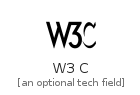
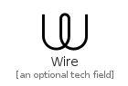

# W

The module W contains 61 entries.

| |Name|
|:---:|---|
||[simpleicons-4/W/W3C](../simpleicons-4/W/W3C.md)
||[simpleicons-4/W/Wagtail](../simpleicons-4/W/Wagtail.md)
||[simpleicons-4/W/Wakatime](../simpleicons-4/W/Wakatime.md)
||[simpleicons-4/W/Walkman](../simpleicons-4/W/Walkman.md)
||[simpleicons-4/W/Wappalyzer](../simpleicons-4/W/Wappalyzer.md)
||[simpleicons-4/W/WarnerbrosDot](../simpleicons-4/W/WarnerbrosDot.md)
||[simpleicons-4/W/Wattpad](../simpleicons-4/W/Wattpad.md)
||[simpleicons-4/W/Waze](../simpleicons-4/W/Waze.md)
||[simpleicons-4/W/Wearos](../simpleicons-4/W/Wearos.md)
||[simpleicons-4/W/Weasyl](../simpleicons-4/W/Weasyl.md)
||[simpleicons-4/W/Webassembly](../simpleicons-4/W/Webassembly.md)
||[simpleicons-4/W/Webauthn](../simpleicons-4/W/Webauthn.md)
||[simpleicons-4/W/WebcomponentsDotOrg](../simpleicons-4/W/WebcomponentsDotOrg.md)
||[simpleicons-4/W/Webdriverio](../simpleicons-4/W/Webdriverio.md)
||[simpleicons-4/W/Webflow](../simpleicons-4/W/Webflow.md)
||[simpleicons-4/W/Webgl](../simpleicons-4/W/Webgl.md)
||[simpleicons-4/W/Webhint](../simpleicons-4/W/Webhint.md)
||[simpleicons-4/W/Webmin](../simpleicons-4/W/Webmin.md)
||[simpleicons-4/W/Webmoney](../simpleicons-4/W/Webmoney.md)
||[simpleicons-4/W/Webpack](../simpleicons-4/W/Webpack.md)
||[simpleicons-4/W/Webrtc](../simpleicons-4/W/Webrtc.md)
||[simpleicons-4/W/Webstorm](../simpleicons-4/W/Webstorm.md)
||[simpleicons-4/W/Wechat](../simpleicons-4/W/Wechat.md)
||[simpleicons-4/W/WeightsAndBiases](../simpleicons-4/W/WeightsAndBiases.md)
||[simpleicons-4/W/Wemo](../simpleicons-4/W/Wemo.md)
||[simpleicons-4/W/Wetransfer](../simpleicons-4/W/Wetransfer.md)
||[simpleicons-4/W/Whatsapp](../simpleicons-4/W/Whatsapp.md)
||[simpleicons-4/W/Wheniwork](../simpleicons-4/W/Wheniwork.md)
||[simpleicons-4/W/Whitesource](../simpleicons-4/W/Whitesource.md)
||[simpleicons-4/W/Wii](../simpleicons-4/W/Wii.md)
||[simpleicons-4/W/Wiiu](../simpleicons-4/W/Wiiu.md)
||[simpleicons-4/W/Wikidata](../simpleicons-4/W/Wikidata.md)
||[simpleicons-4/W/Wikimediacommons](../simpleicons-4/W/Wikimediacommons.md)
||[simpleicons-4/W/Wikipedia](../simpleicons-4/W/Wikipedia.md)
||[simpleicons-4/W/Wikiquote](../simpleicons-4/W/Wikiquote.md)
||[simpleicons-4/W/Wikivoyage](../simpleicons-4/W/Wikivoyage.md)
||[simpleicons-4/W/Windows](../simpleicons-4/W/Windows.md)
||[simpleicons-4/W/Windows95](../simpleicons-4/W/Windows95.md)
||[simpleicons-4/W/Windowsterminal](../simpleicons-4/W/Windowsterminal.md)
||[simpleicons-4/W/Windowsxp](../simpleicons-4/W/Windowsxp.md)
||[simpleicons-4/W/Winmate](../simpleicons-4/W/Winmate.md)
||[simpleicons-4/W/Wipro](../simpleicons-4/W/Wipro.md)
||[simpleicons-4/W/Wire](../simpleicons-4/W/Wire.md)
||[simpleicons-4/W/Wireguard](../simpleicons-4/W/Wireguard.md)
||[simpleicons-4/W/Wireshark](../simpleicons-4/W/Wireshark.md)
||[simpleicons-4/W/Wish](../simpleicons-4/W/Wish.md)
||[simpleicons-4/W/Wistia](../simpleicons-4/W/Wistia.md)
||[simpleicons-4/W/Wix](../simpleicons-4/W/Wix.md)
||[simpleicons-4/W/Wizzair](../simpleicons-4/W/Wizzair.md)
||[simpleicons-4/W/Wolfram](../simpleicons-4/W/Wolfram.md)
||[simpleicons-4/W/Wolframlanguage](../simpleicons-4/W/Wolframlanguage.md)
||[simpleicons-4/W/Wolframmathematica](../simpleicons-4/W/Wolframmathematica.md)
||[simpleicons-4/W/Woo](../simpleicons-4/W/Woo.md)
||[simpleicons-4/W/Woocommerce](../simpleicons-4/W/Woocommerce.md)
||[simpleicons-4/W/Wordpress](../simpleicons-4/W/Wordpress.md)
||[simpleicons-4/W/Workplace](../simpleicons-4/W/Workplace.md)
||[simpleicons-4/W/Worldhealthorganization](../simpleicons-4/W/Worldhealthorganization.md)
||[simpleicons-4/W/Wpengine](../simpleicons-4/W/Wpengine.md)
||[simpleicons-4/W/Wprocket](../simpleicons-4/W/Wprocket.md)
||[simpleicons-4/W/WriteDotAs](../simpleicons-4/W/WriteDotAs.md)
||[simpleicons-4/W/Wwe](../simpleicons-4/W/Wwe.md)

