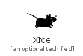
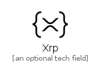

# X

The module X contains 16 entries.

| |Name|
|:---:|---|
||[simpleicons-4/X/Xamarin](../simpleicons-4/X/Xamarin.md)
||[simpleicons-4/X/Xaml](../simpleicons-4/X/Xaml.md)
||[simpleicons-4/X/Xampp](../simpleicons-4/X/Xampp.md)
||[simpleicons-4/X/Xbox](../simpleicons-4/X/Xbox.md)
||[simpleicons-4/X/Xcode](../simpleicons-4/X/Xcode.md)
||[simpleicons-4/X/Xdadevelopers](../simpleicons-4/X/Xdadevelopers.md)
||[simpleicons-4/X/XDotOrg](../simpleicons-4/X/XDotOrg.md)
||[simpleicons-4/X/Xero](../simpleicons-4/X/Xero.md)
||[simpleicons-4/X/Xfce](../simpleicons-4/X/Xfce.md)
||[simpleicons-4/X/Xiaomi](../simpleicons-4/X/Xiaomi.md)
||[simpleicons-4/X/Xilinx](../simpleicons-4/X/Xilinx.md)
||[simpleicons-4/X/Xing](../simpleicons-4/X/Xing.md)
||[simpleicons-4/X/Xmpp](../simpleicons-4/X/Xmpp.md)
||[simpleicons-4/X/XPack](../simpleicons-4/X/XPack.md)
||[simpleicons-4/X/Xrp](../simpleicons-4/X/Xrp.md)
||[simpleicons-4/X/Xsplit](../simpleicons-4/X/Xsplit.md)

