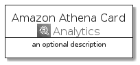
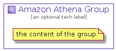

# AmazonAthena


```text
aws-20210131/Architecture/Analytics/AmazonAthena
```

```text
include('aws-20210131/Architecture/Analytics/AmazonAthena')
```


| Illustration | AmazonAthena | AmazonAthenaCard | AmazonAthenaGroup |
| :---: | :---: | :---: | :---: |
|  |  |  |  |


## AmazonAthena

### Load remotely
```plantuml
@startuml
' configures the library
!global $LIB_BASE_LOCATION="https://github.com/tmorin/plantuml-libs/distribution"

' loads the library's bootstrap
!include $LIB_BASE_LOCATION/bootstrap.puml

' loads the package bootstrap
include('aws-20210131/bootstrap')

' loads the Item which embeds the element AmazonAthena
include('aws-20210131/Architecture/Analytics/AmazonAthena')

' renders the element
AmazonAthena('AmazonAthena', 'Amazon Athena', 'an optional tech label')
@enduml
```

### Load locally
```plantuml
@startuml
' configures the library
!global $INCLUSION_MODE="local"
!global $LIB_BASE_LOCATION="../../.."

' loads the library's bootstrap
!include $LIB_BASE_LOCATION/bootstrap.puml

' loads the package bootstrap
include('aws-20210131/bootstrap')

' loads the Item which embeds the element AmazonAthena
include('aws-20210131/Architecture/Analytics/AmazonAthena')

' renders the element
AmazonAthena('AmazonAthena', 'Amazon Athena', 'an optional tech label')
@enduml
```

## AmazonAthenaCard

### Load remotely
```plantuml
@startuml
' configures the library
!global $LIB_BASE_LOCATION="https://github.com/tmorin/plantuml-libs/distribution"

' loads the library's bootstrap
!include $LIB_BASE_LOCATION/bootstrap.puml

' loads the package bootstrap
include('aws-20210131/bootstrap')

' loads the Item which embeds the element AmazonAthenaCard
include('aws-20210131/Architecture/Analytics/AmazonAthena')

' renders the element
AmazonAthenaCard('AmazonAthenaCard', 'Amazon Athena Card', 'an optional description')
@enduml
```

### Load locally
```plantuml
@startuml
' configures the library
!global $INCLUSION_MODE="local"
!global $LIB_BASE_LOCATION="../../.."

' loads the library's bootstrap
!include $LIB_BASE_LOCATION/bootstrap.puml

' loads the package bootstrap
include('aws-20210131/bootstrap')

' loads the Item which embeds the element AmazonAthenaCard
include('aws-20210131/Architecture/Analytics/AmazonAthena')

' renders the element
AmazonAthenaCard('AmazonAthenaCard', 'Amazon Athena Card', 'an optional description')
@enduml
```

## AmazonAthenaGroup

### Load remotely
```plantuml
@startuml
' configures the library
!global $LIB_BASE_LOCATION="https://github.com/tmorin/plantuml-libs/distribution"

' loads the library's bootstrap
!include $LIB_BASE_LOCATION/bootstrap.puml

' loads the package bootstrap
include('aws-20210131/bootstrap')

' loads the Item which embeds the element AmazonAthenaGroup
include('aws-20210131/Architecture/Analytics/AmazonAthena')

' renders the element
AmazonAthenaGroup('AmazonAthenaGroup', 'Amazon Athena Group', 'an optional tech label') {
    note as note
        the content of the group
    end note
}
@enduml
```

### Load locally
```plantuml
@startuml
' configures the library
!global $INCLUSION_MODE="local"
!global $LIB_BASE_LOCATION="../../.."

' loads the library's bootstrap
!include $LIB_BASE_LOCATION/bootstrap.puml

' loads the package bootstrap
include('aws-20210131/bootstrap')

' loads the Item which embeds the element AmazonAthenaGroup
include('aws-20210131/Architecture/Analytics/AmazonAthena')

' renders the element
AmazonAthenaGroup('AmazonAthenaGroup', 'Amazon Athena Group', 'an optional tech label') {
    note as note
        the content of the group
    end note
}
@enduml
```

